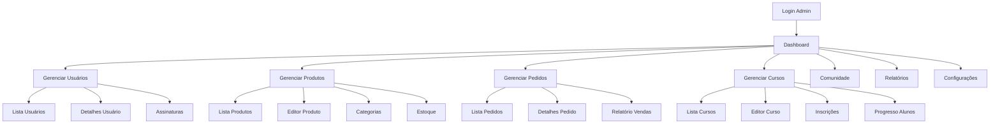

# Requisitos da Parte Administrativa - Caminhos de Hekate

## 1. Visão Geral do Produto

O painel administrativo do Caminhos de Hekate é uma interface web completa para gerenciamento de todos os aspectos do sistema, incluindo usuários, produtos, cursos, pedidos, conteúdo da comunidade e configurações. O sistema permite que administradores e editores gerenciem eficientemente a plataforma de ensino esotérico e e-commerce.

O painel visa centralizar todas as operações administrativas em uma interface intuitiva e responsiva, proporcionando controle total sobre vendas, assinaturas, conteúdo educacional e engajamento da comunidade.

## 2. Funcionalidades Principais

### 2.1 Papéis de Usuário

| Papel | Método de Acesso | Permissões Principais |
|-------|------------------|----------------------|
| Admin | Login com credenciais de administrador | Acesso completo a todas as funcionalidades |
| Editor | Login com credenciais de editor | Gerenciar conteúdo, cursos e posts da comunidade |
| Member | Não tem acesso ao painel | Apenas interface pública |

### 2.2 Módulos Funcionais

O painel administrativo consiste nas seguintes páginas principais:

1. **Dashboard**: visão geral com métricas, gráficos de vendas, usuários ativos e estatísticas gerais
2. **Gerenciamento de Usuários**: listagem, edição, assinaturas e permissões de usuários
3. **Gerenciamento de Produtos**: CRUD de produtos, variantes, estoque e categorias
4. **Gerenciamento de Pedidos**: visualização, processamento e acompanhamento de pedidos
5. **Gerenciamento de Cursos**: criação e edição de cursos, módulos, aulas e progresso dos alunos
6. **Gerenciamento da Comunidade**: moderação de posts, comentários e tópicos
7. **Relatórios e Analytics**: relatórios de vendas, usuários, cursos e engajamento
8. **Configurações do Sistema**: configurações gerais, templates de email, notificações

### 2.3 Detalhes das Páginas

| Nome da Página | Nome do Módulo | Descrição da Funcionalidade |
|----------------|----------------|-----------------------------|
| Dashboard | Visão Geral | Exibir métricas principais, gráficos de vendas, usuários ativos, pedidos recentes e estatísticas de cursos |
| Dashboard | Ações Rápidas | Botões para criar produto, curso, post e visualizar pedidos pendentes |
| Usuários | Lista de Usuários | Listar, filtrar, buscar e paginar usuários com informações básicas e status de assinatura |
| Usuários | Detalhes do Usuário | Visualizar e editar perfil, assinaturas, histórico de pedidos e progresso em cursos |
| Usuários | Gerenciar Assinaturas | Criar, editar, cancelar e renovar assinaturas de usuários |
| Produtos | Lista de Produtos | Listar produtos com filtros por categoria, status e tipo (físico/digital) |
| Produtos | Editor de Produto | Criar e editar produtos com imagens, descrições, variantes, preços e estoque |
| Produtos | Gerenciar Categorias | CRUD de categorias de produtos com hierarquia |
| Produtos | Controle de Estoque | Visualizar e ajustar estoque de variantes de produtos |
| Pedidos | Lista de Pedidos | Listar pedidos com filtros por status, data e cliente |
| Pedidos | Detalhes do Pedido | Visualizar informações completas, alterar status, processar pagamentos e envios |
| Pedidos | Relatório de Vendas | Gráficos e tabelas de vendas por período, produto e região |
| Cursos | Lista de Cursos | Listar cursos com status de publicação e estatísticas de inscrição |
| Cursos | Editor de Curso | Criar e editar cursos com módulos, aulas, vídeos e materiais |
| Cursos | Gerenciar Inscrições | Visualizar e gerenciar inscrições de alunos em cursos |
| Cursos | Progresso dos Alunos | Acompanhar progresso individual e emitir certificados |
| Comunidade | Posts da Comunidade | Moderar posts, comentários e gerenciar tópicos |
| Comunidade | Usuários Ativos | Visualizar engajamento e atividade dos membros |
| Relatórios | Analytics de Vendas | Relatórios detalhados de receita, produtos mais vendidos e tendências |
| Relatórios | Analytics de Usuários | Dados de crescimento, retenção e comportamento dos usuários |
| Relatórios | Analytics de Cursos | Estatísticas de conclusão, avaliações e engajamento em cursos |
| Configurações | Configurações Gerais | Definir configurações básicas do sistema e preferências |
| Configurações | Templates de Email | Gerenciar templates de notificações por email |
| Configurações | Integrações | Configurar APIs externas (Mercado Pago, WhatsApp, AWS) |

## 3. Fluxo Principal de Processos

### Fluxo do Administrador
1. Login no painel administrativo
2. Visualização do dashboard com métricas principais
3. Gerenciamento de produtos, pedidos ou cursos conforme necessidade
4. Monitoramento de relatórios e analytics
5. Configuração de sistema quando necessário

### Fluxo do Editor
1. Login no painel administrativo
2. Acesso limitado ao dashboard
3. Gerenciamento de conteúdo (cursos, posts da comunidade)
4. Moderação de comentários e posts
5. Visualização de relatórios de conteúdo

## 4. Design da Interface do Usuário

### 4.1 Estilo de Design

- **Cores Primárias**: #1a1a2e (azul escuro), #16213e (azul médio), #0f3460 (azul claro)
- **Cores Secundárias**: #e94560 (vermelho accent), #f39c12 (laranja), #27ae60 (verde sucesso)
- **Estilo dos Botões**: Arredondados com sombra sutil, estados hover bem definidos
- **Tipografia**: Inter ou similar, tamanhos 14px (corpo), 16px (títulos), 12px (labels)
- **Layout**: Sidebar fixa à esquerda, conteúdo principal responsivo, cards para organização
- **Ícones**: Lucide React ou Heroicons, estilo outline para consistência

### 4.2 Visão Geral do Design das Páginas

| Nome da Página | Nome do Módulo | Elementos da UI |
|----------------|----------------|----------------|
| Dashboard | Header Principal | Logo, navegação breadcrumb, perfil do usuário, notificações |
| Dashboard | Sidebar | Menu de navegação com ícones, seções colapsáveis, indicadores de status |
| Dashboard | Cards de Métricas | Cards com números principais, ícones coloridos, comparação com período anterior |
| Dashboard | Gráficos | Gráficos de linha para vendas, barras para produtos, donut para usuários |
| Listas | Tabela de Dados | Tabelas responsivas com filtros, busca, paginação e ações em linha |
| Listas | Filtros Avançados | Sidebar de filtros com campos de data, status, categorias |
| Formulários | Editor Principal | Formulários em cards, validação em tempo real, upload de imagens |
| Formulários | Ações de Formulário | Botões de salvar, cancelar, preview com estados de loading |
| Detalhes | Visualização | Layout em duas colunas, informações principais e secundárias |
| Relatórios | Gráficos Interativos | Gráficos com filtros de período, exportação PDF/Excel |

### 4.3 Responsividade

O painel será desktop-first com adaptação para tablets e mobile. Em dispositivos menores, a sidebar se transformará em menu hambúrguer, tabelas terão scroll horizontal e cards se empilharão verticalmente.