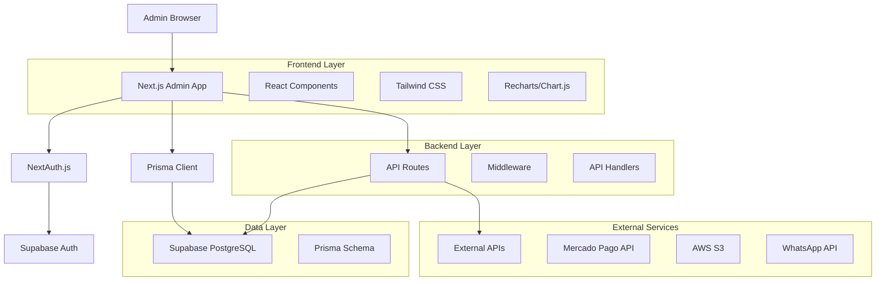
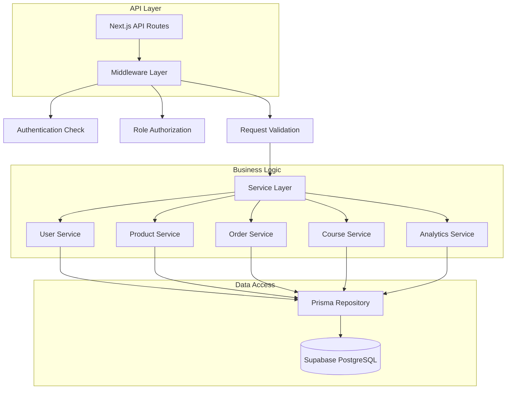
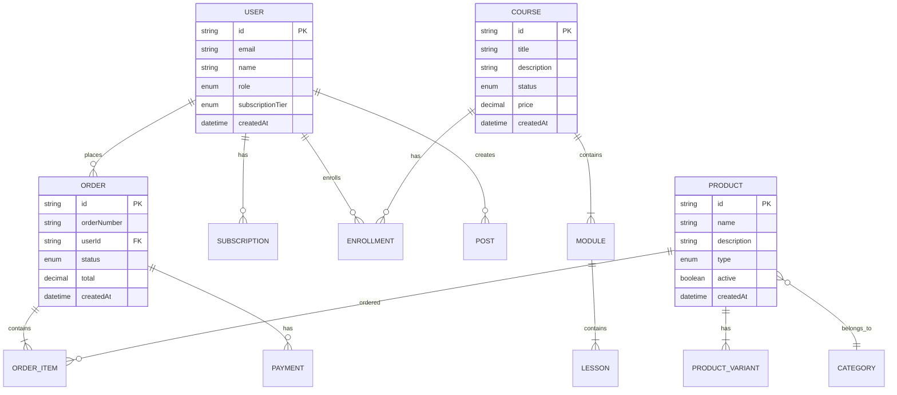

# Arquitetura Técnica - Painel Administrativo Caminhos de Hekate

## 1. Arquitetura do Sistema



## 2. Descrição das Tecnologias

* Frontend: Next.js\@14 + React\@18 + TypeScript + Tailwind CSS\@3

* Autenticação: NextAuth.js\@5 + Supabase Auth

* Banco de Dados: Supabase (PostgreSQL) + Prisma ORM

* Gráficos: Recharts ou Chart.js

* Upload de Arquivos: UploadThing ou AWS S3

* Validação: Zod + React Hook Form

* Estado: Zustand (para estado global)

* Notificações: React Hot Toast

## 3. Definições de Rotas

| Rota                         | Propósito                                      |
| ---------------------------- | ---------------------------------------------- |
| /admin                       | Dashboard principal com métricas e visão geral |
| /admin/login                 | Página de login para administradores           |
| /admin/users                 | Lista e gerenciamento de usuários              |
| /admin/users/\[id]           | Detalhes e edição de usuário específico        |
| /admin/products              | Lista e gerenciamento de produtos              |
| /admin/products/new          | Criação de novo produto                        |
| /admin/products/\[id]        | Edição de produto específico                   |
| /admin/products/categories   | Gerenciamento de categorias                    |
| /admin/orders                | Lista e gerenciamento de pedidos               |
| /admin/orders/\[id]          | Detalhes de pedido específico                  |
| /admin/courses               | Lista e gerenciamento de cursos                |
| /admin/courses/new           | Criação de novo curso                          |
| /admin/courses/\[id]         | Edição de curso específico                     |
| /admin/courses/\[id]/modules | Gerenciamento de módulos do curso              |
| /admin/community             | Gerenciamento de posts e comunidade            |
| /admin/community/posts       | Lista de posts da comunidade                   |
| /admin/community/topics      | Gerenciamento de tópicos                       |
| /admin/reports               | Relatórios e analytics                         |
| /admin/reports/sales         | Relatórios de vendas                           |
| /admin/reports/users         | Analytics de usuários                          |
| /admin/reports/courses       | Analytics de cursos                            |
| /admin/settings              | Configurações do sistema                       |
| /admin/settings/general      | Configurações gerais                           |
| /admin/settings/email        | Templates de email                             |
| /admin/settings/integrations | Configurações de APIs externas                 |

## 4. Definições de API

### 4.1 APIs Principais

**Autenticação e Usuários**

```
GET /api/admin/users
```

Request:

| Parâmetro | Tipo   | Obrigatório | Descrição                      |
| --------- | ------ | ----------- | ------------------------------ |
| page      | number | false       | Número da página (padrão: 1)   |
| limit     | number | false       | Itens por página (padrão: 20)  |
| search    | string | false       | Busca por nome ou email        |
| role      | string | false       | Filtro por papel do usuário    |
| tier      | string | false       | Filtro por nível de assinatura |

Response:

| Parâmetro | Tipo   | Descrição         |
| --------- | ------ | ----------------- |
| users     | array  | Lista de usuários |
| total     | number | Total de usuários |
| pages     | number | Total de páginas  |

Exemplo:

```json
{
  "users": [
    {
      "id": "user_123",
      "name": "João Silva",
      "email": "joao@email.com",
      "role": "MEMBER",
      "subscriptionTier": "ADEPTO",
      "createdAt": "2024-01-15T10:30:00Z"
    }
  ],
  "total": 150,
  "pages": 8
}
```

**Gerenciamento de Produtos**

```
POST /api/admin/products
```

Request:

| Parâmetro        | Tipo   | Obrigatório | Descrição            |
| ---------------- | ------ | ----------- | -------------------- |
| name             | string | true        | Nome do produto      |
| description      | string | true        | Descrição completa   |
| shortDescription | string | false       | Descrição resumida   |
| type             | string | true        | PHYSICAL ou DIGITAL  |
| categoryId       | string | false       | ID da categoria      |
| images           | array  | false       | URLs das imagens     |
| variants         | array  | true        | Variantes do produto |

Response:

| Parâmetro | Tipo    | Descrição               |
| --------- | ------- | ----------------------- |
| success   | boolean | Status da operação      |
| product   | object  | Dados do produto criado |

**Gerenciamento de Pedidos**

```
GET /api/admin/orders
```

Request:

| Parâmetro  | Tipo   | Obrigatório | Descrição                   |
| ---------- | ------ | ----------- | --------------------------- |
| status     | string | false       | Filtro por status do pedido |
| dateFrom   | string | false       | Data inicial (ISO)          |
| dateTo     | string | false       | Data final (ISO)            |
| customerId | string | false       | ID do cliente               |

Response:

| Parâmetro  | Tipo   | Descrição               |
| ---------- | ------ | ----------------------- |
| orders     | array  | Lista de pedidos        |
| total      | number | Total de pedidos        |
| totalValue | number | Valor total dos pedidos |

**Analytics e Relatórios**

```
GET /api/admin/analytics/dashboard
```

Response:

| Parâmetro           | Tipo   | Descrição                    |
| ------------------- | ------ | ---------------------------- |
| totalUsers          | number | Total de usuários            |
| totalOrders         | number | Total de pedidos             |
| totalRevenue        | number | Receita total                |
| activeSubscriptions | number | Assinaturas ativas           |
| recentOrders        | array  | Pedidos recentes             |
| salesChart          | array  | Dados para gráfico de vendas |

## 5. Arquitetura do Servidor



## 6. Modelo de Dados

### 6.1 Definição do Modelo de Dados



### 6.2 Linguagem de Definição de Dados (DDL)

O schema do banco de dados já está definido no arquivo `packages/database/prisma/schema.prisma`. As principais tabelas para o painel administrativo incluem:

**Tabela de Usuários (users)**

```sql
-- Já definida no schema existente
-- Inclui campos para role, subscriptionTier, etc.
```

**Tabela de Produtos (products)**

```sql
-- Já definida no schema existente
-- Inclui relacionamentos com categorias e variantes
```

**Tabela de Pedidos (orders)**

```sql
-- Já definida no schema existente
-- Inclui status, totais e relacionamentos
```

**Tabela de Cursos (courses)**

```sql
-- Já definida no schema existente
-- Inclui módulos, aulas e inscrições
```

**Índices para Performance**

```sql
-- Índices já definidos no schema para:
-- - Busca de usuários por email
-- - Filtros de pedidos por status e data
-- - Busca de produtos por categoria
-- - Analytics por período
```

**Dados Iniciais**

```sql
-- Inserir usuário administrador padrão
INSERT INTO users (email, name, role, password) 
VALUES ('admin@caminhosdehecate.com', 'Administrador', 'ADMIN', 'hashed_password');

-- Inserir configurações padrão do sistema
INSERT INTO settings (key, value, type, category)
VALUES 
  ('site_name', '"Caminhos de Hekate"', 'string', 'general'),
  ('admin_email', '"admin@caminhosdehecate.com"', 'string', 'general
```

