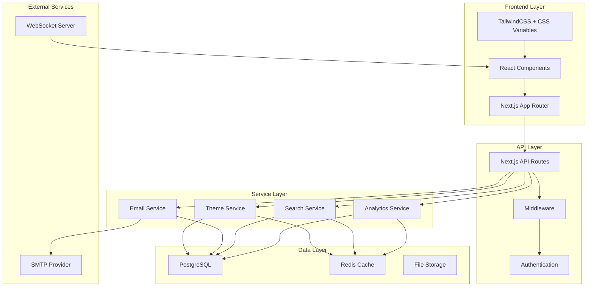
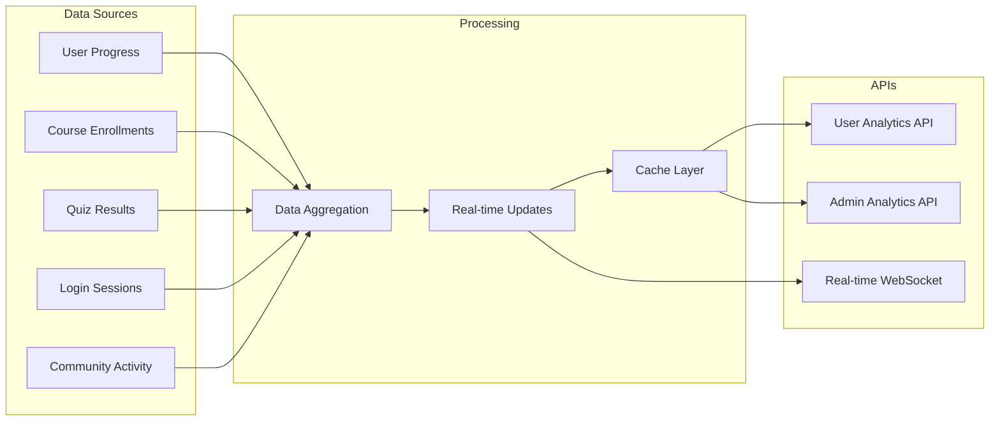
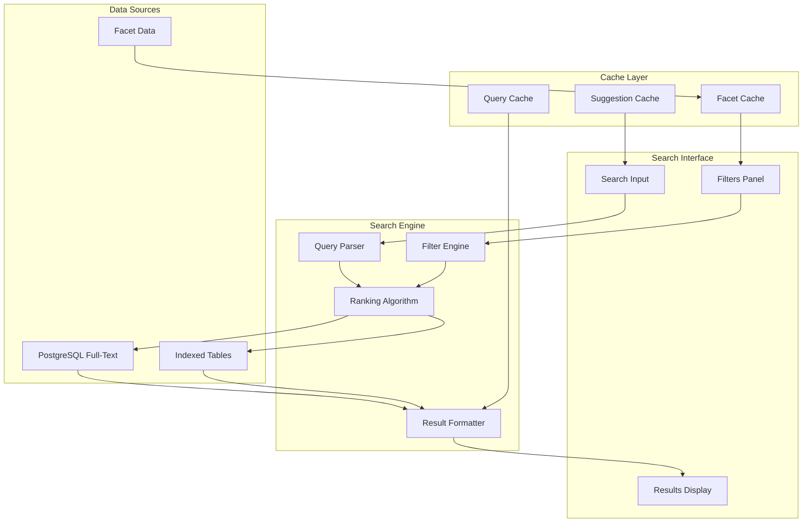
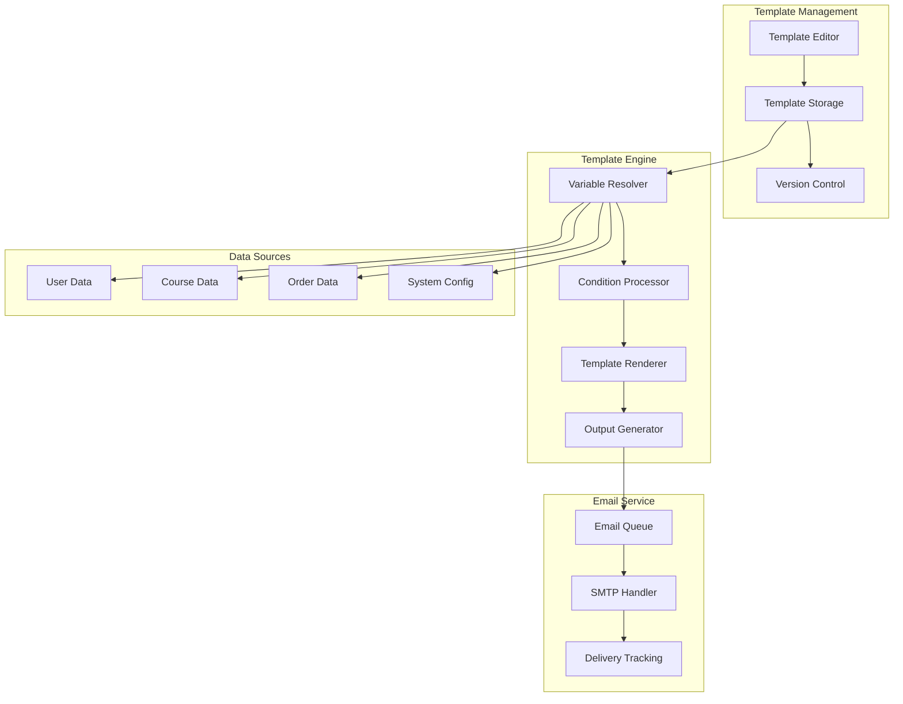
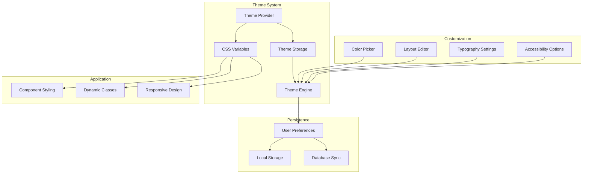

# Arquitetura Técnica - Funcionalidades Prioritárias

## 1. Visão Geral da Arquitetura

Este documento detalha a arquitetura técnica para implementação das funcionalidades prioritárias do projeto Caminhos de Hekate, integrando-se com a infraestrutura existente baseada em Next.js, PostgreSQL e Redis.



## 2. Arquitetura por Funcionalidade

### 2.1 Dashboard Analytics

#### 2.1.1 Arquitetura de Dados


#### 2.1.2 Estrutura de Dados
```sql
-- Tabela para métricas agregadas
CREATE TABLE analytics_metrics (
    id UUID PRIMARY KEY DEFAULT gen_random_uuid(),
    user_id UUID REFERENCES users(id),
    metric_type VARCHAR(50) NOT NULL,
    metric_value JSONB NOT NULL,
    period_start TIMESTAMP WITH TIME ZONE NOT NULL,
    period_end TIMESTAMP WITH TIME ZONE NOT NULL,
    created_at TIMESTAMP WITH TIME ZONE DEFAULT NOW(),
    updated_at TIMESTAMP WITH TIME ZONE DEFAULT NOW()
);

-- Índices para performance
CREATE INDEX idx_analytics_metrics_user_type ON analytics_metrics(user_id, metric_type);
CREATE INDEX idx_analytics_metrics_period ON analytics_metrics(period_start, period_end);
CREATE INDEX idx_analytics_metrics_type_period ON analytics_metrics(metric_type, period_start);

-- Tabela para eventos em tempo real
CREATE TABLE analytics_events (
    id UUID PRIMARY KEY DEFAULT gen_random_uuid(),
    user_id UUID REFERENCES users(id),
    event_type VARCHAR(50) NOT NULL,
    event_data JSONB NOT NULL,
    timestamp TIMESTAMP WITH TIME ZONE DEFAULT NOW()
);

-- Particionamento por data para performance
CREATE TABLE analytics_events_y2024m01 PARTITION OF analytics_events
FOR VALUES FROM ('2024-01-01') TO ('2024-02-01');
```

#### 2.1.3 Serviços de Analytics
```typescript
// packages/analytics/src/AnalyticsService.ts
export class AnalyticsService {
  private db: PrismaClient;
  private redis: Redis;
  private wsServer: WebSocketServer;
  
  async getUserAnalytics(userId: string, period: AnalyticsPeriod): Promise<UserAnalytics> {
    const cacheKey = `analytics:user:${userId}:${period}`;
    
    // Tentar cache primeiro
    const cached = await this.redis.get(cacheKey);
    if (cached) {
      return JSON.parse(cached);
    }
    
    // Calcular métricas
    const metrics = await this.calculateUserMetrics(userId, period);
    
    // Cache por 5 minutos
    await this.redis.setex(cacheKey, 300, JSON.stringify(metrics));
    
    return metrics;
  }
  
  async trackEvent(userId: string, eventType: string, eventData: any): Promise<void> {
    // Salvar evento
    await this.db.analyticsEvent.create({
      data: {
        userId,
        eventType,
        eventData,
        timestamp: new Date()
      }
    });
    
    // Enviar update em tempo real
    this.wsServer.to(`user:${userId}`).emit('analytics:update', {
      type: eventType,
      data: eventData
    });
    
    // Invalidar cache
    await this.redis.del(`analytics:user:${userId}:*`);
  }
  
  private async calculateUserMetrics(userId: string, period: AnalyticsPeriod): Promise<UserAnalytics> {
    const [progress, activity, performance] = await Promise.all([
      this.calculateProgressMetrics(userId, period),
      this.calculateActivityMetrics(userId, period),
      this.calculatePerformanceMetrics(userId, period)
    ]);
    
    return {
      userId,
      period,
      progress,
      activity,
      performance,
      generatedAt: new Date()
    };
  }
}
```

### 2.2 Busca Avançada

#### 2.2.1 Arquitetura de Busca


#### 2.2.2 Configuração de Full-Text Search
```sql
-- Configuração de dicionário português
CREATE TEXT SEARCH CONFIGURATION portuguese_config (COPY = portuguese);

-- Função para normalizar texto de busca
CREATE OR REPLACE FUNCTION normalize_search_text(input_text text)
RETURNS text AS $$
BEGIN
    RETURN lower(unaccent(trim(input_text)));
END;
$$ LANGUAGE plpgsql IMMUTABLE;

-- Índices de busca otimizados
CREATE INDEX idx_courses_fts ON courses USING GIN(
    to_tsvector('portuguese_config', 
        normalize_search_text(title) || ' ' || 
        normalize_search_text(description) || ' ' ||
        COALESCE(normalize_search_text(short_description), '')
    )
);

CREATE INDEX idx_products_fts ON products USING GIN(
    to_tsvector('portuguese_config',
        normalize_search_text(name) || ' ' ||
        normalize_search_text(description)
    )
);

-- Função de busca unificada
CREATE OR REPLACE FUNCTION unified_search(
    search_query text,
    search_type text DEFAULT 'all',
    filters jsonb DEFAULT '{}',
    sort_by text DEFAULT 'relevance',
    limit_count int DEFAULT 20,
    offset_count int DEFAULT 0
)
RETURNS TABLE(
    id text,
    type text,
    title text,
    description text,
    url text,
    rank real,
    metadata jsonb
) AS $$
DECLARE
    query_vector tsquery;
    filter_conditions text := '';
BEGIN
    -- Preparar query vector
    query_vector := plainto_tsquery('portuguese_config', normalize_search_text(search_query));
    
    -- Construir condições de filtro
    IF filters ? 'categories' THEN
        filter_conditions := filter_conditions || ' AND category = ANY(' || quote_literal(filters->>'categories') || ')';
    END IF;
    
    -- Buscar em cursos
    IF search_type IN ('all', 'courses') THEN
        RETURN QUERY
        SELECT 
            c.id::text,
            'course'::text,
            c.title,
            c.description,
            '/courses/' || c.slug,
            ts_rank(to_tsvector('portuguese_config', normalize_search_text(c.title || ' ' || c.description)), query_vector) as rank,
            jsonb_build_object(
                'level', c.level,
                'duration', c.duration,
                'price', c.price,
                'featured_image', c.featured_image
            )
        FROM courses c
        WHERE to_tsvector('portuguese_config', normalize_search_text(c.title || ' ' || c.description)) @@ query_vector
        AND c.status = 'PUBLISHED'
        ORDER BY rank DESC;
    END IF;
    
    -- Buscar em produtos
    IF search_type IN ('all', 'products') THEN
        RETURN QUERY
        SELECT 
            p.id::text,
            'product'::text,
            p.name,
            p.description,
            '/products/' || p.slug,
            ts_rank(to_tsvector('portuguese_config', normalize_search_text(p.name || ' ' || p.description)), query_vector) as rank,
            jsonb_build_object(
                'price', p.price,
                'category', p.category,
                'image', p.image
            )
        FROM products p
        WHERE to_tsvector('portuguese_config', normalize_search_text(p.name || ' ' || p.description)) @@ query_vector
        AND p.status = 'ACTIVE'
        ORDER BY rank DESC;
    END IF;
END;
$$ LANGUAGE plpgsql;
```

#### 2.2.3 Serviço de Busca
```typescript
// packages/search/src/SearchService.ts
export class SearchService {
  private db: PrismaClient;
  private redis: Redis;
  
  async search(params: SearchParams): Promise<SearchResponse> {
    const cacheKey = this.generateCacheKey(params);
    
    // Verificar cache
    const cached = await this.redis.get(cacheKey);
    if (cached) {
      return JSON.parse(cached);
    }
    
    // Executar busca
    const [results, facets, total] = await Promise.all([
      this.executeSearch(params),
      this.calculateFacets(params),
      this.countResults(params)
    ]);
    
    const response: SearchResponse = {
      results,
      facets,
      total,
      pagination: this.calculatePagination(params, total),
      suggestions: await this.generateSuggestions(params.query)
    };
    
    // Cache por 5 minutos
    await this.redis.setex(cacheKey, 300, JSON.stringify(response));
    
    return response;
  }
  
  private async executeSearch(params: SearchParams): Promise<SearchResult[]> {
    const query = `
      SELECT * FROM unified_search(
        $1, $2, $3, $4, $5, $6
      )
    `;
    
    const results = await this.db.$queryRaw`
      ${query}
      ${params.query}
      ${params.type}
      ${JSON.stringify(params.filters)}
      ${params.sort}
      ${params.limit}
      ${params.offset}
    `;
    
    return results.map(this.formatSearchResult);
  }
  
  private async calculateFacets(params: SearchParams): Promise<SearchFacets> {
    // Calcular facetas baseadas nos resultados
    const facets = await Promise.all([
      this.getCategoryFacets(params),
      this.getLevelFacets(params),
      this.getPriceFacets(params)
    ]);
    
    return {
      categories: facets[0],
      levels: facets[1],
      priceRanges: facets[2]
    };
  }
}
```

### 2.3 Templates de Email

#### 2.3.1 Arquitetura de Templates


#### 2.3.2 Schema de Templates
```sql
-- Tabela principal de templates
CREATE TABLE email_templates (
    id UUID PRIMARY KEY DEFAULT gen_random_uuid(),
    name VARCHAR(255) NOT NULL,
    type VARCHAR(50) NOT NULL,
    subject TEXT NOT NULL,
    html_content TEXT NOT NULL,
    text_content TEXT,
    variables JSONB DEFAULT '[]',
    conditions JSONB DEFAULT '[]',
    language VARCHAR(10) DEFAULT 'pt-BR',
    is_active BOOLEAN DEFAULT true,
    version INTEGER DEFAULT 1,
    parent_id UUID REFERENCES email_templates(id),
    created_by UUID REFERENCES users(id),
    created_at TIMESTAMP WITH TIME ZONE DEFAULT NOW(),
    updated_at TIMESTAMP WITH TIME ZONE DEFAULT NOW()
);

-- Tabela para histórico de envios
CREATE TABLE email_sends (
    id UUID PRIMARY KEY DEFAULT gen_random_uuid(),
    template_id UUID REFERENCES email_templates(id),
    recipient_email VARCHAR(255) NOT NULL,
    recipient_name VARCHAR(255),
    subject TEXT NOT NULL,
    html_content TEXT NOT NULL,
    text_content TEXT,
    variables_used JSONB,
    status VARCHAR(20) DEFAULT 'pending',
    sent_at TIMESTAMP WITH TIME ZONE,
    delivered_at TIMESTAMP WITH TIME ZONE,
    opened_at TIMESTAMP WITH TIME ZONE,
    clicked_at TIMESTAMP WITH TIME ZONE,
    error_message TEXT,
    created_at TIMESTAMP WITH TIME ZONE DEFAULT NOW()
);

-- Índices para performance
CREATE INDEX idx_email_templates_type ON email_templates(type, is_active);
CREATE INDEX idx_email_sends_status ON email_sends(status, created_at);
CREATE INDEX idx_email_sends_recipient ON email_sends(recipient_email, sent_at);
```

#### 2.3.3 Template Engine
```typescript
// packages/email/src/TemplateEngine.ts
import Handlebars from 'handlebars';
import { JSDOM } from 'jsdom';

export class TemplateEngine {
  private handlebars: typeof Handlebars;
  
  constructor() {
    this.handlebars = Handlebars.create();
    this.registerHelpers();
  }
  
  async renderTemplate(
    template: EmailTemplate,
    variables: Record<string, any>,
    user?: User
  ): Promise<RenderedEmail> {
    // Resolver variáveis
    const resolvedVariables = await this.resolveVariables(variables, user, template);
    
    // Processar condições
    const processedHtml = this.processConditions(template.htmlContent, resolvedVariables);
    const processedText = this.processConditions(template.textContent || '', resolvedVariables);
    
    // Renderizar com Handlebars
    const htmlTemplate = this.handlebars.compile(processedHtml);
    const textTemplate = this.handlebars.compile(processedText);
    const subjectTemplate = this.handlebars.compile(template.subject);
    
    const html = htmlTemplate(resolvedVariables);
    const text = textTemplate(resolvedVariables);
    const subject = subjectTemplate(resolvedVariables);
    
    // Validar HTML
    const validatedHtml = await this.validateAndSanitizeHtml(html);
    
    return {
      html: validatedHtml,
      text: text || this.htmlToText(validatedHtml),
      subject,
      variables: resolvedVariables
    };
  }
  
  private async resolveVariables(
    variables: Record<string, any>,
    user?: User,
    template?: EmailTemplate
  ): Promise<Record<string, any>> {
    const resolved = {
      ...variables,
      // Variáveis do usuário
      user: user ? {
        id: user.id,
        name: user.name,
        email: user.email,
        firstName: user.name.split(' ')[0],
        lastName: user.name.split(' ').slice(1).join(' '),
        avatar: user.avatar
      } : {},
      // Variáveis do sistema
      site: {
        name: 'Caminhos de Hekate',
        url: process.env.NEXT_PUBLIC_APP_URL,
        logo: `${process.env.NEXT_PUBLIC_APP_URL}/logo.png`,
        supportEmail: process.env.SUPPORT_EMAIL
      },
      // Variáveis de data/hora
      date: {
        now: new Date(),
        formatted: new Date().toLocaleDateString('pt-BR'),
        year: new Date().getFullYear()
      }
    };
    
    // Resolver variáveis dinâmicas baseadas no template
    if (template?.variables) {
      for (const variable of template.variables) {
        if (variable.type === 'dynamic' && variable.resolver) {
          resolved[variable.name] = await this.resolveDynamicVariable(
            variable.resolver,
            resolved
          );
        }
      }
    }
    
    return resolved;
  }
  
  private processConditions(
    content: string,
    variables: Record<string, any>
  ): string {
    // Processar condições {{#if condition}} ... {{/if}}
    return content.replace(
      /{{#if\s+([^}]+)}}([\s\S]*?){{/if}}/g,
      (match, condition, content) => {
        const result = this.evaluateCondition(condition, variables);
        return result ? content : '';
      }
    );
  }
  
  private registerHelpers(): void {
    // Helper para formatação de data
    this.handlebars.registerHelper('formatDate', (date: Date, format: string) => {
      return new Intl.DateTimeFormat('pt-BR', {
        year: 'numeric',
        month: 'long',
        day: 'numeric'
      }).format(new Date(date));
    });
    
    // Helper para formatação de moeda
    this.handlebars.registerHelper('formatCurrency', (value: number) => {
      return new Intl.NumberFormat('pt-BR', {
        style: 'currency',
        currency: 'BRL'
      }).format(value);
    });
    
    // Helper para URLs
    this.handlebars.registerHelper('url', (path: string) => {
      return `${process.env.NEXT_PUBLIC_APP_URL}${path}`;
    });
  }
}
```

### 2.4 Personalização de UI

#### 2.4.1 Arquitetura de Temas


#### 2.4.2 Schema de Preferências
```sql
-- Tabela de preferências do usuário
CREATE TABLE user_preferences (
    id UUID PRIMARY KEY DEFAULT gen_random_uuid(),
    user_id UUID UNIQUE REFERENCES users(id) ON DELETE CASCADE,
    theme JSONB DEFAULT '{}',
    layout JSONB DEFAULT '{}',
    accessibility JSONB DEFAULT '{}',
    locale VARCHAR(10) DEFAULT 'pt-BR',
    timezone VARCHAR(50) DEFAULT 'America/Sao_Paulo',
    created_at TIMESTAMP WITH TIME ZONE DEFAULT NOW(),
    updated_at TIMESTAMP WITH TIME ZONE DEFAULT NOW()
);

-- Tabela de temas customizados
CREATE TABLE custom_themes (
    id UUID PRIMARY KEY DEFAULT gen_random_uuid(),
    user_id UUID REFERENCES users(id) ON DELETE CASCADE,
    name VARCHAR(255) NOT NULL,
    colors JSONB NOT NULL,
    typography JSONB DEFAULT '{}',
    spacing JSONB DEFAULT '{}',
    is_public BOOLEAN DEFAULT false,
    created_at TIMESTAMP WITH TIME ZONE DEFAULT NOW(),
    updated_at TIMESTAMP WITH TIME ZONE DEFAULT NOW()
);

-- Índices
CREATE INDEX idx_user_preferences_user_id ON user_preferences(user_id);
CREATE INDEX idx_custom_themes_user_id ON custom_themes(user_id);
CREATE INDEX idx_custom_themes_public ON custom_themes(is_public) WHERE is_public = true;
```

#### 2.4.3 Theme Service
```typescript
// packages/theme/src/ThemeService.ts
export class ThemeService {
  private db: PrismaClient;
  private redis: Redis;
  
  async getUserPreferences(userId: string): Promise<UserPreferences> {
    const cacheKey = `preferences:${userId}`;
    
    // Verificar cache
    const cached = await this.redis.get(cacheKey);
    if (cached) {
      return JSON.parse(cached);
    }
    
    // Buscar do banco
    const preferences = await this.db.userPreferences.findUnique({
      where: { userId },
      include: {
        customThemes: true
      }
    });
    
    const result = preferences || this.getDefaultPreferences();
    
    // Cache por 1 hora
    await this.redis.setex(cacheKey, 3600, JSON.stringify(result));
    
    return result;
  }
  
  async updatePreferences(
    userId: string,
    updates: Partial<UserPreferences>
  ): Promise<UserPreferences> {
    // Validar updates
    const validatedUpdates = this.validatePreferences(updates);
    
    // Atualizar no banco
    const updated = await this.db.userPreferences.upsert({
      where: { userId },
      update: validatedUpdates,
      create: {
        userId,
        ...this.getDefaultPreferences(),
        ...validatedUpdates
      }
    });
    
    // Invalidar cache
    await this.redis.del(`preferences:${userId}`);
    
    // Notificar mudanças via WebSocket
    this.notifyPreferencesChange(userId, updated);
    
    return updated;
  }
  
  generateCSSVariables(preferences: UserPreferences): string {
    const { theme, layout, accessibility } = preferences;
    
    const variables = {
      // Cores
      '--color-primary': theme.colors?.primary || '#8B5CF6',
      '--color-secondary': theme.colors?.secondary || '#06B6D4',
      '--color-background': theme.colors?.background || '#FFFFFF',
      '--color-surface': theme.colors?.surface || '#F8FAFC',
      '--color-text': theme.colors?.text || '#1E293B',
      
      // Tipografia
      '--font-family': theme.typography?.fontFamily || 'Inter, sans-serif',
      '--font-size-base': this.getFontSize(theme.typography?.fontSize || 'medium'),
      '--line-height-base': theme.typography?.lineHeight || 1.5,
      
      // Espaçamento
      '--spacing-unit': this.getSpacingUnit(theme.spacing || 'comfortable'),
      
      // Layout
      '--sidebar-width': `${layout.sidebar?.width || 280}px`,
      '--header-height': `${layout.header?.height || 64}px`,
      
      // Acessibilidade
      '--motion-reduce': accessibility.reduceMotion ? '1' : '0',
      '--contrast-high': accessibility.highContrast ? '1' : '0'
    };
    
    return Object.entries(variables)
      .map(([key, value]) => `${key}: ${value};`)
      .join('\n');
  }
  
  private validatePreferences(preferences: Partial<UserPreferences>): Partial<UserPreferences> {
    const validated: Partial<UserPreferences> = {};
    
    // Validar cores
    if (preferences.theme?.colors) {
      validated.theme = {
        ...validated.theme,
        colors: this.validateColors(preferences.theme.colors)
      };
    }
    
    // Validar layout
    if (preferences.layout) {
      validated.layout = this.validateLayout(preferences.layout);
    }
    
    // Validar acessibilidade
    if (preferences.accessibility) {
      validated.accessibility = this.validateAccessibility(preferences.accessibility);
    }
    
    return validated;
  }
}
```

## 3. Integração e Deployment

### 3.1 Estrutura de Arquivos
```
apps/web/src/
├── components/
│   ├── analytics/
│   │   ├── AnalyticsDashboard.tsx
│   │   ├── MetricsGrid.tsx
│   │   ├── ChartsSection.tsx
│   │   └── RealtimeUpdates.tsx
│   ├── search/
│   │   ├── AdvancedSearch.tsx
│   │   ├── SearchFilters.tsx
│   │   ├── SearchResults.tsx
│   │   └── SearchSuggestions.tsx
│   ├── email/
│   │   ├── TemplateEditor.tsx
│   │   ├── TemplatePreview.tsx
│   │   └── VariableManager.tsx
│   └── theme/
│       ├── ThemeProvider.tsx
│       ├── CustomizationPanel.tsx
│       └── ThemeCustomization.tsx
├── hooks/
│   ├── useAnalytics.ts
│   ├── useAdvancedSearch.ts
│   ├── useEmailTemplates.ts
│   └── useTheme.ts
├── lib/
│   ├── analytics.ts
│   ├── search.ts
│   ├── email.ts
│   └── theme.ts
└── app/api/
    ├── analytics/
    ├── search/
    ├── email-templates/
    └── preferences/

packages/
├── analytics/
├── search/
├── email/
└── theme/
```

### 3.2 Configuração de Ambiente
```bash
# .env.local
# Analytics
ANALYTICS_CACHE_TTL=300
ANALYTICS_BATCH_SIZE=100

# Search
SEARCH_CACHE_TTL=300
SEARCH_MAX_RESULTS=100
SEARCH_SUGGESTION_LIMIT=10

# Email
EMAIL_TEMPLATE_CACHE_TTL=3600
EMAIL_QUEUE_BATCH_SIZE=50

# Theme
THEME_CACHE_TTL=3600
THEME_CSS_CACHE_TTL=86400
```

### 3.3 Scripts de Build
```json
{
  "scripts": {
    "build:analytics": "tsc -p packages/analytics/tsconfig.json",
    "build:search": "tsc -p packages/search/tsconfig.json",
    "build:email": "tsc -p packages/email/tsconfig.json",
    "build:theme": "tsc -p packages/theme/tsconfig.json",
    "build:packages": "pnpm run build:analytics && pnpm run build:search && pnpm run build:email && pnpm run build:theme",
    "dev:analytics": "tsc -p packages/analytics/tsconfig.json --watch",
    "dev:search": "tsc -p packages/search/tsconfig.json --watch",
    "dev:email": "tsc -p packages/email/tsconfig.json --watch",
    "dev:theme": "tsc -p packages/theme/tsconfig.json --watch"
  }
}
```

## 4. Monitoramento e Performance

### 4.1 Métricas de Performance
- **Analytics**: Tempo de resposta < 500ms, cache hit rate > 80%
- **Search**: Tempo de busca < 300ms, relevância > 85%
- **Email**: Taxa de entrega > 95%, tempo de renderização < 100ms
- **Theme**: Aplicação de tema < 50ms, cache hit rate > 90%

### 4.2 Logging e Monitoramento
```typescript
// lib/monitoring.ts
export class MonitoringService {
  static trackPerformance(operation: string, duration: number, metadata?: any) {
    console.log(`[PERF] ${operation}: ${duration}ms`, metadata);
    
    // Enviar para serviço de monitoramento
    if (process.env.NODE_ENV === 'production') {
      // Analytics service integration
    }
  }
  
  static trackError(error: Error, context: string, metadata?: any) {
    console.error(`[ERROR] ${context}:`, error, metadata);
    
    // Enviar para serviço de erro
    if (process.env.NODE_ENV === 'production') {
      // Error tracking service integration
    }
  }
}
```

### 4.3 Health Checks
```typescript
// app/api/health/route.ts
export async function GET() {
  const checks = await Promise.allSettled([
    checkDatabase(),
    checkRedis(),
    checkEmailService(),
    checkSearchIndex()
  ]);
  
  const results = checks.map((check, index) => ({
    service: ['database', 'redis', 'email', 'search'][index],
    status: check.status === 'fulfilled' ? 'healthy' : 'unhealthy',
    details: check.status === 'fulfilled' ? check.value : check.reason
  }));
  
  const overallStatus = results.every(r => r.status === 'healthy') ? 'healthy' : 'degraded';
  
  return Response.json({
    status: overallStatus,
    timestamp: new Date().toISOString(),
    services: results
  });
}
```

Esta arquitetura técnica fornece uma base sólida para implementar as funcionalidades prioritárias de forma escalável, performática e maintível, integrando-se perfeitamente com a infraestrutura existente do projeto Caminhos de Hekate.