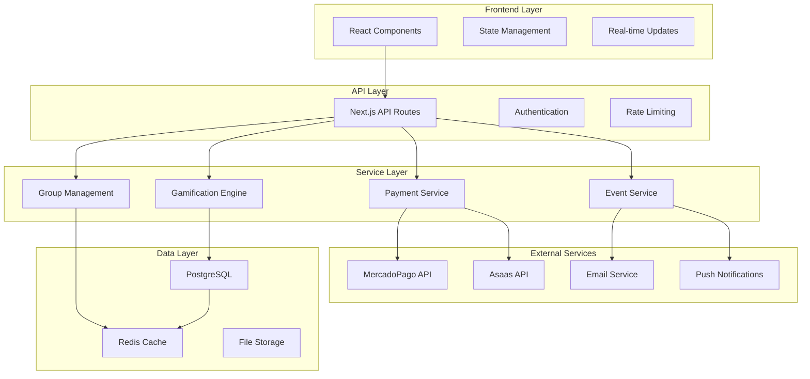
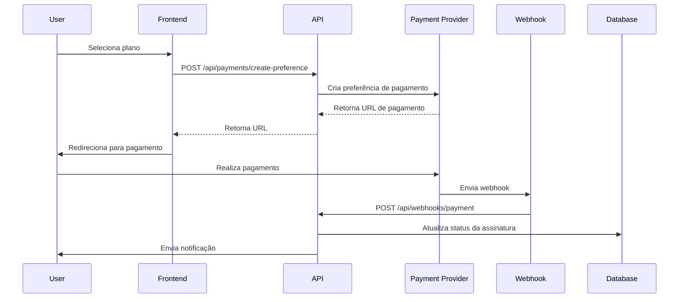

# Arquitetura Técnica - Funcionalidades Avançadas

## 1. Visão Geral da Arquitetura

### 1.1 Arquitetura de Alto Nível



## 2. Tecnologias e Dependências

### 2.1 Dependências de Produção

```json
{
  "@mercadopago/sdk-react": "^0.0.19",
  "mercadopago": "^2.0.15",
  "asaas-sdk": "^1.0.0",
  "socket.io": "^4.7.5",
  "socket.io-client": "^4.7.5",
  "redis": "^4.6.12",
  "bull": "^4.12.2",
  "node-cron": "^3.0.3",
  "ical-generator": "^4.1.0",
  "date-fns": "^2.30.0",
  "date-fns-tz": "^2.0.0",
  "react-big-calendar": "^1.8.5",
  "react-dnd": "^16.0.1",
  "framer-motion": "^10.16.16",
  "recharts": "^2.8.0",
  "react-confetti": "^6.1.0",
  "react-spring": "^9.7.3"
}
```

### 2.2 Variáveis de Ambiente

```env
# Pagamentos
MERCADOPAGO_ACCESS_TOKEN=
MERCADOPAGO_PUBLIC_KEY=
MERCADOPAGO_WEBHOOK_SECRET=

ASAAS_API_KEY=
ASAAS_WEBHOOK_TOKEN=
ASAAS_ENVIRONMENT=sandbox # ou production

# Redis
REDIS_URL=redis://localhost:6379
REDIS_PASSWORD=

# WebSockets
SOCKET_IO_SECRET=

# Calendário
GOOGLE_CALENDAR_CLIENT_ID=
GOOGLE_CALENDAR_CLIENT_SECRET=

# Notificações
PUSH_NOTIFICATION_VAPID_PUBLIC=
PUSH_NOTIFICATION_VAPID_PRIVATE=
```

## 3. Arquitetura de Pagamentos

### 3.1 Fluxo de Pagamento



### 3.2 Implementação do Webhook Handler

```typescript
// lib/payments/webhook-handler.ts
export class WebhookHandler {
  async handleMercadoPago(payload: any, signature: string) {
    // Verificar assinatura
    if (!this.verifyMercadoPagoSignature(payload, signature)) {
      throw new Error('Invalid signature')
    }
    
    const { type, data } = payload
    
    switch (type) {
      case 'payment':
        await this.processPayment(data.id)
        break
      case 'subscription':
        await this.processSubscription(data.id)
        break
    }
  }
  
  async handleAsaas(payload: any, token: string) {
    // Verificar token
    if (token !== process.env.ASAAS_WEBHOOK_TOKEN) {
      throw new Error('Invalid token')
    }
    
    const { event, payment } = payload
    
    switch (event) {
      case 'PAYMENT_RECEIVED':
        await this.activateSubscription(payment.subscription)
        break
      case 'PAYMENT_OVERDUE':
        await this.handleOverduePayment(payment.id)
        break
    }
  }
}
```

### 3.3 Gerenciamento de Assinaturas

```typescript
// lib/payments/subscription-manager.ts
export class SubscriptionManager {
  async createSubscription(userId: string, planId: string, paymentData: any) {
    const plan = await this.getPlan(planId)
    const user = await this.getUser(userId)
    
    // Criar assinatura no provedor
    const externalSubscription = await this.paymentProvider.createSubscription({
      customer: user,
      plan: plan,
      paymentMethod: paymentData
    })
    
    // Salvar no banco
    const subscription = await prisma.subscription.create({
      data: {
        userId,
        planId,
        status: 'pending',
        externalSubscriptionId: externalSubscription.id,
        paymentProvider: this.provider,
        currentPeriodStart: new Date(),
        currentPeriodEnd: this.calculatePeriodEnd(plan.interval)
      }
    })
    
    return subscription
  }
  
  async cancelSubscription(subscriptionId: string) {
    const subscription = await this.getSubscription(subscriptionId)
    
    // Cancelar no provedor
    await this.paymentProvider.cancelSubscription(subscription.externalSubscriptionId)
    
    // Atualizar no banco
    await prisma.subscription.update({
      where: { id: subscriptionId },
      data: {
        status: 'canceled',
        cancelAtPeriodEnd: true
      }
    })
  }
}
```

## 4. Arquitetura de Gamificação

### 4.1 Engine de Conquistas

```typescript
// lib/gamification/achievement-engine.ts
export class AchievementEngine {
  private redis: Redis
  private eventQueue: Queue
  
  constructor() {
    this.redis = new Redis(process.env.REDIS_URL)
    this.eventQueue = new Queue('achievement processing')
  }
  
  async processUserAction(userId: string, action: UserAction) {
    // Adicionar à fila para processamento assíncrono
    await this.eventQueue.add('process-action', {
      userId,
      action,
      timestamp: new Date()
    })
  }
  
  async checkAchievements(userId: string, action: UserAction) {
    const userProgress = await this.getUserProgress(userId)
    const eligibleAchievements = await this.getEligibleAchievements(action.type)
    
    const newAchievements = []
    
    for (const achievement of eligibleAchievements) {
      const progress = await this.calculateProgress(userId, achievement, action)
      
      if (progress.completed && !userProgress.achievements.includes(achievement.id)) {
        await this.awardAchievement(userId, achievement)
        newAchievements.push(achievement)
      }
    }
    
    return newAchievements
  }
  
  async updateLeaderboard(userId: string, category: string, points: number) {
    const key = `leaderboard:${category}`
    
    // Atualizar ranking no Redis
    await this.redis.zadd(key, points, userId)
    
    // Manter apenas top 1000
    await this.redis.zremrangebyrank(key, 0, -1001)
    
    // Atualizar ranking no banco (batch job)
    await this.eventQueue.add('update-leaderboard', {
      category,
      userId,
      points
    })
  }
}
```

### 4.2 Sistema de Pontos

```typescript
// lib/gamification/points-system.ts
export class PointsSystem {
  private pointsConfig = {
    'complete_lesson': 10,
    'complete_course': 100,
    'create_post': 5,
    'receive_like': 2,
    'daily_streak': 15,
    'weekly_streak': 50,
    'monthly_streak': 200
  }
  
  async awardPoints(userId: string, action: string, multiplier = 1) {
    const basePoints = this.pointsConfig[action] || 0
    const points = basePoints * multiplier
    
    if (points > 0) {
      await prisma.userPoints.create({
        data: {
          userId,
          points,
          category: this.getCategoryFromAction(action),
          source: action,
          description: this.getPointsDescription(action, points)
        }
      })
      
      // Atualizar total de pontos do usuário
      await this.updateUserTotalPoints(userId, points)
      
      // Atualizar leaderboard
      await this.achievementEngine.updateLeaderboard(
        userId, 
        this.getCategoryFromAction(action), 
        points
      )
    }
  }
}
```

## 5. Arquitetura de Grupos Privados

### 5.1 Sistema de Chat em Tempo Real

```typescript
// lib/groups/chat-server.ts
export class GroupChatServer {
  private io: Server
  
  constructor(server: any) {
    this.io = new Server(server, {
      cors: {
        origin: process.env.FRONTEND_URL,
        methods: ['GET', 'POST']
      }
    })
    
    this.setupEventHandlers()
  }
  
  private setupEventHandlers() {
    this.io.on('connection', (socket) => {
      socket.on('join-group', async (groupId) => {
        const userId = socket.handshake.auth.userId
        
        // Verificar se usuário é membro do grupo
        const isMember = await this.verifyGroupMembership(userId, groupId)
        if (!isMember) {
          socket.emit('error', 'Unauthorized')
          return
        }
        
        socket.join(`group:${groupId}`)
        socket.emit('joined-group', groupId)
      })
      
      socket.on('send-message', async (data) => {
        const { groupId, content, messageType = 'text' } = data
        const userId = socket.handshake.auth.userId
        
        // Salvar mensagem no banco
        const message = await prisma.groupMessage.create({
          data: {
            groupId,
            userId,
            content,
            messageType
          },
          include: {
            user: {
              select: { id: true, name: true, image: true }
            }
          }
        })
        
        // Enviar para todos os membros do grupo
        this.io.to(`group:${groupId}`).emit('new-message', message)
      })
    })
  }
}
```

### 5.2 Gerenciamento de Membros

```typescript
// lib/groups/member-manager.ts
export class GroupMemberManager {
  async inviteUser(groupId: string, inviterUserId: string, inviteeEmail: string) {
    // Verificar permissões do convite
    const canInvite = await this.canUserInvite(inviterUserId, groupId)
    if (!canInvite) {
      throw new Error('Insufficient permissions')
    }
    
    // Verificar se grupo não está cheio
    const group = await this.getGroupWithMemberCount(groupId)
    if (group.memberCount >= group.maxMembers) {
      throw new Error('Group is full')
    }
    
    // Criar convite
    const invitation = await prisma.groupInvitation.create({
      data: {
        groupId,
        inviterUserId,
        inviteeEmail,
        expiresAt: new Date(Date.now() + 7 * 24 * 60 * 60 * 1000) // 7 dias
      }
    })
    
    // Enviar email de convite
    await this.emailService.sendGroupInvitation(invitation)
    
    return invitation
  }
  
  async acceptInvitation(invitationId: string, userId: string) {
    const invitation = await prisma.groupInvitation.findUnique({
      where: { id: invitationId },
      include: { group: true }
    })
    
    if (!invitation || invitation.status !== 'pending') {
      throw new Error('Invalid invitation')
    }
    
    if (invitation.expiresAt < new Date()) {
      throw new Error('Invitation expired')
    }
    
    // Adicionar usuário ao grupo
    await prisma.groupMember.create({
      data: {
        groupId: invitation.groupId,
        userId,
        role: 'member'
      }
    })
    
    // Atualizar status do convite
    await prisma.groupInvitation.update({
      where: { id: invitationId },
      data: { status: 'accepted', inviteeId: userId }
    })
    
    // Notificar membros do grupo
    await this.notifyGroupMembers(invitation.groupId, 'new_member', { userId })
  }
}
```

## 6. Arquitetura de Eventos e Calendário

### 6.1 Sistema de Eventos Recorrentes

```typescript
// lib/events/recurring-events.ts
export class RecurringEventManager {
  async createRecurringEvent(eventData: CreateEventData, recurrenceData: RecurrenceData) {
    // Criar evento principal
    const baseEvent = await prisma.event.create({
      data: eventData
    })
    
    // Criar configuração de recorrência
    await prisma.recurringEvent.create({
      data: {
        eventId: baseEvent.id,
        ...recurrenceData
      }
    })
    
    // Gerar ocorrências futuras (próximos 6 meses)
    await this.generateFutureOccurrences(baseEvent.id, recurrenceData)
    
    return baseEvent
  }
  
  async generateFutureOccurrences(eventId: string, recurrence: RecurrenceData) {
    const baseEvent = await prisma.event.findUnique({ where: { id: eventId } })
    const occurrences = this.calculateOccurrences(baseEvent, recurrence)
    
    for (const occurrence of occurrences) {
      await prisma.event.create({
        data: {
          ...baseEvent,
          id: undefined, // Novo ID
          parentEventId: eventId,
          startDate: occurrence.startDate,
          endDate: occurrence.endDate,
          isRecurring: true
        }
      })
    }
  }
  
  private calculateOccurrences(baseEvent: Event, recurrence: RecurrenceData): EventOccurrence[] {
    const occurrences = []
    let currentDate = new Date(baseEvent.startDate)
    const endDate = recurrence.endDate || addMonths(new Date(), 6)
    
    while (currentDate <= endDate && occurrences.length < (recurrence.maxOccurrences || 100)) {
      switch (recurrence.pattern) {
        case 'daily':
          currentDate = addDays(currentDate, recurrence.interval)
          break
        case 'weekly':
          currentDate = addWeeks(currentDate, recurrence.interval)
          break
        case 'monthly':
          currentDate = addMonths(currentDate, recurrence.interval)
          break
      }
      
      if (currentDate <= endDate) {
        occurrences.push({
          startDate: currentDate,
          endDate: addHours(currentDate, differenceInHours(baseEvent.endDate, baseEvent.startDate))
        })
      }
    }
    
    return occurrences
  }
}
```

### 6.2 Sistema de Lembretes

```typescript
// lib/events/reminder-system.ts
export class EventReminderSystem {
  private reminderQueue: Queue
  
  constructor() {
    this.reminderQueue = new Queue('event reminders')
    this.setupReminderProcessor()
  }
  
  async scheduleReminders(eventId: string) {
    const event = await prisma.event.findUnique({
      where: { id: eventId },
      include: { registrations: { include: { user: true } } }
    })
    
    const reminderTimes = [
      { time: subDays(event.startDate, 7), type: '7_days' },
      { time: subDays(event.startDate, 1), type: '1_day' },
      { time: subHours(event.startDate, 1), type: '1_hour' }
    ]
    
    for (const registration of event.registrations) {
      for (const reminder of reminderTimes) {
        if (reminder.time > new Date()) {
          await this.reminderQueue.add(
            'send-reminder',
            {
              eventId,
              userId: registration.userId,
              reminderType: reminder.type
            },
            {
              delay: reminder.time.getTime() - Date.now()
            }
          )
        }
      }
    }
  }
  
  private setupReminderProcessor() {
    this.reminderQueue.process('send-reminder', async (job) => {
      const { eventId, userId, reminderType } = job.data
      
      const event = await prisma.event.findUnique({ where: { id: eventId } })
      const user = await prisma.user.findUnique({ where: { id: userId } })
      
      // Enviar lembrete por email
      await this.emailService.sendEventReminder(user, event, reminderType)
      
      // Enviar notificação push se habilitada
      if (user.pushNotificationsEnabled) {
        await this.pushService.sendEventReminder(user, event, reminderType)
      }
      
      // Registrar lembrete enviado
      await prisma.eventReminder.create({
        data: {
          eventId,
          userId,
          reminderType: 'email',
          remindAt: new Date(),
          sent: true
        }
      })
    })
  }
}
```

## 7. Otimizações de Performance

### 7.1 Cache Strategy

```typescript
// lib/cache/cache-manager.ts
export class CacheManager {
  private redis: Redis
  
  constructor() {
    this.redis = new Redis(process.env.REDIS_URL)
  }
  
  // Cache de leaderboards
  async getLeaderboard(category: string, period: string) {
    const key = `leaderboard:${category}:${period}`
    const cached = await this.redis.get(key)
    
    if (cached) {
      return JSON.parse(cached)
    }
    
    const leaderboard = await this.calculateLeaderboard(category, period)
    await this.redis.setex(key, 300, JSON.stringify(leaderboard)) // 5 min cache
    
    return leaderboard
  }
  
  // Cache de estatísticas de usuário
  async getUserStats(userId: string) {
    const key = `user:stats:${userId}`
    const cached = await this.redis.get(key)
    
    if (cached) {
      return JSON.parse(cached)
    }
    
    const stats = await this.calculateUserStats(userId)
    await this.redis.setex(key, 600, JSON.stringify(stats)) // 10 min cache
    
    return stats
  }
  
  // Invalidar cache quando necessário
  async invalidateUserCache(userId: string) {
    const pattern = `user:*:${userId}`
    const keys = await this.redis.keys(pattern)
    
    if (keys.length > 0) {
      await this.redis.del(...keys)
    }
  }
}
```

### 7.2 Database Indexing

```sql
-- Índices para performance de gamificação
CREATE INDEX idx_user_achievements_user_id ON user_achievements(user_id);
CREATE INDEX idx_user_achievements_achievement_id ON user_achievements(achievement_id);
CREATE INDEX idx_user_points_user_id_category ON user_points(user_id, category);
CREATE INDEX idx_leaderboards_category_period_rank ON leaderboards(category, period, rank);

-- Índices para grupos
CREATE INDEX idx_group_members_group_id ON group_members(group_id) WHERE is_active = true;
CREATE INDEX idx_group_messages_group_id_created_at ON group_messages(group_id, created_at DESC);

-- Índices para eventos
CREATE INDEX idx_events_start_date ON events(start_date);
CREATE INDEX idx_events_organizer_id ON events(organizer_id);
CREATE INDEX idx_event_registrations_user_id ON event_registrations(user_id);
CREATE INDEX idx_event_registrations_event_id ON event_registrations(event_id);

-- Índices para pagamentos
CREATE INDEX idx_subscriptions_user_id_status ON subscriptions(user_id, status);
CREATE INDEX idx_payments_user_id_created_at ON payments(user_id, created_at DESC);
```

## 8. Monitoramento e Observabilidade

### 8.1 Métricas Importantes

```typescript
// lib/monitoring/metrics.ts
export class MetricsCollector {
  async collectPaymentMetrics() {
    return {
      totalRevenue: await this.getTotalRevenue(),
      activeSubscriptions: await this.getActiveSubscriptions(),
      churnRate: await this.calculateChurnRate(),
      conversionRate: await this.calculateConversionRate()
    }
  }
  
  async collectGamificationMetrics() {
    return {
      totalAchievements: await this.getTotalAchievements(),
      activeUsers: await this.getActiveGamificationUsers(),
      averageEngagement: await this.calculateEngagementScore(),
      topAchievements: await this.getTopAchievements()
    }
  }
  
  async collectGroupMetrics() {
    return {
      totalGroups: await this.getTotalGroups(),
      averageGroupSize: await this.getAverageGroupSize(),
      messageVolume: await this.getMessageVolume(),
      activeGroups: await this.getActiveGroups()
    }
  }
}
```

### 8.2 Health Checks

```typescript
// lib/monitoring/health-checks.ts
export class HealthChecker {
  async checkPaymentProviders() {
    const checks = {
      mercadopago: await this.checkMercadoPago(),
      asaas: await this.checkAsaas()
    }
    
    return checks
  }
  
  async checkRedisConnection() {
    try {
      await this.redis.ping()
      return { status: 'healthy', latency: Date.now() }
    } catch (error) {
      return { status: 'unhealthy', error: error.message }
    }
  }
  
  async checkWebSocketServer() {
    // Verificar se servidor WebSocket está respondendo
    return { status: 'healthy', connections: this.io.engine.clientsCount }
  }
}
```

Esta arquitetura técnica fornece uma base sólida e escalável para implementar todas as funcionalidades avançadas solicitadas, com foco em performance, segurança e manutenibilidade.