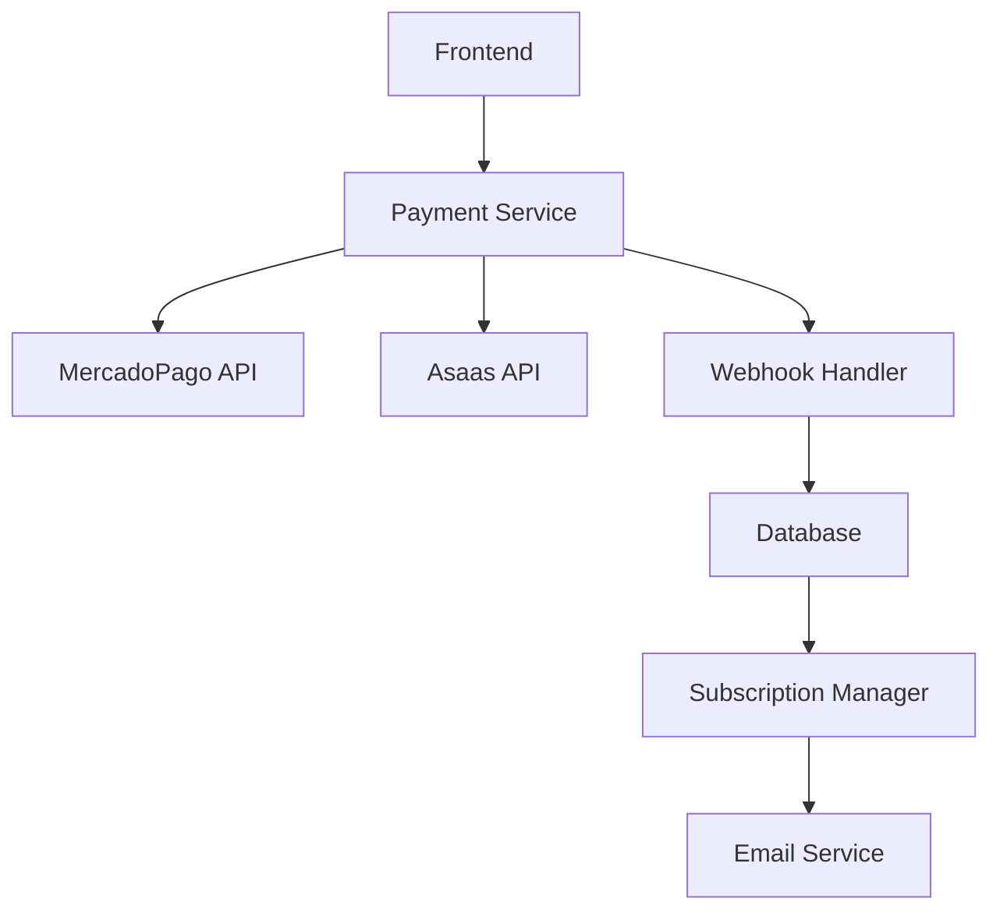
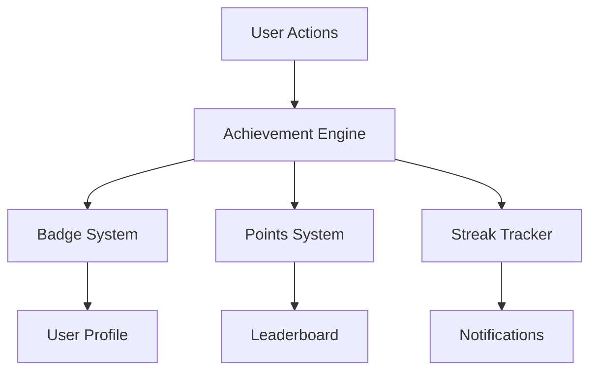
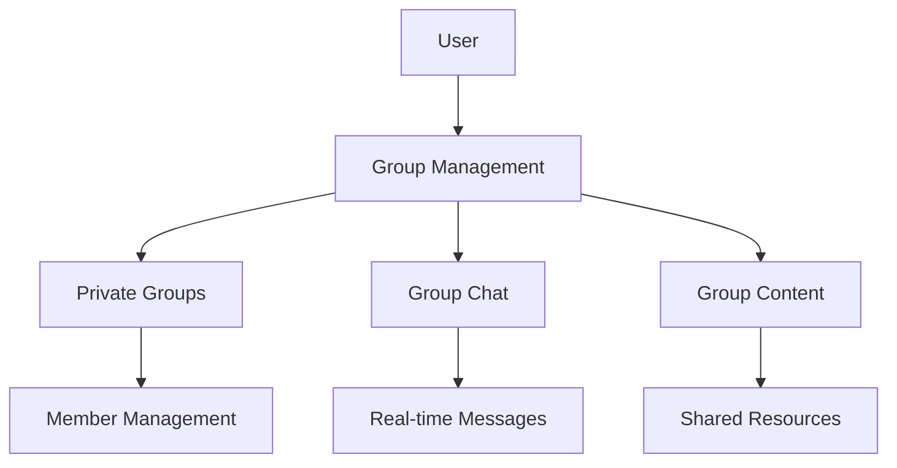
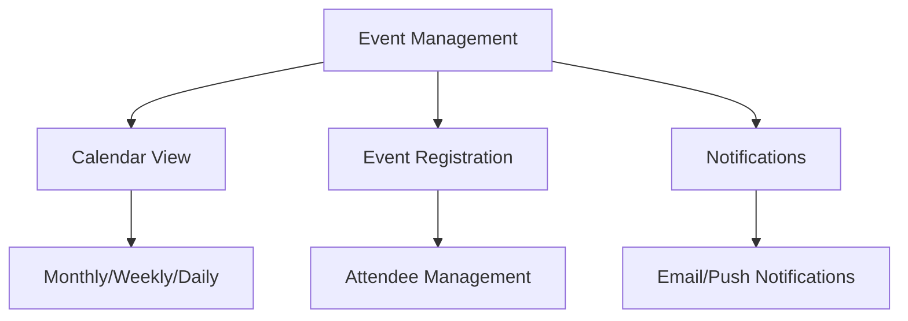

# Implementação de Funcionalidades Avançadas - Caminhos de Hekate

## 1. Visão Geral

Este documento detalha a implementação de 4 funcionalidades avançadas para expandir significativamente as capacidades da plataforma Caminhos de Hekate:

1. **Sistema de Pagamentos e Assinaturas** (MercadoPago/Asaas)
2. **Sistema de Gamificação Completa** (badges, ranking, streak)
3. **Sistema de Grupos Privados**
4. **Sistema de Eventos e Calendário**

## 2. Sistema de Pagamentos e Assinaturas

### 2.1 Arquitetura de Pagamentos



### 2.2 Modelos de Dados

#### Subscription
```sql
CREATE TABLE subscriptions (
    id UUID PRIMARY KEY DEFAULT gen_random_uuid(),
    user_id UUID NOT NULL REFERENCES users(id),
    plan_id UUID NOT NULL REFERENCES subscription_plans(id),
    status VARCHAR(20) NOT NULL CHECK (status IN ('active', 'canceled', 'expired', 'pending')),
    current_period_start TIMESTAMP WITH TIME ZONE NOT NULL,
    current_period_end TIMESTAMP WITH TIME ZONE NOT NULL,
    cancel_at_period_end BOOLEAN DEFAULT FALSE,
    payment_provider VARCHAR(20) NOT NULL CHECK (payment_provider IN ('mercadopago', 'asaas')),
    external_subscription_id VARCHAR(255),
    created_at TIMESTAMP WITH TIME ZONE DEFAULT NOW(),
    updated_at TIMESTAMP WITH TIME ZONE DEFAULT NOW()
);

CREATE TABLE subscription_plans (
    id UUID PRIMARY KEY DEFAULT gen_random_uuid(),
    name VARCHAR(100) NOT NULL,
    description TEXT,
    price_monthly DECIMAL(10,2) NOT NULL,
    price_yearly DECIMAL(10,2),
    features JSONB NOT NULL,
    is_active BOOLEAN DEFAULT TRUE,
    created_at TIMESTAMP WITH TIME ZONE DEFAULT NOW()
);

CREATE TABLE payments (
    id UUID PRIMARY KEY DEFAULT gen_random_uuid(),
    user_id UUID NOT NULL REFERENCES users(id),
    subscription_id UUID REFERENCES subscriptions(id),
    amount DECIMAL(10,2) NOT NULL,
    currency VARCHAR(3) DEFAULT 'BRL',
    status VARCHAR(20) NOT NULL,
    payment_provider VARCHAR(20) NOT NULL,
    external_payment_id VARCHAR(255),
    payment_method VARCHAR(50),
    metadata JSONB,
    created_at TIMESTAMP WITH TIME ZONE DEFAULT NOW()
);
```

### 2.3 APIs de Pagamento

#### Endpoints Principais
```typescript
// /api/payments/plans
GET /api/payments/plans - Listar planos disponíveis
POST /api/payments/plans - Criar novo plano (admin)

// /api/payments/subscriptions
GET /api/payments/subscriptions - Listar assinaturas do usuário
POST /api/payments/subscriptions - Criar nova assinatura
PUT /api/payments/subscriptions/[id] - Atualizar assinatura
DELETE /api/payments/subscriptions/[id] - Cancelar assinatura

// /api/payments/webhooks
POST /api/payments/webhooks/mercadopago - Webhook MercadoPago
POST /api/payments/webhooks/asaas - Webhook Asaas
```

### 2.4 Componentes Frontend

#### Estrutura de Componentes
```
src/components/payments/
├── PlanSelector.tsx          # Seleção de planos
├── PaymentForm.tsx           # Formulário de pagamento
├── SubscriptionManager.tsx   # Gerenciar assinatura
├── PaymentHistory.tsx        # Histórico de pagamentos
├── BillingInfo.tsx          # Informações de cobrança
└── PaymentStatus.tsx        # Status do pagamento
```

#### Exemplo: PlanSelector
```typescript
interface Plan {
  id: string
  name: string
  description: string
  priceMonthly: number
  priceYearly?: number
  features: string[]
  isPopular?: boolean
}

export function PlanSelector({ onSelectPlan }: { onSelectPlan: (plan: Plan) => void }) {
  // Implementação do seletor de planos
}
```

### 2.5 Integração com Provedores

#### MercadoPago
```typescript
// lib/payments/mercadopago.ts
export class MercadoPagoService {
  async createPreference(data: PaymentData) {
    // Criar preferência de pagamento
  }
  
  async getPaymentStatus(paymentId: string) {
    // Verificar status do pagamento
  }
  
  async handleWebhook(payload: any) {
    // Processar webhook
  }
}
```

#### Asaas
```typescript
// lib/payments/asaas.ts
export class AsaasService {
  async createSubscription(data: SubscriptionData) {
    // Criar assinatura
  }
  
  async cancelSubscription(subscriptionId: string) {
    // Cancelar assinatura
  }
  
  async handleWebhook(payload: any) {
    // Processar webhook
  }
}
```

## 3. Sistema de Gamificação Completa

### 3.1 Arquitetura de Gamificação



### 3.2 Modelos de Dados

```sql
CREATE TABLE user_achievements (
    id UUID PRIMARY KEY DEFAULT gen_random_uuid(),
    user_id UUID NOT NULL REFERENCES users(id),
    achievement_id UUID NOT NULL REFERENCES achievements(id),
    earned_at TIMESTAMP WITH TIME ZONE DEFAULT NOW(),
    progress INTEGER DEFAULT 0,
    completed BOOLEAN DEFAULT FALSE,
    metadata JSONB
);

CREATE TABLE achievements (
    id UUID PRIMARY KEY DEFAULT gen_random_uuid(),
    name VARCHAR(100) NOT NULL,
    description TEXT NOT NULL,
    icon VARCHAR(255),
    category VARCHAR(50) NOT NULL,
    type VARCHAR(20) NOT NULL CHECK (type IN ('badge', 'milestone', 'streak')),
    requirements JSONB NOT NULL,
    points INTEGER DEFAULT 0,
    rarity VARCHAR(20) DEFAULT 'common' CHECK (rarity IN ('common', 'rare', 'epic', 'legendary')),
    is_active BOOLEAN DEFAULT TRUE,
    created_at TIMESTAMP WITH TIME ZONE DEFAULT NOW()
);

CREATE TABLE user_points (
    id UUID PRIMARY KEY DEFAULT gen_random_uuid(),
    user_id UUID NOT NULL REFERENCES users(id),
    points INTEGER NOT NULL DEFAULT 0,
    category VARCHAR(50) NOT NULL,
    source VARCHAR(100) NOT NULL,
    description TEXT,
    created_at TIMESTAMP WITH TIME ZONE DEFAULT NOW()
);

CREATE TABLE user_streaks (
    id UUID PRIMARY KEY DEFAULT gen_random_uuid(),
    user_id UUID NOT NULL REFERENCES users(id),
    streak_type VARCHAR(50) NOT NULL,
    current_count INTEGER DEFAULT 0,
    best_count INTEGER DEFAULT 0,
    last_activity_date DATE,
    is_active BOOLEAN DEFAULT TRUE,
    created_at TIMESTAMP WITH TIME ZONE DEFAULT NOW(),
    updated_at TIMESTAMP WITH TIME ZONE DEFAULT NOW()
);

CREATE TABLE leaderboards (
    id UUID PRIMARY KEY DEFAULT gen_random_uuid(),
    user_id UUID NOT NULL REFERENCES users(id),
    category VARCHAR(50) NOT NULL,
    score INTEGER NOT NULL DEFAULT 0,
    rank INTEGER,
    period VARCHAR(20) NOT NULL CHECK (period IN ('daily', 'weekly', 'monthly', 'all_time')),
    updated_at TIMESTAMP WITH TIME ZONE DEFAULT NOW()
);
```

### 3.3 Sistema de Conquistas

#### Tipos de Conquistas
```typescript
interface Achievement {
  id: string
  name: string
  description: string
  icon: string
  category: 'learning' | 'social' | 'engagement' | 'milestone'
  type: 'badge' | 'milestone' | 'streak'
  requirements: {
    action: string
    count: number
    timeframe?: string
  }
  points: number
  rarity: 'common' | 'rare' | 'epic' | 'legendary'
}

// Exemplos de conquistas
const achievements: Achievement[] = [
  {
    id: 'first-course',
    name: 'Primeiro Passo',
    description: 'Complete seu primeiro curso',
    category: 'learning',
    type: 'badge',
    requirements: { action: 'complete_course', count: 1 },
    points: 100,
    rarity: 'common'
  },
  {
    id: 'streak-7',
    name: 'Dedicação Semanal',
    description: 'Estude por 7 dias consecutivos',
    category: 'engagement',
    type: 'streak',
    requirements: { action: 'daily_study', count: 7 },
    points: 250,
    rarity: 'rare'
  }
]
```

### 3.4 Componentes de Gamificação

```
src/components/gamification/
├── AchievementCard.tsx       # Card de conquista
├── BadgeCollection.tsx       # Coleção de badges
├── PointsDisplay.tsx         # Exibição de pontos
├── StreakCounter.tsx         # Contador de streak
├── Leaderboard.tsx          # Ranking
├── ProgressBar.tsx          # Barra de progresso
├── AchievementNotification.tsx # Notificação de conquista
└── GamificationDashboard.tsx # Dashboard principal
```

### 3.5 Engine de Conquistas

```typescript
// lib/gamification/achievement-engine.ts
export class AchievementEngine {
  async processUserAction(userId: string, action: string, metadata?: any) {
    // Processar ação do usuário
    const achievements = await this.checkAchievements(userId, action)
    
    for (const achievement of achievements) {
      await this.awardAchievement(userId, achievement.id)
    }
  }
  
  async updateStreak(userId: string, streakType: string) {
    // Atualizar streak do usuário
  }
  
  async calculateLeaderboard(category: string, period: string) {
    // Calcular ranking
  }
}
```

## 4. Sistema de Grupos Privados

### 4.1 Arquitetura de Grupos



### 4.2 Modelos de Dados

```sql
CREATE TABLE private_groups (
    id UUID PRIMARY KEY DEFAULT gen_random_uuid(),
    name VARCHAR(100) NOT NULL,
    description TEXT,
    avatar_url VARCHAR(255),
    owner_id UUID NOT NULL REFERENCES users(id),
    max_members INTEGER DEFAULT 50,
    is_invite_only BOOLEAN DEFAULT TRUE,
    settings JSONB DEFAULT '{}',
    created_at TIMESTAMP WITH TIME ZONE DEFAULT NOW(),
    updated_at TIMESTAMP WITH TIME ZONE DEFAULT NOW()
);

CREATE TABLE group_members (
    id UUID PRIMARY KEY DEFAULT gen_random_uuid(),
    group_id UUID NOT NULL REFERENCES private_groups(id),
    user_id UUID NOT NULL REFERENCES users(id),
    role VARCHAR(20) DEFAULT 'member' CHECK (role IN ('owner', 'admin', 'moderator', 'member')),
    joined_at TIMESTAMP WITH TIME ZONE DEFAULT NOW(),
    is_active BOOLEAN DEFAULT TRUE,
    UNIQUE(group_id, user_id)
);

CREATE TABLE group_invitations (
    id UUID PRIMARY KEY DEFAULT gen_random_uuid(),
    group_id UUID NOT NULL REFERENCES private_groups(id),
    inviter_id UUID NOT NULL REFERENCES users(id),
    invitee_email VARCHAR(255) NOT NULL,
    invitee_id UUID REFERENCES users(id),
    status VARCHAR(20) DEFAULT 'pending' CHECK (status IN ('pending', 'accepted', 'declined', 'expired')),
    expires_at TIMESTAMP WITH TIME ZONE,
    created_at TIMESTAMP WITH TIME ZONE DEFAULT NOW()
);

CREATE TABLE group_messages (
    id UUID PRIMARY KEY DEFAULT gen_random_uuid(),
    group_id UUID NOT NULL REFERENCES private_groups(id),
    user_id UUID NOT NULL REFERENCES users(id),
    content TEXT NOT NULL,
    message_type VARCHAR(20) DEFAULT 'text' CHECK (message_type IN ('text', 'image', 'file', 'system')),
    reply_to_id UUID REFERENCES group_messages(id),
    attachments JSONB,
    created_at TIMESTAMP WITH TIME ZONE DEFAULT NOW(),
    updated_at TIMESTAMP WITH TIME ZONE DEFAULT NOW()
);

CREATE TABLE group_resources (
    id UUID PRIMARY KEY DEFAULT gen_random_uuid(),
    group_id UUID NOT NULL REFERENCES private_groups(id),
    user_id UUID NOT NULL REFERENCES users(id),
    title VARCHAR(200) NOT NULL,
    description TEXT,
    resource_type VARCHAR(50) NOT NULL,
    file_url VARCHAR(255),
    metadata JSONB,
    created_at TIMESTAMP WITH TIME ZONE DEFAULT NOW()
);
```

### 4.3 APIs de Grupos

```typescript
// /api/groups
GET /api/groups - Listar grupos do usuário
POST /api/groups - Criar novo grupo
GET /api/groups/[id] - Detalhes do grupo
PUT /api/groups/[id] - Atualizar grupo
DELETE /api/groups/[id] - Deletar grupo

// /api/groups/[id]/members
GET /api/groups/[id]/members - Listar membros
POST /api/groups/[id]/members - Adicionar membro
DELETE /api/groups/[id]/members/[userId] - Remover membro

// /api/groups/[id]/messages
GET /api/groups/[id]/messages - Listar mensagens
POST /api/groups/[id]/messages - Enviar mensagem

// /api/groups/[id]/resources
GET /api/groups/[id]/resources - Listar recursos
POST /api/groups/[id]/resources - Adicionar recurso
```

### 4.4 Componentes de Grupos

```
src/components/groups/
├── GroupCard.tsx            # Card do grupo
├── GroupList.tsx            # Lista de grupos
├── GroupChat.tsx            # Chat do grupo
├── GroupMembers.tsx         # Lista de membros
├── GroupSettings.tsx        # Configurações
├── GroupInvite.tsx          # Convite para grupo
├── GroupResources.tsx       # Recursos compartilhados
└── CreateGroupModal.tsx     # Modal de criação
```

### 4.5 Chat em Tempo Real

```typescript
// hooks/useGroupChat.ts
export function useGroupChat(groupId: string) {
  const [messages, setMessages] = useState<Message[]>([])
  const [isConnected, setIsConnected] = useState(false)
  
  useEffect(() => {
    const socket = io('/groups')
    
    socket.emit('join-group', groupId)
    
    socket.on('new-message', (message) => {
      setMessages(prev => [...prev, message])
    })
    
    return () => socket.disconnect()
  }, [groupId])
  
  const sendMessage = useCallback((content: string) => {
    // Enviar mensagem
  }, [])
  
  return { messages, sendMessage, isConnected }
}
```

## 5. Sistema de Eventos e Calendário

### 5.1 Arquitetura de Eventos



### 5.2 Modelos de Dados

```sql
CREATE TABLE events (
    id UUID PRIMARY KEY DEFAULT gen_random_uuid(),
    title VARCHAR(200) NOT NULL,
    description TEXT,
    event_type VARCHAR(50) NOT NULL CHECK (event_type IN ('webinar', 'workshop', 'course', 'meeting', 'community')),
    start_date TIMESTAMP WITH TIME ZONE NOT NULL,
    end_date TIMESTAMP WITH TIME ZONE NOT NULL,
    timezone VARCHAR(50) DEFAULT 'America/Sao_Paulo',
    location VARCHAR(255),
    is_online BOOLEAN DEFAULT TRUE,
    meeting_url VARCHAR(255),
    max_attendees INTEGER,
    is_public BOOLEAN DEFAULT TRUE,
    requires_approval BOOLEAN DEFAULT FALSE,
    price DECIMAL(10,2) DEFAULT 0,
    organizer_id UUID NOT NULL REFERENCES users(id),
    group_id UUID REFERENCES private_groups(id),
    course_id UUID REFERENCES courses(id),
    status VARCHAR(20) DEFAULT 'scheduled' CHECK (status IN ('scheduled', 'live', 'completed', 'cancelled')),
    metadata JSONB DEFAULT '{}',
    created_at TIMESTAMP WITH TIME ZONE DEFAULT NOW(),
    updated_at TIMESTAMP WITH TIME ZONE DEFAULT NOW()
);

CREATE TABLE event_registrations (
    id UUID PRIMARY KEY DEFAULT gen_random_uuid(),
    event_id UUID NOT NULL REFERENCES events(id),
    user_id UUID NOT NULL REFERENCES users(id),
    status VARCHAR(20) DEFAULT 'registered' CHECK (status IN ('registered', 'attended', 'no_show', 'cancelled')),
    registration_date TIMESTAMP WITH TIME ZONE DEFAULT NOW(),
    attended_at TIMESTAMP WITH TIME ZONE,
    feedback_rating INTEGER CHECK (feedback_rating >= 1 AND feedback_rating <= 5),
    feedback_comment TEXT,
    UNIQUE(event_id, user_id)
);

CREATE TABLE event_reminders (
    id UUID PRIMARY KEY DEFAULT gen_random_uuid(),
    event_id UUID NOT NULL REFERENCES events(id),
    user_id UUID NOT NULL REFERENCES users(id),
    reminder_type VARCHAR(20) NOT NULL CHECK (reminder_type IN ('email', 'push', 'sms')),
    remind_at TIMESTAMP WITH TIME ZONE NOT NULL,
    sent BOOLEAN DEFAULT FALSE,
    created_at TIMESTAMP WITH TIME ZONE DEFAULT NOW()
);

CREATE TABLE recurring_events (
    id UUID PRIMARY KEY DEFAULT gen_random_uuid(),
    event_id UUID NOT NULL REFERENCES events(id),
    recurrence_pattern VARCHAR(20) NOT NULL CHECK (recurrence_pattern IN ('daily', 'weekly', 'monthly', 'yearly')),
    recurrence_interval INTEGER DEFAULT 1,
    days_of_week INTEGER[], -- Para eventos semanais
    end_date DATE,
    max_occurrences INTEGER,
    created_at TIMESTAMP WITH TIME ZONE DEFAULT NOW()
);
```

### 5.3 APIs de Eventos

```typescript
// /api/events
GET /api/events - Listar eventos (com filtros)
POST /api/events - Criar evento
GET /api/events/[id] - Detalhes do evento
PUT /api/events/[id] - Atualizar evento
DELETE /api/events/[id] - Deletar evento

// /api/events/[id]/register
POST /api/events/[id]/register - Registrar-se no evento
DELETE /api/events/[id]/register - Cancelar registro

// /api/events/[id]/attendees
GET /api/events/[id]/attendees - Listar participantes
PUT /api/events/[id]/attendees/[userId] - Marcar presença

// /api/calendar
GET /api/calendar - Eventos do calendário do usuário
GET /api/calendar/[year]/[month] - Eventos do mês
```

### 5.4 Componentes de Calendário

```
src/components/calendar/
├── Calendar.tsx             # Componente principal
├── CalendarGrid.tsx         # Grade do calendário
├── EventCard.tsx            # Card do evento
├── EventModal.tsx           # Modal de detalhes
├── CreateEventModal.tsx     # Modal de criação
├── EventRegistration.tsx    # Registro no evento
├── AttendeeList.tsx         # Lista de participantes
└── EventReminders.tsx       # Lembretes
```

### 5.5 Integração com Calendários Externos

```typescript
// lib/calendar/integrations.ts
export class CalendarIntegration {
  async syncWithGoogleCalendar(userId: string, eventId: string) {
    // Sincronizar com Google Calendar
  }
  
  async syncWithOutlook(userId: string, eventId: string) {
    // Sincronizar com Outlook
  }
  
  async generateICSFile(eventId: string) {
    // Gerar arquivo .ics
  }
}
```

## 6. Cronograma de Implementação

### Fase 1: Sistema de Pagamentos (4-6 semanas)

**Semana 1-2: Configuração Base**
- [ ] Configurar contas MercadoPago e Asaas
- [ ] Criar modelos de dados de pagamento
- [ ] Implementar APIs básicas de planos

**Semana 3-4: Integração com Provedores**
- [ ] Implementar integração MercadoPago
- [ ] Implementar integração Asaas
- [ ] Criar sistema de webhooks

**Semana 5-6: Interface e Testes**
- [ ] Criar componentes de pagamento
- [ ] Implementar fluxo de assinatura
- [ ] Testes de integração

### Fase 2: Sistema de Gamificação (3-4 semanas)

**Semana 1-2: Engine de Conquistas**
- [ ] Criar modelos de dados de gamificação
- [ ] Implementar engine de conquistas
- [ ] Sistema de pontos e streaks

**Semana 3-4: Interface e Ranking**
- [ ] Componentes de badges e conquistas
- [ ] Sistema de leaderboard
- [ ] Notificações de conquistas

### Fase 3: Grupos Privados (3-4 semanas)

**Semana 1-2: Estrutura Base**
- [ ] Modelos de dados de grupos
- [ ] APIs de gerenciamento de grupos
- [ ] Sistema de convites

**Semana 3-4: Chat e Recursos**
- [ ] Chat em tempo real
- [ ] Compartilhamento de recursos
- [ ] Interface de grupos

### Fase 4: Eventos e Calendário (3-4 semanas)

**Semana 1-2: Sistema de Eventos**
- [ ] Modelos de dados de eventos
- [ ] APIs de eventos
- [ ] Sistema de registro

**Semana 3-4: Calendário e Integrações**
- [ ] Interface de calendário
- [ ] Sistema de lembretes
- [ ] Integrações externas

### Cronograma Total: 13-18 semanas

## 7. Considerações Técnicas

### 7.1 Performance
- Implementar cache Redis para dados frequentes
- Otimizar queries de ranking e estatísticas
- Usar WebSockets para funcionalidades em tempo real

### 7.2 Segurança
- Validar webhooks de pagamento
- Implementar rate limiting
- Criptografar dados sensíveis

### 7.3 Escalabilidade
- Usar filas para processamento assíncrono
- Implementar sharding para dados de gamificação
- Considerar microserviços para funcionalidades complexas

### 7.4 Monitoramento
- Logs detalhados para transações de pagamento
- Métricas de engajamento de gamificação
- Alertas para falhas críticas

Esta implementação expandirá significativamente as capacidades da plataforma, oferecendo uma experiência completa e envolvente para os usuários.