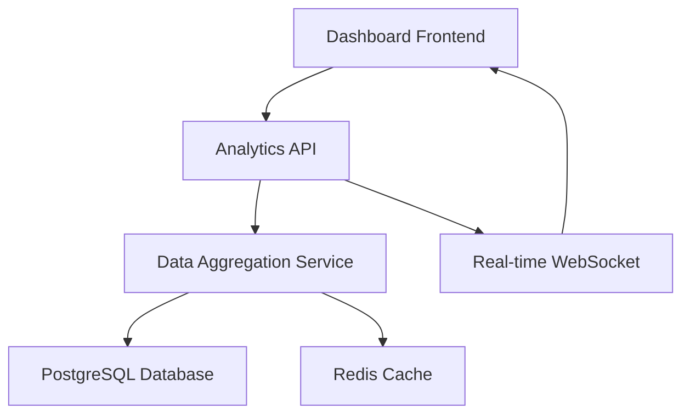
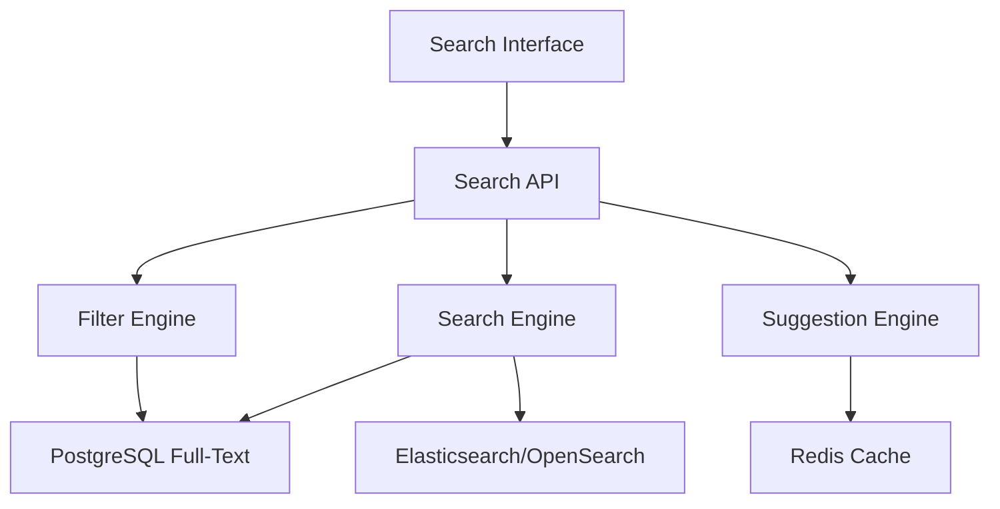
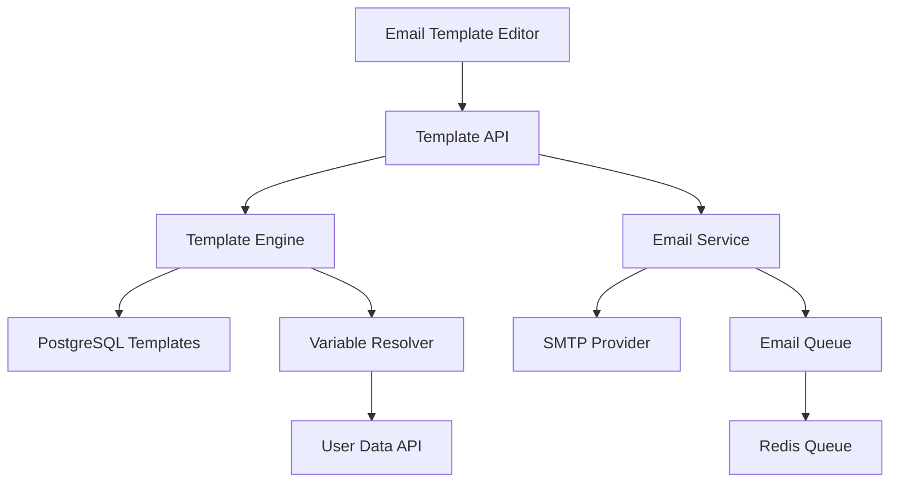
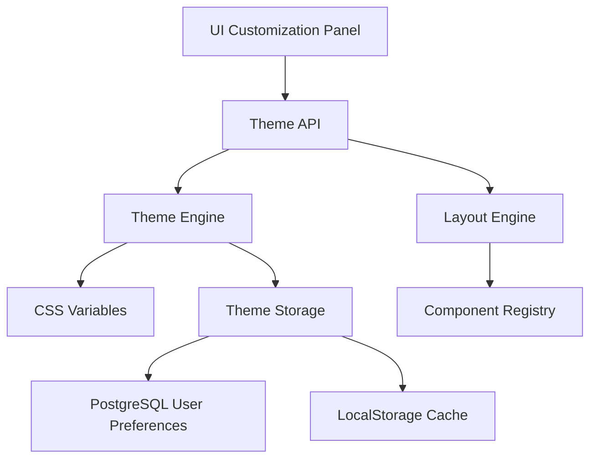

# Implementação de Funcionalidades Prioritárias - Caminhos de Hekate

## 1. Visão Geral

Este documento detalha a implementação técnica de 4 funcionalidades prioritárias identificadas no roadmap:
1. **Dashboard Analytics** (Prioridade Alta)
2. **Busca Avançada** (Prioridade Média)
3. **Templates de Email** (Prioridade Média)
4. **Personalização de UI** (Prioridade Baixa)

## 2. Dashboard Analytics (Prioridade Alta)

### 2.1 Visão Geral
Sistema completo de analytics para dashboard administrativo e do usuário com métricas em tempo real, gráficos interativos e relatórios personalizáveis.

### 2.2 Componentes Principais

#### 2.2.1 Métricas de Usuário
- **Progresso de Cursos**: Percentual de conclusão, tempo gasto, lições completadas
- **Atividade Recente**: Últimas ações, login frequency, engagement
- **Performance**: Pontuações em quizzes, certificados obtidos

#### 2.2.2 Métricas Administrativas
- **Usuários**: Registros, atividade, retenção, churn rate
- **Cursos**: Popularidade, taxa de conclusão, feedback
- **Vendas**: Revenue, conversões, produtos mais vendidos
- **Comunidade**: Posts, comentários, engajamento

### 2.3 Arquitetura Técnica



### 2.4 APIs Necessárias

#### 2.4.1 User Analytics API
```typescript
// GET /api/analytics/user/[userId]
interface UserAnalytics {
  userId: string;
  coursesProgress: CourseProgress[];
  totalStudyTime: number;
  completedLessons: number;
  certificatesEarned: number;
  quizScores: QuizScore[];
  activityTimeline: Activity[];
  learningStreak: number;
}

interface CourseProgress {
  courseId: string;
  title: string;
  progress: number; // 0-100
  timeSpent: number; // minutes
  lastAccessed: Date;
  completedLessons: number;
  totalLessons: number;
}
```

#### 2.4.2 Admin Analytics API
```typescript
// GET /api/analytics/admin/overview
interface AdminAnalytics {
  users: {
    total: number;
    active: number;
    newThisMonth: number;
    retentionRate: number;
  };
  courses: {
    total: number;
    published: number;
    averageCompletion: number;
    mostPopular: Course[];
  };
  revenue: {
    total: number;
    thisMonth: number;
    growth: number;
    topProducts: Product[];
  };
  community: {
    totalPosts: number;
    totalComments: number;
    activeUsers: number;
    engagementRate: number;
  };
}
```

### 2.5 Componentes React

#### 2.5.1 Dashboard Analytics Container
```typescript
// apps/web/src/components/dashboard/analytics/AnalyticsDashboard.tsx
import { useAnalytics } from '@/hooks/useAnalytics';
import { MetricsGrid } from './MetricsGrid';
import { ChartsSection } from './ChartsSection';
import { RealtimeUpdates } from './RealtimeUpdates';

export function AnalyticsDashboard({ userId, isAdmin }: AnalyticsDashboardProps) {
  const { data, loading, error } = useAnalytics(userId, isAdmin);
  
  return (
    <div className="analytics-dashboard">
      <MetricsGrid metrics={data?.metrics} />
      <ChartsSection data={data?.charts} />
      <RealtimeUpdates userId={userId} />
    </div>
  );
}
```

#### 2.5.2 Métricas Grid
```typescript
// apps/web/src/components/dashboard/analytics/MetricsGrid.tsx
export function MetricsGrid({ metrics }: MetricsGridProps) {
  return (
    <div className="grid grid-cols-1 md:grid-cols-2 lg:grid-cols-4 gap-6">
      <MetricCard
        title="Progresso Total"
        value={`${metrics.overallProgress}%`}
        icon={<TrendingUpIcon />}
        trend={metrics.progressTrend}
      />
      <MetricCard
        title="Tempo de Estudo"
        value={formatTime(metrics.studyTime)}
        icon={<ClockIcon />}
        trend={metrics.timeTrend}
      />
      {/* More metric cards */}
    </div>
  );
}
```

### 2.6 Integração com Banco de Dados

#### 2.6.1 Queries de Analytics
```sql
-- Progresso do usuário por curso
SELECT 
  c.id,
  c.title,
  COUNT(p.id) * 100.0 / COUNT(l.id) as progress_percentage,
  SUM(p.video_time) as total_time_spent
FROM courses c
JOIN modules m ON c.id = m.course_id
JOIN lessons l ON m.id = l.module_id
LEFT JOIN progress p ON l.id = p.lesson_id AND p.user_id = $1
WHERE c.id IN (SELECT course_id FROM enrollments WHERE user_id = $1)
GROUP BY c.id, c.title;

-- Métricas administrativas
SELECT 
  COUNT(*) as total_users,
  COUNT(CASE WHEN last_login > NOW() - INTERVAL '30 days' THEN 1 END) as active_users,
  COUNT(CASE WHEN created_at > NOW() - INTERVAL '30 days' THEN 1 END) as new_users
FROM users;
```

## 3. Busca Avançada (Prioridade Média)

### 3.1 Visão Geral
Sistema de busca avançada com filtros múltiplos, ordenação, busca semântica e sugestões inteligentes.

### 3.2 Funcionalidades

#### 3.2.1 Tipos de Busca
- **Busca Textual**: Full-text search em títulos, descrições, conteúdo
- **Busca por Filtros**: Categoria, nível, preço, duração, instrutor
- **Busca Semântica**: Busca por conceitos e temas relacionados
- **Busca por Tags**: Sistema de tags hierárquico

#### 3.2.2 Filtros Disponíveis
- **Cursos**: Nível, categoria, duração, preço, instrutor, idioma
- **Produtos**: Categoria, preço, disponibilidade, tipo
- **Posts**: Tópico, autor, data, popularidade
- **Usuários**: Role, status, data de registro

### 3.3 Arquitetura Técnica



### 3.4 APIs de Busca

#### 3.4.1 Search API
```typescript
// POST /api/search
interface SearchRequest {
  query: string;
  type: 'courses' | 'products' | 'posts' | 'users' | 'all';
  filters: SearchFilters;
  sort: SortOptions;
  pagination: PaginationOptions;
}

interface SearchFilters {
  categories?: string[];
  levels?: CourseLevel[];
  priceRange?: { min: number; max: number };
  duration?: { min: number; max: number };
  tags?: string[];
  dateRange?: { start: Date; end: Date };
}

interface SearchResponse<T> {
  results: T[];
  total: number;
  facets: SearchFacets;
  suggestions: string[];
  pagination: PaginationInfo;
}
```

#### 3.4.2 Suggestions API
```typescript
// GET /api/search/suggestions?q={query}
interface SuggestionsResponse {
  suggestions: {
    text: string;
    type: 'course' | 'product' | 'tag' | 'category';
    count: number;
  }[];
  popular: string[];
  recent: string[];
}
```

### 3.5 Componentes React

#### 3.5.1 Search Container
```typescript
// apps/web/src/components/search/AdvancedSearch.tsx
export function AdvancedSearch() {
  const [query, setQuery] = useState('');
  const [filters, setFilters] = useState<SearchFilters>({});
  const [results, setResults] = useState<SearchResponse<any>>();
  
  const { search, loading } = useAdvancedSearch();
  
  return (
    <div className="advanced-search">
      <SearchInput 
        value={query}
        onChange={setQuery}
        onSearch={handleSearch}
        suggestions={suggestions}
      />
      <SearchFilters 
        filters={filters}
        onChange={setFilters}
        facets={results?.facets}
      />
      <SearchResults 
        results={results?.results}
        loading={loading}
        total={results?.total}
      />
    </div>
  );
}
```

#### 3.5.2 Search Filters
```typescript
// apps/web/src/components/search/SearchFilters.tsx
export function SearchFilters({ filters, onChange, facets }: SearchFiltersProps) {
  return (
    <div className="search-filters">
      <FilterGroup title="Categoria">
        {facets?.categories.map(category => (
          <FilterCheckbox
            key={category.value}
            label={`${category.label} (${category.count})`}
            checked={filters.categories?.includes(category.value)}
            onChange={(checked) => handleCategoryChange(category.value, checked)}
          />
        ))}
      </FilterGroup>
      
      <FilterGroup title="Nível">
        <FilterSelect
          options={levelOptions}
          value={filters.levels}
          onChange={(levels) => onChange({ ...filters, levels })}
          multiple
        />
      </FilterGroup>
      
      <FilterGroup title="Preço">
        <PriceRangeSlider
          min={0}
          max={1000}
          value={filters.priceRange}
          onChange={(priceRange) => onChange({ ...filters, priceRange })}
        />
      </FilterGroup>
    </div>
  );
}
```

### 3.6 Implementação de Full-Text Search

#### 3.6.1 PostgreSQL Configuration
```sql
-- Criar índices de full-text search
CREATE INDEX idx_courses_search ON courses USING GIN(
  to_tsvector('portuguese', title || ' ' || description || ' ' || COALESCE(short_description, ''))
);

CREATE INDEX idx_products_search ON products USING GIN(
  to_tsvector('portuguese', name || ' ' || description)
);

-- Função de busca
CREATE OR REPLACE FUNCTION search_courses(search_query text)
RETURNS TABLE(
  id text,
  title text,
  description text,
  rank real
) AS $$
BEGIN
  RETURN QUERY
  SELECT 
    c.id,
    c.title,
    c.description,
    ts_rank(to_tsvector('portuguese', c.title || ' ' || c.description), plainto_tsquery('portuguese', search_query)) as rank
  FROM courses c
  WHERE to_tsvector('portuguese', c.title || ' ' || c.description) @@ plainto_tsquery('portuguese', search_query)
  ORDER BY rank DESC;
END;
$$ LANGUAGE plpgsql;
```

## 4. Templates de Email (Prioridade Média)

### 4.1 Visão Geral
Sistema robusto de templates de email com personalização dinâmica, preview em tempo real e suporte a múltiplos idiomas.

### 4.2 Funcionalidades

#### 4.2.1 Tipos de Templates
- **Autenticação**: Verificação de email, reset de senha, 2FA
- **Cursos**: Boas-vindas, progresso, conclusão, certificados
- **Vendas**: Confirmação de pedido, pagamento, entrega
- **Marketing**: Newsletter, promoções, anúncios
- **Sistema**: Notificações, alertas, manutenção

#### 4.2.2 Recursos Avançados
- **Editor Visual**: WYSIWYG editor com drag-and-drop
- **Variáveis Dinâmicas**: Personalização com dados do usuário
- **Condicionais**: Conteúdo baseado em condições
- **Multilíngue**: Suporte a múltiplos idiomas
- **Preview**: Visualização em diferentes dispositivos
- **A/B Testing**: Testes de diferentes versões

### 4.3 Arquitetura Técnica



### 4.4 Modelo de Dados

#### 4.4.1 Email Templates Schema
```typescript
interface EmailTemplate {
  id: string;
  name: string;
  type: EmailTemplateType;
  subject: string;
  htmlContent: string;
  textContent: string;
  variables: TemplateVariable[];
  conditions: TemplateCondition[];
  language: string;
  isActive: boolean;
  version: number;
  createdAt: Date;
  updatedAt: Date;
}

interface TemplateVariable {
  name: string;
  type: 'string' | 'number' | 'date' | 'boolean' | 'object';
  required: boolean;
  defaultValue?: any;
  description: string;
}

interface TemplateCondition {
  field: string;
  operator: 'equals' | 'not_equals' | 'contains' | 'greater_than' | 'less_than';
  value: any;
  content: string;
}
```

### 4.5 APIs de Templates

#### 4.5.1 Template Management API
```typescript
// GET /api/email-templates
// POST /api/email-templates
// PUT /api/email-templates/[id]
// DELETE /api/email-templates/[id]

interface CreateTemplateRequest {
  name: string;
  type: EmailTemplateType;
  subject: string;
  htmlContent: string;
  textContent?: string;
  variables: TemplateVariable[];
  language: string;
}

// POST /api/email-templates/[id]/send
interface SendEmailRequest {
  to: string | string[];
  variables: Record<string, any>;
  scheduleAt?: Date;
}
```

#### 4.5.2 Template Preview API
```typescript
// POST /api/email-templates/preview
interface PreviewRequest {
  templateId: string;
  variables: Record<string, any>;
  device: 'desktop' | 'mobile' | 'tablet';
}

interface PreviewResponse {
  html: string;
  text: string;
  subject: string;
  screenshots: {
    desktop: string;
    mobile: string;
    tablet: string;
  };
}
```

### 4.6 Componentes React

#### 4.6.1 Template Editor
```typescript
// apps/web/src/components/email/TemplateEditor.tsx
import { EmailEditor } from 'react-email-editor';

export function TemplateEditor({ template, onSave }: TemplateEditorProps) {
  const [design, setDesign] = useState(template?.design);
  const [variables, setVariables] = useState(template?.variables || []);
  
  return (
    <div className="template-editor">
      <div className="editor-toolbar">
        <VariableManager 
          variables={variables}
          onChange={setVariables}
        />
        <PreviewButton 
          template={template}
          variables={variables}
        />
        <SaveButton 
          onSave={() => handleSave(design, variables)}
        />
      </div>
      
      <EmailEditor
        ref={emailEditorRef}
        onLoad={onEditorLoad}
        onDesignLoad={onDesignLoad}
        options={{
          displayMode: 'email',
          locale: 'pt-BR'
        }}
      />
    </div>
  );
}
```

#### 4.6.2 Template Preview
```typescript
// apps/web/src/components/email/TemplatePreview.tsx
export function TemplatePreview({ templateId, variables }: TemplatePreviewProps) {
  const [preview, setPreview] = useState<PreviewResponse>();
  const [device, setDevice] = useState<'desktop' | 'mobile' | 'tablet'>('desktop');
  
  return (
    <div className="template-preview">
      <div className="preview-controls">
        <DeviceSelector value={device} onChange={setDevice} />
        <VariableInputs variables={variables} onChange={setVariables} />
      </div>
      
      <div className="preview-container">
        <iframe
          srcDoc={preview?.html}
          className={`preview-frame ${device}`}
        />
      </div>
    </div>
  );
}
```

### 4.7 Template Engine

#### 4.7.1 Variable Resolution
```typescript
// packages/email/src/templateEngine.ts
export class TemplateEngine {
  async renderTemplate(
    template: EmailTemplate,
    variables: Record<string, any>,
    user?: User
  ): Promise<RenderedEmail> {
    // Resolve variables
    const resolvedVariables = await this.resolveVariables(variables, user);
    
    // Process conditions
    const processedContent = this.processConditions(
      template.htmlContent,
      resolvedVariables
    );
    
    // Render template
    const html = this.renderHandlebars(processedContent, resolvedVariables);
    const text = this.renderHandlebars(template.textContent, resolvedVariables);
    const subject = this.renderHandlebars(template.subject, resolvedVariables);
    
    return { html, text, subject };
  }
  
  private async resolveVariables(
    variables: Record<string, any>,
    user?: User
  ): Promise<Record<string, any>> {
    return {
      ...variables,
      user: user ? {
        name: user.name,
        email: user.email,
        firstName: user.name.split(' ')[0]
      } : {},
      site: {
        name: 'Caminhos de Hekate',
        url: process.env.NEXT_PUBLIC_APP_URL
      },
      date: new Date().toLocaleDateString('pt-BR')
    };
  }
}
```

## 5. Personalização de UI (Prioridade Baixa)

### 5.1 Visão Geral
Sistema completo de personalização da interface do usuário com temas customizáveis, layouts flexíveis e preferências salvas.

### 5.2 Funcionalidades

#### 5.2.1 Temas
- **Temas Pré-definidos**: Light, Dark, High Contrast, Sepia
- **Temas Customizados**: Criação de temas personalizados
- **Cores**: Paleta de cores customizável
- **Tipografia**: Seleção de fontes e tamanhos
- **Espaçamento**: Densidade da interface

#### 5.2.2 Layout
- **Sidebar**: Posição (esquerda/direita), largura, collapse
- **Header**: Altura, elementos visíveis
- **Dashboard**: Organização de widgets, grid customizável
- **Cards**: Estilo, tamanho, informações exibidas

#### 5.2.3 Preferências
- **Idioma**: Seleção de idioma da interface
- **Timezone**: Fuso horário para datas
- **Notificações**: Tipos e frequência
- **Acessibilidade**: Contraste, tamanho de fonte, animações

### 5.3 Arquitetura Técnica



### 5.4 Modelo de Dados

#### 5.4.1 User Preferences Schema
```typescript
interface UserPreferences {
  id: string;
  userId: string;
  theme: {
    name: string;
    colors: {
      primary: string;
      secondary: string;
      background: string;
      surface: string;
      text: string;
      accent: string;
    };
    typography: {
      fontFamily: string;
      fontSize: 'small' | 'medium' | 'large';
      lineHeight: number;
    };
    spacing: 'compact' | 'comfortable' | 'spacious';
  };
  layout: {
    sidebar: {
      position: 'left' | 'right';
      width: number;
      collapsed: boolean;
    };
    header: {
      height: number;
      showBreadcrumbs: boolean;
      showSearch: boolean;
    };
    dashboard: {
      widgets: DashboardWidget[];
      columns: number;
    };
  };
  accessibility: {
    highContrast: boolean;
    reduceMotion: boolean;
    screenReader: boolean;
  };
  locale: string;
  timezone: string;
}

interface DashboardWidget {
  id: string;
  type: string;
  position: { x: number; y: number };
  size: { width: number; height: number };
  config: Record<string, any>;
  visible: boolean;
}
```

### 5.5 APIs de Personalização

#### 5.5.1 Preferences API
```typescript
// GET /api/user/preferences
// PUT /api/user/preferences

interface UpdatePreferencesRequest {
  theme?: Partial<ThemeConfig>;
  layout?: Partial<LayoutConfig>;
  accessibility?: Partial<AccessibilityConfig>;
  locale?: string;
  timezone?: string;
}

// GET /api/themes
interface ThemesResponse {
  predefined: Theme[];
  custom: Theme[];
}

// POST /api/themes
interface CreateThemeRequest {
  name: string;
  colors: ColorPalette;
  typography: TypographyConfig;
  spacing: SpacingConfig;
}
```

### 5.6 Componentes React

#### 5.6.1 Theme Provider
```typescript
// apps/web/src/components/theme/ThemeProvider.tsx
export function ThemeProvider({ children }: ThemeProviderProps) {
  const [theme, setTheme] = useState<Theme>();
  const [preferences, setPreferences] = useState<UserPreferences>();
  
  useEffect(() => {
    // Load user preferences
    loadUserPreferences().then(setPreferences);
  }, []);
  
  useEffect(() => {
    if (preferences?.theme) {
      // Apply CSS variables
      applyThemeVariables(preferences.theme);
      setTheme(preferences.theme);
    }
  }, [preferences]);
  
  return (
    <ThemeContext.Provider value={{ theme, setTheme, preferences, setPreferences }}>
      <div className={`theme-${theme?.name} spacing-${theme?.spacing}`}>
        {children}
      </div>
    </ThemeContext.Provider>
  );
}
```

#### 5.6.2 Customization Panel
```typescript
// apps/web/src/components/customization/CustomizationPanel.tsx
export function CustomizationPanel() {
  const { theme, preferences, updatePreferences } = useTheme();
  const [activeTab, setActiveTab] = useState('theme');
  
  return (
    <div className="customization-panel">
      <div className="panel-tabs">
        <Tab active={activeTab === 'theme'} onClick={() => setActiveTab('theme')}>
          Tema
        </Tab>
        <Tab active={activeTab === 'layout'} onClick={() => setActiveTab('layout')}>
          Layout
        </Tab>
        <Tab active={activeTab === 'accessibility'} onClick={() => setActiveTab('accessibility')}>
          Acessibilidade
        </Tab>
      </div>
      
      <div className="panel-content">
        {activeTab === 'theme' && (
          <ThemeCustomization 
            theme={theme}
            onChange={(newTheme) => updatePreferences({ theme: newTheme })}
          />
        )}
        {activeTab === 'layout' && (
          <LayoutCustomization 
            layout={preferences?.layout}
            onChange={(newLayout) => updatePreferences({ layout: newLayout })}
          />
        )}
        {activeTab === 'accessibility' && (
          <AccessibilitySettings 
            settings={preferences?.accessibility}
            onChange={(newSettings) => updatePreferences({ accessibility: newSettings })}
          />
        )}
      </div>
    </div>
  );
}
```

#### 5.6.3 Theme Customization
```typescript
// apps/web/src/components/customization/ThemeCustomization.tsx
export function ThemeCustomization({ theme, onChange }: ThemeCustomizationProps) {
  return (
    <div className="theme-customization">
      <div className="section">
        <h3>Cores</h3>
        <ColorPicker
          label="Cor Primária"
          value={theme.colors.primary}
          onChange={(color) => onChange({
            ...theme,
            colors: { ...theme.colors, primary: color }
          })}
        />
        <ColorPicker
          label="Cor Secundária"
          value={theme.colors.secondary}
          onChange={(color) => onChange({
            ...theme,
            colors: { ...theme.colors, secondary: color }
          })}
        />
        {/* More color pickers */}
      </div>
      
      <div className="section">
        <h3>Tipografia</h3>
        <Select
          label="Fonte"
          value={theme.typography.fontFamily}
          options={fontOptions}
          onChange={(font) => onChange({
            ...theme,
            typography: { ...theme.typography, fontFamily: font }
          })}
        />
        <Select
          label="Tamanho"
          value={theme.typography.fontSize}
          options={[{ value: 'small', label: 'Pequeno' }, { value: 'medium', label: 'Médio' }, { value: 'large', label: 'Grande' }]}
          onChange={(size) => onChange({
            ...theme,
            typography: { ...theme.typography, fontSize: size }
          })}
        />
      </div>
      
      <div className="section">
        <h3>Espaçamento</h3>
        <RadioGroup
          value={theme.spacing}
          options={[
            { value: 'compact', label: 'Compacto' },
            { value: 'comfortable', label: 'Confortável' },
            { value: 'spacious', label: 'Espaçoso' }
          ]}
          onChange={(spacing) => onChange({ ...theme, spacing })}
        />
      </div>
    </div>
  );
}
```

### 5.7 CSS Variables System

#### 5.7.1 Theme Variables
```css
/* apps/web/src/styles/themes.css */
:root {
  /* Default Light Theme */
  --color-primary: #8B5CF6;
  --color-secondary: #06B6D4;
  --color-background: #FFFFFF;
  --color-surface: #F8FAFC;
  --color-text: #1E293B;
  --color-accent: #F59E0B;
  
  /* Typography */
  --font-family: 'Inter', sans-serif;
  --font-size-base: 16px;
  --line-height-base: 1.5;
  
  /* Spacing */
  --spacing-unit: 1rem;
  --spacing-xs: calc(var(--spacing-unit) * 0.25);
  --spacing-sm: calc(var(--spacing-unit) * 0.5);
  --spacing-md: var(--spacing-unit);
  --spacing-lg: calc(var(--spacing-unit) * 1.5);
  --spacing-xl: calc(var(--spacing-unit) * 2);
}

.theme-dark {
  --color-background: #0F172A;
  --color-surface: #1E293B;
  --color-text: #F1F5F9;
}

.spacing-compact {
  --spacing-unit: 0.75rem;
}

.spacing-spacious {
  --spacing-unit: 1.25rem;
}
```

## 6. Plano de Implementação

### 6.1 Fase 1: Dashboard Analytics (Semana 1-2)
1. **Semana 1**:
   - Criar APIs de analytics para usuário e admin
   - Implementar queries de banco de dados otimizadas
   - Desenvolver componentes básicos de métricas

2. **Semana 2**:
   - Adicionar gráficos interativos com Chart.js/Recharts
   - Implementar atualizações em tempo real com WebSocket
   - Criar dashboard responsivo

### 6.2 Fase 2: Busca Avançada (Semana 3-4)
1. **Semana 3**:
   - Configurar full-text search no PostgreSQL
   - Criar APIs de busca com filtros
   - Implementar componente de busca básico

2. **Semana 4**:
   - Adicionar filtros avançados e facetas
   - Implementar sugestões e autocomplete
   - Otimizar performance com cache

### 6.3 Fase 3: Templates de Email (Semana 5-6)
1. **Semana 5**:
   - Criar sistema de templates no banco
   - Implementar template engine com Handlebars
   - Desenvolver editor básico

2. **Semana 6**:
   - Adicionar preview em tempo real
   - Implementar sistema de variáveis
   - Criar templates padrão

### 6.4 Fase 4: Personalização de UI (Semana 7-8)
1. **Semana 7**:
   - Implementar sistema de temas com CSS variables
   - Criar componentes de customização
   - Adicionar persistência de preferências

2. **Semana 8**:
   - Finalizar customização de layout
   - Implementar configurações de acessibilidade
   - Testes e refinamentos

## 7. Considerações Técnicas

### 7.1 Performance
- **Cache**: Redis para dados frequentemente acessados
- **Lazy Loading**: Componentes carregados sob demanda
- **Debouncing**: Para buscas e atualizações em tempo real
- **Pagination**: Para listas grandes
- **Indexação**: Índices otimizados no PostgreSQL

### 7.2 Segurança
- **Autorização**: Verificação de permissões em todas as APIs
- **Sanitização**: Limpeza de inputs do usuário
- **Rate Limiting**: Proteção contra abuse
- **CORS**: Configuração adequada para APIs

### 7.3 Acessibilidade
- **ARIA**: Labels e roles adequados
- **Keyboard Navigation**: Navegação completa por teclado
- **Screen Readers**: Compatibilidade com leitores de tela
- **Color Contrast**: Contraste adequado em todos os temas

### 7.4 Testes
- **Unit Tests**: Jest para lógica de negócio
- **Integration Tests**: Cypress para fluxos completos
- **API Tests**: Testes automatizados para todas as APIs
- **Performance Tests**: Lighthouse para métricas de performance

## 8. Métricas de Sucesso

### 8.1 Dashboard Analytics
- Tempo de carregamento < 2s
- Atualizações em tempo real funcionando
- 100% dos dados mock substituídos
- Métricas precisas e atualizadas

### 8.2 Busca Avançada
- Resultados relevantes em < 500ms
- Filtros funcionando corretamente
- Sugestões inteligentes implementadas
- Busca semântica operacional

### 8.3 Templates de Email
- Editor visual funcional
- Preview em tempo real
- Variáveis dinâmicas funcionando
- Templates responsivos

### 8.4 Personalização de UI
- Temas aplicados corretamente
- Preferências persistidas
- Interface acessível
- Customização completa disponível

Este documento serve como guia técnico completo para a implementação das 4 funcionalidades prioritárias, garantindo uma abordagem estruturada e eficiente para o desenvolvimento.