# Fase 7: Comunidade e Configurações - Requisitos do Produto

## 1. Visão Geral do Produto

A Fase 7 implementa o sistema completo de comunidade e configurações administrativas para o painel administrativo dos Caminhos de Hekate. Esta fase permite aos administradores gerenciar fóruns de discussão, moderar conteúdo da comunidade e configurar aspectos fundamentais do sistema.

O objetivo é criar uma plataforma robusta de comunidade com ferramentas avançadas de moderação e um sistema flexível de configurações que permita personalizar completamente a experiência do usuário e as funcionalidades do sistema.

## 2. Funcionalidades Principais

### 2.1 Papéis de Usuário

| Papel | Método de Registro | Permissões Principais |
|-------|-------------------|----------------------|
| Administrador | Acesso direto ao sistema | Acesso completo a todas as funcionalidades de comunidade e configurações |
| Editor | Promovido pelo Administrador | Pode moderar posts e comentários, gerenciar tópicos, mas não pode alterar configurações do sistema |
| Moderador | Designado pelo Administrador | Pode moderar conteúdo da comunidade e resolver relatórios |

### 2.2 Módulos de Funcionalidades

Nossos requisitos da Fase 7 consistem nas seguintes páginas principais:

1. **Dashboard da Comunidade**: estatísticas gerais, atividade recente, alertas de moderação
2. **Gerenciamento de Tópicos**: criação, edição, organização e arquivamento de tópicos de discussão
3. **Moderação de Posts**: aprovação, rejeição, edição e remoção de posts da comunidade
4. **Moderação de Comentários**: gerenciamento de comentários, respostas aninhadas e ações em lote
5. **Sistema de Relatórios**: processamento de denúncias, categorização e resolução de problemas
6. **Configurações Gerais**: personalização do site, informações básicas e preferências globais
7. **Templates de Email**: criação, edição e gerenciamento de templates para comunicações automáticas
8. **Configurações de Integrações**: gerenciamento de APIs externas, webhooks e serviços terceirizados

### 2.3 Detalhes das Páginas

| Nome da Página | Nome do Módulo | Descrição da Funcionalidade |
|----------------|----------------|-----------------------------|
| Dashboard da Comunidade | Estatísticas Gerais | Exibir métricas de posts, comentários, usuários ativos e relatórios pendentes com gráficos interativos |
| Dashboard da Comunidade | Atividade Recente | Mostrar timeline de atividades recentes da comunidade com filtros por tipo e data |
| Dashboard da Comunidade | Alertas de Moderação | Notificações em tempo real sobre conteúdo que requer atenção dos moderadores |
| Gerenciamento de Tópicos | Lista de Tópicos | Visualizar todos os tópicos com filtros por status, categoria e data de criação |
| Gerenciamento de Tópicos | Formulário de Tópico | Criar e editar tópicos com título, descrição, categoria e configurações de visibilidade |
| Gerenciamento de Tópicos | Ações em Lote | Fixar, arquivar, bloquear ou deletar múltiplos tópicos simultaneamente |
| Moderação de Posts | Lista de Posts | Visualizar posts com filtros por status, tópico, autor e data com sistema de busca avançada |
| Moderação de Posts | Detalhes do Post | Visualizar conteúdo completo, histórico de edições e ações de moderação disponíveis |
| Moderação de Posts | Painel de Moderação | Aprovar, rejeitar, editar ou remover posts com justificativas e notificações automáticas |
| Moderação de Comentários | Lista de Comentários | Visualizar comentários com hierarquia de respostas e filtros por status e conteúdo |
| Moderação de Comentários | Ações de Moderação | Moderar comentários individuais ou em lote com opções de edição e remoção |
| Sistema de Relatórios | Lista de Relatórios | Visualizar todas as denúncias com priorização automática e filtros por tipo e status |
| Sistema de Relatórios | Detalhes do Relatório | Analisar denúncia completa com contexto, histórico e ações de resolução disponíveis |
| Sistema de Relatórios | Resolução de Relatórios | Processar denúncias com ações corretivas, notificações e documentação da resolução |
| Configurações Gerais | Informações do Site | Configurar nome, descrição, logos, cores e informações de contato do sistema |
| Configurações Gerais | Preferências Globais | Definir configurações de registro, moderação automática e políticas de conteúdo |
| Templates de Email | Lista de Templates | Gerenciar todos os templates com preview, status de ativação e categorização |
| Templates de Email | Editor de Template | Criar e editar templates com editor WYSIWYG, variáveis dinâmicas e preview em tempo real |
| Templates de Email | Teste de Template | Enviar emails de teste e validar renderização em diferentes clientes de email |
| Configurações de Integrações | APIs Externas | Configurar chaves de API, webhooks e integrações com serviços terceirizados |
| Configurações de Integrações | Monitoramento | Visualizar logs de integrações, status de conexões e métricas de uso |

## 3. Processo Principal

### Fluxo do Administrador

O administrador acessa o dashboard da comunidade para visualizar estatísticas gerais e atividades recentes. A partir daí, pode navegar para diferentes seções de moderação conforme necessário. Para gerenciar tópicos, acessa a lista de tópicos, onde pode criar novos tópicos ou editar existentes. Na moderação de posts, revisa conteúdo pendente e toma ações apropriadas. O sistema de relatórios permite processar denúncias de forma eficiente. As configurações gerais permitem personalizar aspectos fundamentais do sistema, enquanto os templates de email facilitam a comunicação automatizada.

### Fluxo do Editor/Moderador

Editores e moderadores têm acesso limitado focado em suas responsabilidades específicas. Podem acessar o dashboard para ver atividades relevantes, moderar posts e comentários conforme suas permissões, e processar relatórios dentro de seu escopo de autoridade. Não têm acesso às configurações do sistema ou templates de email.

```mermaid
graph TD
    A[Dashboard da Comunidade] --> B[Gerenciamento de Tópicos]
    A --> C[Moderação de Posts]
    A --> D[Moderação de Comentários]
    A --> E[Sistema de Relatórios]
    A --> F[Configurações Gerais]
    A --> G[Templates de Email]
    A --> H[Configurações de Integrações]
    
    B --> B1[Lista de Tópicos]
    B --> B2[Criar/Editar Tópico]
    
    C --> C1[Lista de Posts]
    C --> C2[Detalhes do Post]
    C --> C3[Ações de Moderação]
    
    D --> D1[Lista de Comentários]
    D --> D2[Moderação em Lote]
    
    E --> E1[Lista de Relatórios]
    E --> E2[Detalhes do Relatório]
    E --> E3[Resolução]
    
    F --> F1[Informações do Site]
    F --> F2[Preferências Globais]
    
    G --> G1[Lista de Templates]
    G --> G2[Editor de Template]
    G --> G3[Teste de Template]
    
    H --> H1[APIs Externas]
    H --> H2[Monitoramento]
```

## 4. Design da Interface do Usuário

### 4.1 Estilo de Design

- **Cores Primárias**: #7C3AED (roxo principal), #F3F4F6 (cinza claro para backgrounds)
- **Cores Secundárias**: #10B981 (verde para ações positivas), #EF4444 (vermelho para ações de remoção), #F59E0B (amarelo para alertas)
- **Estilo de Botões**: Botões arredondados com sombras sutis, estados hover bem definidos
- **Fonte**: Inter para textos gerais (14px-16px), títulos em 18px-24px com peso semibold
- **Layout**: Design baseado em cards com navegação lateral fixa, breadcrumbs para orientação
- **Ícones**: Lucide React com estilo minimalista, tamanho 16px-20px para ações, 24px para navegação

### 4.2 Visão Geral do Design das Páginas

| Nome da Página | Nome do Módulo | Elementos da UI |
|----------------|----------------|----------------|
| Dashboard da Comunidade | Estatísticas Gerais | Cards com métricas, gráficos de linha e barras usando Recharts, cores #7C3AED e #10B981 |
| Dashboard da Comunidade | Atividade Recente | Timeline vertical com avatares, timestamps relativos, badges de status coloridos |
| Dashboard da Comunidade | Alertas de Moderação | Lista com badges de prioridade, botões de ação rápida, notificações em tempo real |
| Gerenciamento de Tópicos | Lista de Tópicos | Tabela responsiva com filtros dropdown, ações em lote, paginação inferior |
| Gerenciamento de Tópicos | Formulário de Tópico | Formulário em duas colunas, campos de texto com validação, toggle switches para opções |
| Moderação de Posts | Lista de Posts | Cards de post com preview, badges de status, botões de ação coloridos por tipo |
| Moderação de Posts | Detalhes do Post | Layout de duas colunas, conteúdo principal à esquerda, ações à direita |
| Sistema de Relatórios | Lista de Relatórios | Tabela com indicadores de prioridade, filtros por categoria, ações rápidas |
| Configurações Gerais | Informações do Site | Formulário organizado em seções, upload de imagens com preview, campos agrupados |
| Templates de Email | Editor de Template | Editor WYSIWYG com toolbar, preview ao vivo, painel de variáveis lateral |

### 4.3 Responsividade

O sistema é desktop-first com adaptação completa para tablets e dispositivos móveis. Em telas menores, a navegação lateral se transforma em menu hambúrguer, tabelas se tornam cards empilhados, e formulários se reorganizam em coluna única. Todas as ações de toque são otimizadas com áreas de clique adequadas (mínimo 44px) e feedback visual imediato.