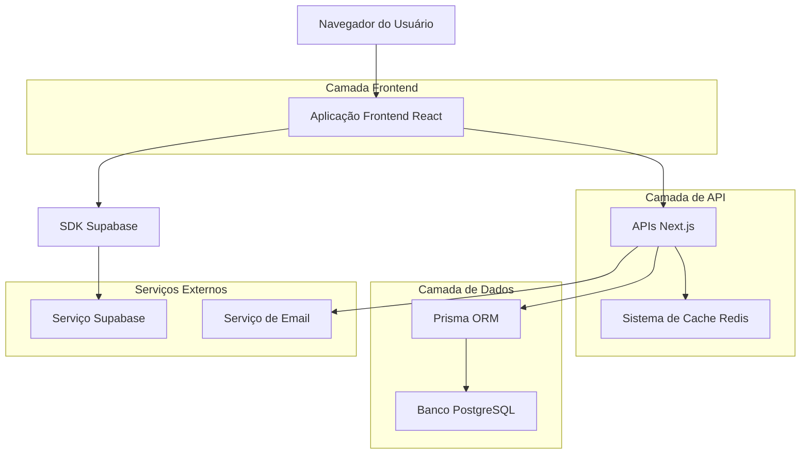
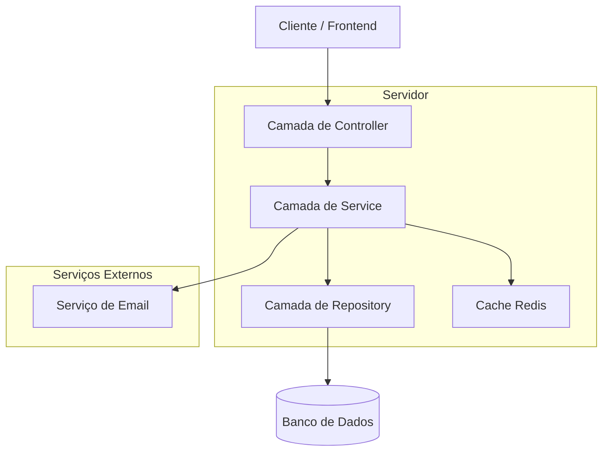
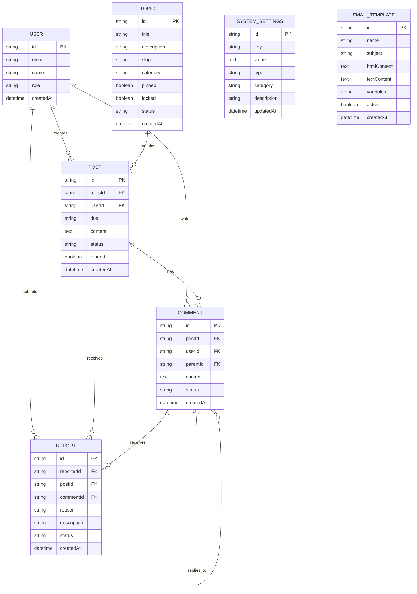

# Fase 7: Comunidade e Configurações - Arquitetura Técnica

## 1. Design da Arquitetura



## 2. Descrição das Tecnologias

* **Frontend**: React\@18 + TypeScript + Tailwind CSS\@3 + Next.js\@14

* **Backend**: Next.js API Routes + Prisma ORM

* **Banco de Dados**: Supabase (PostgreSQL)

* **Autenticação**: NextAuth.js integrado com Supabase

* **Validação**: Zod para schemas de validação

* **UI Components**: Radix UI + Lucide React Icons

* **Cache**: Redis para cache de configurações e sessões

* **Email**: Nodemailer com templates dinâmicos

## 3. Definições de Rotas

| Rota                                  | Propósito                                                       |
| ------------------------------------- | --------------------------------------------------------------- |
| /admin/community                      | Dashboard principal da comunidade com estatísticas e atividades |
| /admin/community/topics               | Lista e gerenciamento de tópicos de discussão                   |
| /admin/community/topics/\[id]         | Detalhes e edição de tópico específico                          |
| /admin/community/topics/new           | Criação de novo tópico                                          |
| /admin/community/posts                | Lista e moderação de posts da comunidade                        |
| /admin/community/posts/\[id]          | Detalhes e moderação de post específico                         |
| /admin/community/posts/moderation     | Painel de moderação em lote para posts                          |
| /admin/community/comments             | Lista e moderação de comentários                                |
| /admin/community/comments/moderation  | Painel de moderação em lote para comentários                    |
| /admin/community/reports              | Lista de relatórios e denúncias                                 |
| /admin/community/reports/\[id]        | Detalhes e resolução de relatório específico                    |
| /admin/settings                       | Configurações gerais do sistema                                 |
| /admin/settings/email                 | Configurações de email e SMTP                                   |
| /admin/settings/email/templates       | Lista de templates de email                                     |
| /admin/settings/email/templates/\[id] | Edição de template específico                                   |
| /admin/settings/email/templates/new   | Criação de novo template                                        |
| /admin/settings/integrations          | Configurações de integrações e APIs                             |
| /admin/settings/system                | Configurações avançadas do sistema                              |

## 4. Definições de API

### 4.1 APIs da Comunidade

**Gerenciamento de Tópicos**

```
GET /api/admin/community/topics
```

Request:

| Nome do Parâmetro | Tipo   | Obrigatório | Descrição                                     |
| ----------------- | ------ | ----------- | --------------------------------------------- |
| page              | number | false       | Número da página (padrão: 1)                  |
| limit             | number | false       | Itens por página (padrão: 10)                 |
| status            | string | false       | Filtro por status (ACTIVE, ARCHIVED, DELETED) |
| category          | string | false       | Filtro por categoria                          |
| search            | string | false       | Busca por título ou descrição                 |

Response:

| Nome do Parâmetro | Tipo     | Descrição        |
| ----------------- | -------- | ---------------- |
| topics            | Topic\[] | Lista de tópicos |
| total             | number   | Total de tópicos |
| page              | number   | Página atual     |
| totalPages        | number   | Total de páginas |

Exemplo:

```json
{
  "topics": [
    {
      "id": "topic_123",
      "title": "Discussão sobre Tarot",
      "description": "Espaço para discussões sobre cartas de tarot",
      "category": "Divinação",
      "status": "ACTIVE",
      "pinned": true,
      "locked": false,
      "createdAt": "2024-01-15T10:00:00Z",
      "_count": {
        "posts": 25
      }
    }
  ],
  "total": 50,
  "page": 1,
  "totalPages": 5
}
```

**Moderação de Posts**

```
PUT /api/admin/community/posts/moderation
```

Request:

| Nome do Parâmetro | Tipo      | Obrigatório | Descrição                                            |
| ----------------- | --------- | ----------- | ---------------------------------------------------- |
| postIds           | string\[] | true        | IDs dos posts para moderar                           |
| action            | string    | true        | Ação a ser executada (approve, reject, hide, delete) |
| reason            | string    | false       | Motivo da ação (obrigatório para reject/delete)      |

Response:

| Nome do Parâmetro | Tipo      | Descrição                   |
| ----------------- | --------- | --------------------------- |
| success           | boolean   | Status da operação          |
| processed         | number    | Número de posts processados |
| errors            | string\[] | Lista de erros, se houver   |

**Sistema de Relatórios**

```
GET /api/admin/community/reports
```

Request:

| Nome do Parâmetro | Tipo   | Obrigatório | Descrição                                                  |
| ----------------- | ------ | ----------- | ---------------------------------------------------------- |
| status            | string | false       | Filtro por status (PENDING, REVIEWED, RESOLVED, DISMISSED) |
| priority          | string | false       | Filtro por prioridade (LOW, MEDIUM, HIGH, URGENT)          |
| type              | string | false       | Tipo de conteúdo reportado (post, comment)                 |

Response:

| Nome do Parâmetro | Tipo      | Descrição                   |
| ----------------- | --------- | --------------------------- |
| reports           | Report\[] | Lista de relatórios         |
| stats             | object    | Estatísticas dos relatórios |

### 4.2 APIs de Configurações

**Configurações do Sistema**

```
GET /api/admin/settings
```

Response:

| Nome do Parâmetro | Tipo              | Descrição                       |
| ----------------- | ----------------- | ------------------------------- |
| settings          | SystemSettings\[] | Lista de todas as configurações |
| categories        | string\[]         | Categorias disponíveis          |

Exemplo:

```json
{
  "settings": [
    {
      "key": "site_name",
      "value": "Caminhos de Hekate",
      "type": "string",
      "category": "general",
      "description": "Nome do site exibido no cabeçalho"
    },
    {
      "key": "registration_enabled",
      "value": "true",
      "type": "boolean",
      "category": "general",
      "description": "Permitir novos registros de usuários"
    }
  ],
  "categories": ["general", "email", "payment", "community"]
}
```

**Templates de Email**

```
POST /api/admin/settings/email-templates
```

Request:

| Nome do Parâmetro | Tipo      | Obrigatório | Descrição                      |
| ----------------- | --------- | ----------- | ------------------------------ |
| name              | string    | true        | Nome único do template         |
| subject           | string    | true        | Assunto do email               |
| htmlContent       | string    | true        | Conteúdo HTML do template      |
| textContent       | string    | false       | Versão em texto plano          |
| variables         | string\[] | false       | Lista de variáveis disponíveis |

Response:

| Nome do Parâmetro | Tipo          | Descrição          |
| ----------------- | ------------- | ------------------ |
| template          | EmailTemplate | Template criado    |
| success           | boolean       | Status da operação |

## 5. Arquitetura do Servidor



## 6. Modelo de Dados

### 6.1 Definição do Modelo de Dados



### 6.2 Linguagem de Definição de Dados

**Tabela de Tópicos (topics)**

```sql
-- Criar tabela
CREATE TABLE topics (
    id VARCHAR(30) PRIMARY KEY DEFAULT gen_random_uuid(),
    title VARCHAR(200) NOT NULL,
    description TEXT,
    slug VARCHAR(250) UNIQUE NOT NULL,
    category VARCHAR(100),
    pinned BOOLEAN DEFAULT FALSE,
    locked BOOLEAN DEFAULT FALSE,
    status VARCHAR(20) DEFAULT 'ACTIVE' CHECK (status IN ('ACTIVE', 'ARCHIVED', 'DELETED')),
    created_at TIMESTAMP WITH TIME ZONE DEFAULT NOW(),
    updated_at TIMESTAMP WITH TIME ZONE DEFAULT NOW()
);

-- Criar índices
CREATE INDEX idx_topics_status ON topics(status);
CREATE INDEX idx_topics_category ON topics(category);
CREATE INDEX idx_topics_created_at ON topics(created_at DESC);
CREATE INDEX idx_topics_slug ON topics(slug);

-- Dados iniciais
INSERT INTO topics (title, slug, description, category, pinned) VALUES
('Bem-vindos aos Caminhos de Hekate', 'bem-vindos', 'Apresentações e boas-vindas à comunidade', 'Geral', TRUE),
('Discussões sobre Tarot', 'tarot-discussoes', 'Espaço para discussões sobre cartas de tarot', 'Divinação', FALSE),
('Rituais e Práticas', 'rituais-praticas', 'Compartilhamento de rituais e práticas espirituais', 'Práticas', FALSE);
```

**Tabela de Posts (posts)**

```sql
-- Criar tabela
CREATE TABLE posts (
    id VARCHAR(30) PRIMARY KEY DEFAULT gen_random_uuid(),
    topic_id VARCHAR(30) NOT NULL REFERENCES topics(id) ON DELETE CASCADE,
    user_id VARCHAR(30) NOT NULL REFERENCES users(id),
    title VARCHAR(300),
    content TEXT NOT NULL,
    status VARCHAR(20) DEFAULT 'PUBLISHED' CHECK (status IN ('DRAFT', 'PUBLISHED', 'HIDDEN', 'DELETED')),
    pinned BOOLEAN DEFAULT FALSE,
    created_at TIMESTAMP WITH TIME ZONE DEFAULT NOW(),
    updated_at TIMESTAMP WITH TIME ZONE DEFAULT NOW()
);

-- Criar índices
CREATE INDEX idx_posts_topic_id ON posts(topic_id);
CREATE INDEX idx_posts_user_id ON posts(user_id);
CREATE INDEX idx_posts_status ON posts(status);
CREATE INDEX idx_posts_created_at ON posts(created_at DESC);
CREATE INDEX idx_posts_pinned ON posts(pinned DESC, created_at DESC);
```

**Tabela de Comentários (comments)**

```sql
-- Criar tabela
CREATE TABLE comments (
    id VARCHAR(30) PRIMARY KEY DEFAULT gen_random_uuid(),
    post_id VARCHAR(30) NOT NULL REFERENCES posts(id) ON DELETE CASCADE,
    user_id VARCHAR(30) NOT NULL REFERENCES users(id),
    parent_id VARCHAR(30) REFERENCES comments(id),
    content TEXT NOT NULL,
    status VARCHAR(20) DEFAULT 'PUBLISHED' CHECK (status IN ('PUBLISHED', 'HIDDEN', 'DELETED')),
    created_at TIMESTAMP WITH TIME ZONE DEFAULT NOW(),
    updated_at TIMESTAMP WITH TIME ZONE DEFAULT NOW()
);

-- Criar índices
CREATE INDEX idx_comments_post_id ON comments(post_id);
CREATE INDEX idx_comments_user_id ON comments(user_id);
CREATE INDEX idx_comments_parent_id ON comments(parent_id);
CREATE INDEX idx_comments_status ON comments(status);
CREATE INDEX idx_comments_created_at ON comments(created_at DESC);
```

**Tabela de Relatórios (reports)**

```sql
-- Criar tabela
CREATE TABLE reports (
    id VARCHAR(30) PRIMARY KEY DEFAULT gen_random_uuid(),
    reporter_id VARCHAR(30) NOT NULL REFERENCES users(id),
    post_id VARCHAR(30) REFERENCES posts(id),
    comment_id VARCHAR(30) REFERENCES comments(id),
    reason VARCHAR(100) NOT NULL,
    description TEXT,
    status VARCHAR(20) DEFAULT 'PENDING' CHECK (status IN ('PENDING', 'REVIEWED', 'RESOLVED', 'DISMISSED')),
    created_at TIMESTAMP WITH TIME ZONE DEFAULT NOW(),
    updated_at TIMESTAMP WITH TIME ZONE DEFAULT NOW(),
    CONSTRAINT check_report_target CHECK (
        (post_id IS NOT NULL AND comment_id IS NULL) OR 
        (post_id IS NULL AND comment_id IS NOT NULL)
    )
);

-- Criar índices
CREATE INDEX idx_reports_reporter_id ON reports(reporter_id);
CREATE INDEX idx_reports_post_id ON reports(post_id);
CREATE INDEX idx_reports_comment_id ON reports(comment_id);
CREATE INDEX idx_reports_status ON reports(status);
CREATE INDEX idx_reports_created_at ON reports(created_at DESC);
```

**Tabela de Configurações do Sistema (system\_settings)**

```sql
-- Criar tabela
CREATE TABLE system_settings (
    id VARCHAR(30) PRIMARY KEY DEFAULT gen_random_uuid(),
    key VARCHAR(100) UNIQUE NOT NULL,
    value TEXT NOT NULL,
    type VARCHAR(20) NOT NULL CHECK (type IN ('string', 'number', 'boolean', 'json')),
    category VARCHAR(50) NOT NULL,
    description TEXT,
    created_at TIMESTAMP WITH TIME ZONE DEFAULT NOW(),
    updated_at TIMESTAMP WITH TIME ZONE DEFAULT NOW()
);

-- Criar índices
CREATE INDEX idx_system_settings_key ON system_settings(key);
CREATE INDEX idx_system_settings_category ON system_settings(category);

-- Dados iniciais
INSERT INTO system_settings (key, value, type, category, description) VALUES
('site_name', 'Caminhos de Hekate', 'string', 'general', 'Nome do site'),
('site_description', 'Plataforma de estudos esotéricos e espirituais', 'string', 'general', 'Descrição do site'),
('registration_enabled', 'true', 'boolean', 'general', 'Permitir novos registros'),
('maintenance_mode', 'false', 'boolean', 'general', 'Modo de manutenção'),
('contact_email', 'contato@caminhosdehekate.com', 'string', 'general', 'Email de contato'),
('posts_per_page', '10', 'number', 'community', 'Posts por página'),
('auto_moderation', 'false', 'boolean', 'community', 'Moderação automática');
```

**Tabela de Templates de Email (email\_templates)**

```sql
-- Criar tabela
CREATE TABLE email_templates (
    id VARCHAR(30) PRIMARY KEY DEFAULT gen_random_uuid(),
    name VARCHAR(100) UNIQUE NOT NULL,
    subject VARCHAR(200) NOT NULL,
    html_content TEXT NOT NULL,
    text_content TEXT,
    variables TEXT[] DEFAULT '{}',
    active BOOLEAN DEFAULT TRUE,
    created_at TIMESTAMP WITH TIME ZONE DEFAULT NOW(),
    updated_at TIMESTAMP WITH TIME ZONE DEFAULT NOW()
);

-- Criar índices
CREATE INDEX idx_email_templates_name ON email_templates(name);
CREATE INDEX idx_email_templates_active ON email_templates(active);

-- Dados iniciais
INSERT INTO email_templates (name, subject, html_content, variables) VALUES
('welcome', 'Bem-vindo aos Caminhos de Hekate', '<h1>Olá {{name}}!</h1><p>Bem-vindo à nossa comunidade.</p>', ARRAY['name', 'email']),
('post_approved', 'Seu post foi aprovado', '<h1>Olá {{name}}!</h1><p>Seu post "{{post_title}}" foi aprovado.</p>', ARRAY['name', 'post_title', 'post_url']),
('comment_reply', 'Nova resposta ao seu comentário', '<h1>Olá {{name}}!</h1><p>{{replier_name}} respondeu ao seu comentário.</p>', ARRAY['name', 'replier_name', 'comment_url']);
```

**Permissões Supabase**

```sql
-- Conceder permissões básicas para role anon
GRANT SELECT ON topics TO anon;
GRANT SELECT ON posts TO anon;
GRANT SELECT ON comments TO anon;

-- Conceder permissões completas para role authenticated
GRANT ALL PRIVILEGES ON topics TO authenticated;
GRANT ALL PRIVILEGES ON posts TO authenticated;
GRANT ALL PRIVILEGES ON comments TO authenticated;
GRANT ALL PRIVILEGES ON reports TO authenticated;
GRANT ALL PRIVILEGES ON system_settings TO authenticated;
GRANT ALL PRIVILEGES ON email_templates TO authenticated;
```

