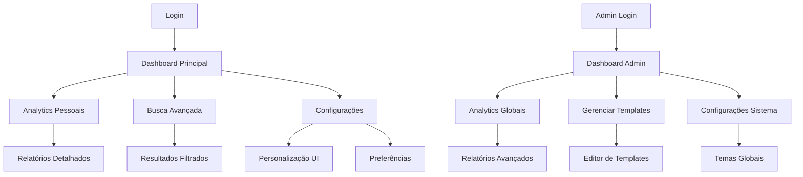

# PRD - Funcionalidades Prioritárias

## 1. Visão Geral do Produto

Este documento define os requisitos para implementação de quatro funcionalidades prioritárias na plataforma Caminhos de Hekate: Dashboard Analytics, Busca Avançada, Templates de Email e Personalização de UI. Essas funcionalidades visam melhorar significativamente a experiência do usuário, fornecer insights valiosos para administradores e aumentar o engajamento na plataforma.

O objetivo é criar uma experiência mais personalizada e orientada por dados, permitindo que usuários tenham controle sobre sua interface e que administradores tomem decisões baseadas em métricas precisas.

## 2. Funcionalidades Principais

### 2.1 Papéis de Usuário

| Papel | Método de Registro | Permissões Principais |
|-------|-------------------|----------------------|
| Usuário Comum | Email + senha | Visualizar analytics pessoais, usar busca avançada, personalizar UI |
| Instrutor | Convite + aprovação | Todas as permissões do usuário + analytics de cursos próprios |
| Administrador | Criação manual | Todas as permissões + analytics globais, gerenciar templates de email |

### 2.2 Módulos de Funcionalidades

Nossas funcionalidades prioritárias consistem nas seguintes páginas principais:

1. **Dashboard Analytics**: métricas pessoais, gráficos de progresso, relatórios de desempenho, insights em tempo real
2. **Busca Avançada**: interface de busca, filtros dinâmicos, resultados categorizados, sugestões inteligentes
3. **Gerenciador de Templates**: editor de templates, preview em tempo real, gerenciamento de variáveis, histórico de envios
4. **Painel de Personalização**: seletor de temas, customização de cores, configurações de layout, preferências de acessibilidade

### 2.3 Detalhes das Páginas

| Nome da Página | Nome do Módulo | Descrição da Funcionalidade |
|----------------|----------------|-----------------------------|
| Dashboard Analytics | Métricas Pessoais | Exibir progresso em cursos, tempo de estudo, conquistas e estatísticas de aprendizado |
| Dashboard Analytics | Gráficos Interativos | Mostrar gráficos de linha, barras e pizza com dados de progresso ao longo do tempo |
| Dashboard Analytics | Relatórios de Desempenho | Gerar relatórios detalhados de performance em quizzes, exercícios e avaliações |
| Dashboard Analytics | Updates em Tempo Real | Atualizar métricas automaticamente via WebSocket quando houver nova atividade |
| Busca Avançada | Interface de Busca | Permitir busca por texto livre com autocomplete e sugestões inteligentes |
| Busca Avançada | Filtros Dinâmicos | Filtrar por categoria, nível, preço, duração, instrutor e data de criação |
| Busca Avançada | Resultados Categorizados | Organizar resultados por tipo (cursos, produtos, posts) com paginação |
| Busca Avançada | Histórico de Buscas | Salvar e sugerir buscas anteriores do usuário |
| Gerenciador de Templates | Editor Visual | Criar e editar templates de email com editor WYSIWYG e preview em tempo real |
| Gerenciador de Templates | Sistema de Variáveis | Gerenciar variáveis dinâmicas como {{nome}}, {{curso}}, {{data}} nos templates |
| Gerenciador de Templates | Histórico de Envios | Rastrear entregas, aberturas, cliques e erros de emails enviados |
| Gerenciador de Templates | Versionamento | Manter histórico de versões dos templates com possibilidade de rollback |
| Painel de Personalização | Seletor de Temas | Escolher entre temas predefinidos (claro, escuro, alto contraste) |
| Painel de Personalização | Customização de Cores | Personalizar cores primárias, secundárias e de fundo da interface |
| Painel de Personalização | Configurações de Layout | Ajustar largura da sidebar, altura do header e densidade de informações |
| Painel de Personalização | Preferências de Acessibilidade | Configurar redução de movimento, alto contraste e tamanho de fonte |

## 3. Fluxos Principais

### Fluxo do Usuário Comum
1. Usuário acessa dashboard e visualiza suas métricas pessoais
2. Utiliza busca avançada para encontrar conteúdo específico
3. Personaliza a interface conforme suas preferências
4. Recebe emails personalizados baseados em templates dinâmicos

### Fluxo do Administrador
1. Acessa dashboard com métricas globais da plataforma
2. Gerencia templates de email e monitora entregas
3. Analisa dados de busca para otimizar conteúdo
4. Configura temas e opções de personalização disponíveis

## 4. Design da Interface

### 4.1 Estilo de Design

- **Cores Primárias**: Roxo (#8B5CF6) e Ciano (#06B6D4)
- **Cores Secundárias**: Cinza neutro (#64748B) e branco (#FFFFFF)
- **Estilo de Botões**: Arredondados com sombra sutil e estados hover/focus bem definidos
- **Tipografia**: Inter como fonte principal, tamanhos de 14px a 32px
- **Layout**: Design baseado em cards com navegação lateral fixa
- **Ícones**: Lucide React para consistência e clareza visual

### 4.2 Visão Geral do Design das Páginas

| Nome da Página | Nome do Módulo | Elementos da UI |
|----------------|----------------|----------------|
| Dashboard Analytics | Métricas Pessoais | Cards com números grandes, ícones coloridos, progress bars animadas |
| Dashboard Analytics | Gráficos Interativos | Gráficos responsivos com Chart.js, tooltips informativos, legendas claras |
| Dashboard Analytics | Relatórios | Tabelas com ordenação, filtros de data, botões de exportação PDF/CSV |
| Busca Avançada | Interface Principal | Barra de busca centralizada, filtros em sidebar colapsável, breadcrumbs |
| Busca Avançada | Resultados | Grid responsivo de cards, paginação numerada, indicadores de relevância |
| Gerenciador Templates | Editor | Split view com código/preview, toolbar com ferramentas, syntax highlighting |
| Gerenciador Templates | Histórico | Timeline de envios, status badges coloridos, métricas de engajamento |
| Personalização UI | Seletor Temas | Preview cards dos temas, toggle switches, color pickers interativos |
| Personalização UI | Configurações | Sliders para ajustes, checkboxes para opções, preview em tempo real |

### 4.3 Responsividade

A aplicação é desktop-first com adaptação completa para mobile e tablet. Inclui otimizações para touch, navegação por gestos e reorganização de layout para telas menores. Breakpoints principais: 768px (tablet) e 1024px (desktop).

## 5. Requisitos Técnicos

### 5.1 Performance
- Tempo de carregamento inicial < 2 segundos
- Atualização de métricas em tempo real < 500ms
- Busca com resultados < 300ms
- Aplicação de temas < 100ms

### 5.2 Compatibilidade
- Navegadores: Chrome 90+, Firefox 88+, Safari 14+, Edge 90+
- Dispositivos: Desktop, tablet e mobile
- Acessibilidade: WCAG 2.1 AA compliance

### 5.3 Segurança
- Autenticação obrigatória para todas as funcionalidades
- Rate limiting nas APIs de busca e analytics
- Sanitização de templates de email
- Validação de preferências de usuário

## 6. Critérios de Sucesso

### 6.1 Métricas de Adoção
- 80% dos usuários ativos utilizam o dashboard analytics
- 60% dos usuários personalizam a interface
- 40% dos usuários utilizam busca avançada semanalmente
- 95% de taxa de entrega dos emails com templates

### 6.2 Métricas de Performance
- Redução de 30% no tempo para encontrar conteúdo
- Aumento de 25% no engajamento com emails
- Melhoria de 40% na satisfação com a interface
- Redução de 50% em tickets de suporte relacionados à navegação

### 6.3 Métricas Técnicas
- Uptime > 99.5%
- Tempo de resposta médio < 200ms
- Taxa de erro < 0.1%
- Cache hit rate > 85%

## 7. Roadmap de Implementação

### Fase 1 (Semanas 1-2): Dashboard Analytics
- Implementar coleta e agregação de métricas
- Criar componentes de visualização
- Configurar updates em tempo real
- Testes de performance e usabilidade

### Fase 2 (Semanas 3-4): Busca Avançada
- Configurar índices de busca full-text
- Implementar sistema de filtros
- Criar interface de busca responsiva
- Otimizar performance de queries

### Fase 3 (Semanas 5-6): Templates de Email
- Desenvolver editor de templates
- Implementar sistema de variáveis
- Configurar tracking de entregas
- Criar interface de gerenciamento

### Fase 4 (Semanas 7-8): Personalização de UI
- Implementar sistema de temas
- Criar painel de customização
- Configurar persistência de preferências
- Testes de acessibilidade

### Fase 5 (Semana 9): Integração e Testes
- Testes de integração entre funcionalidades
- Otimização de performance geral
- Documentação para usuários
- Deploy e monitoramento

## 8. Riscos e Mitigações

### 8.1 Riscos Técnicos
- **Performance com grandes volumes de dados**: Implementar paginação e cache inteligente
- **Complexidade do sistema de temas**: Usar CSS variables e design tokens
- **Sincronização em tempo real**: Implementar fallbacks e reconexão automática

### 8.2 Riscos de Produto
- **Baixa adoção das funcionalidades**: Criar onboarding guiado e tooltips explicativos
- **Sobrecarga de opções de personalização**: Começar com opções básicas e expandir gradualmente
- **Problemas de usabilidade**: Realizar testes com usuários reais em cada fase

### 8.3 Riscos de Negócio
- **Aumento de custos de infraestrutura**: Monitorar uso e otimizar recursos
- **Impacto na performance geral**: Implementar feature flags para rollback rápido
- **Complexidade de manutenção**: Documentar bem e criar testes automatizados

Este PRD serve como guia completo para a implementação das funcionalidades prioritárias, garantindo que todos os aspectos técnicos, de design e de negócio sejam considerados durante o desenvolvimento.