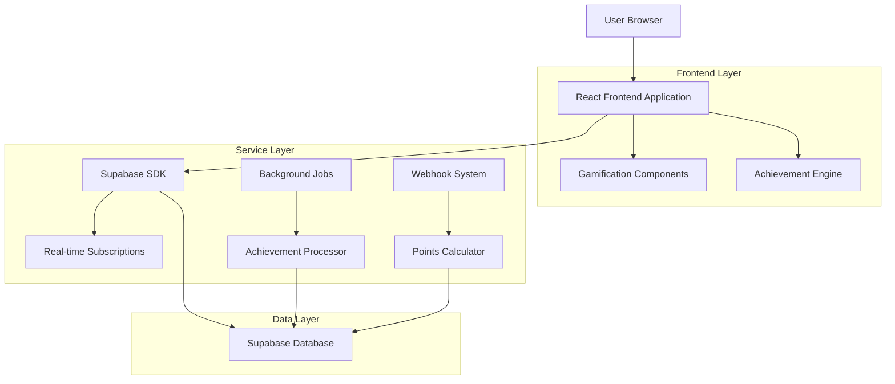
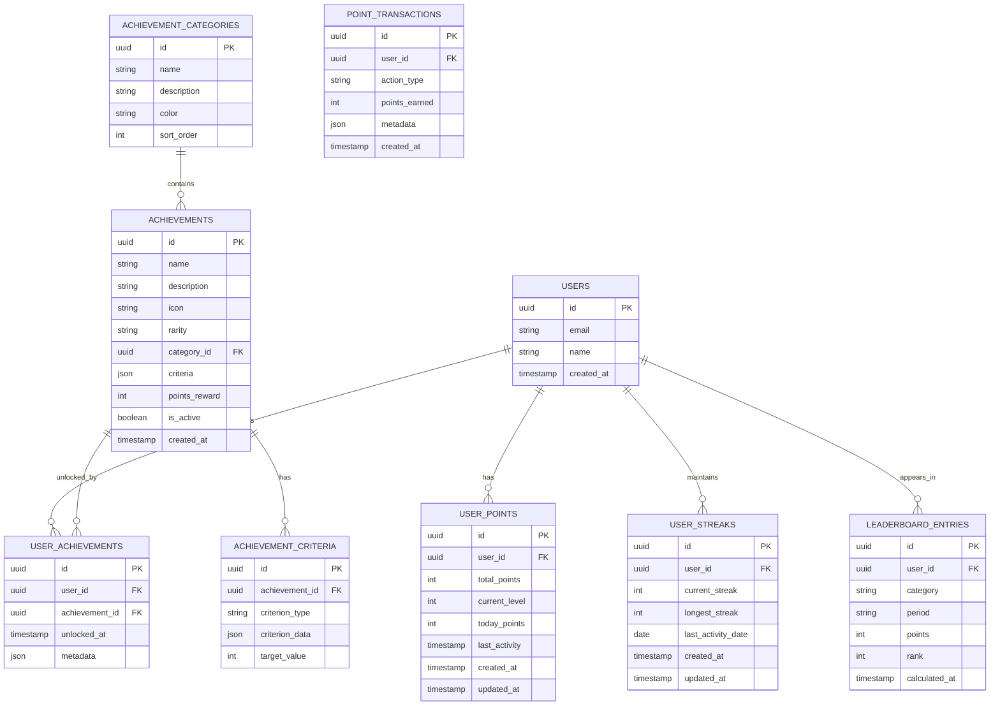

# Sistema de Gamificação - Arquitetura Técnica

## 1. Architecture Design



## 2. Technology Description

- **Frontend**: React@18 + TypeScript + TailwindCSS@3 + Framer Motion + Chart.js
- **Backend**: Supabase (PostgreSQL + Real-time + Edge Functions)
- **State Management**: Zustand para estado de gamificação
- **Animations**: Framer Motion para micro-interações e celebrações
- **Charts**: Chart.js para gráficos de progresso e estatísticas
- **Icons**: Lucide React + ícones customizados SVG

## 3. Route Definitions

| Route | Purpose |
|-------|----------|
| /gamification | Dashboard principal de gamificação |
| /gamification/achievements | Coleção completa de conquistas e badges |
| /gamification/leaderboard | Rankings globais e por categoria |
| /gamification/profile | Perfil pessoal de conquistas e estatísticas |
| /gamification/events | Eventos e competições especiais |
| /admin/gamification | Painel administrativo de gamificação |

## 4. API Definitions

### 4.1 Core APIs

**Pontos e Níveis**
```
GET /api/gamification/points
```
Response:
| Param Name | Param Type | Description |
|------------|------------|-------------|
| totalPoints | number | Total de pontos do usuário |
| currentLevel | number | Nível atual do usuário |
| pointsToNextLevel | number | Pontos necessários para próximo nível |
| todayPoints | number | Pontos ganhos hoje |

```
POST /api/gamification/points/add
```
Request:
| Param Name | Param Type | isRequired | Description |
|------------|------------|------------|-------------|
| action | string | true | Tipo de ação realizada |
| metadata | object | false | Dados adicionais da ação |

**Conquistas**
```
GET /api/gamification/achievements
```
Response:
| Param Name | Param Type | Description |
|------------|------------|-------------|
| achievements | Achievement[] | Lista de todas as conquistas |
| userAchievements | UserAchievement[] | Conquistas do usuário |
| progress | AchievementProgress[] | Progresso das conquistas |

```
POST /api/gamification/achievements/check
```
Request:
| Param Name | Param Type | isRequired | Description |
|------------|------------|------------|-------------|
| userId | string | true | ID do usuário |
| action | string | true | Ação que pode desbloquear conquista |

**Rankings**
```
GET /api/gamification/leaderboard
```
Query Parameters:
| Param Name | Param Type | isRequired | Description |
|------------|------------|------------|-------------|
| category | string | false | Categoria do ranking |
| period | string | false | Período (daily, weekly, monthly, all) |
| limit | number | false | Número de resultados (padrão: 100) |

**Streaks**
```
GET /api/gamification/streaks
```
Response:
| Param Name | Param Type | Description |
|------------|------------|-------------|
| currentStreak | number | Streak atual em dias |
| longestStreak | number | Maior streak já alcançado |
| lastActivity | string | Data da última atividade |

### 4.2 Webhook APIs

```
POST /api/webhooks/gamification/activity
```
Processa atividades do usuário e atualiza pontos/conquistas automaticamente.

```
POST /api/webhooks/gamification/achievement-unlock
```
Dispara quando uma conquista é desbloqueada para enviar notificações.

## 5. Data Model

### 5.1 Data Model Definition



### 5.2 Data Definition Language

**Tabela de Pontos do Usuário (user_points)**
```sql
-- Criar tabela de pontos
CREATE TABLE user_points (
    id UUID PRIMARY KEY DEFAULT gen_random_uuid(),
    user_id UUID NOT NULL REFERENCES auth.users(id) ON DELETE CASCADE,
    total_points INTEGER DEFAULT 0,
    current_level INTEGER DEFAULT 1,
    today_points INTEGER DEFAULT 0,
    last_activity TIMESTAMP WITH TIME ZONE DEFAULT NOW(),
    created_at TIMESTAMP WITH TIME ZONE DEFAULT NOW(),
    updated_at TIMESTAMP WITH TIME ZONE DEFAULT NOW()
);

-- Índices
CREATE UNIQUE INDEX idx_user_points_user_id ON user_points(user_id);
CREATE INDEX idx_user_points_total_points ON user_points(total_points DESC);
CREATE INDEX idx_user_points_level ON user_points(current_level DESC);

-- RLS Policies
ALTER TABLE user_points ENABLE ROW LEVEL SECURITY;
CREATE POLICY "Users can view own points" ON user_points FOR SELECT USING (auth.uid() = user_id);
CREATE POLICY "Users can update own points" ON user_points FOR UPDATE USING (auth.uid() = user_id);
GRANT SELECT ON user_points TO anon, authenticated;
GRANT ALL ON user_points TO authenticated;
```

**Tabela de Categorias de Conquistas (achievement_categories)**
```sql
-- Criar tabela de categorias
CREATE TABLE achievement_categories (
    id UUID PRIMARY KEY DEFAULT gen_random_uuid(),
    name VARCHAR(100) NOT NULL,
    description TEXT,
    color VARCHAR(7) DEFAULT '#6B46C1',
    sort_order INTEGER DEFAULT 0,
    created_at TIMESTAMP WITH TIME ZONE DEFAULT NOW()
);

-- Dados iniciais
INSERT INTO achievement_categories (name, description, color, sort_order) VALUES
('Aprendizado', 'Conquistas relacionadas ao progresso educacional', '#10B981', 1),
('Engajamento', 'Conquistas de participação e dedicação', '#F59E0B', 2),
('Social', 'Conquistas de interação com a comunidade', '#3B82F6', 3),
('Especiais', 'Conquistas raras e eventos limitados', '#8B5CF6', 4);

-- RLS Policies
ALTER TABLE achievement_categories ENABLE ROW LEVEL SECURITY;
CREATE POLICY "Categories are viewable by everyone" ON achievement_categories FOR SELECT USING (true);
GRANT SELECT ON achievement_categories TO anon, authenticated;
```

**Tabela de Conquistas (achievements)**
```sql
-- Criar tabela de conquistas
CREATE TABLE achievements (
    id UUID PRIMARY KEY DEFAULT gen_random_uuid(),
    name VARCHAR(200) NOT NULL,
    description TEXT NOT NULL,
    icon VARCHAR(100) DEFAULT 'trophy',
    rarity VARCHAR(20) DEFAULT 'common' CHECK (rarity IN ('common', 'rare', 'epic', 'legendary', 'mythic')),
    category_id UUID REFERENCES achievement_categories(id),
    criteria JSONB NOT NULL,
    points_reward INTEGER DEFAULT 0,
    is_active BOOLEAN DEFAULT true,
    created_at TIMESTAMP WITH TIME ZONE DEFAULT NOW()
);

-- Índices
CREATE INDEX idx_achievements_category ON achievements(category_id);
CREATE INDEX idx_achievements_rarity ON achievements(rarity);
CREATE INDEX idx_achievements_active ON achievements(is_active);

-- Dados iniciais
INSERT INTO achievements (name, description, icon, rarity, category_id, criteria, points_reward) 
SELECT 
    'Primeiro Passo',
    'Complete seu primeiro curso na plataforma',
    'graduation-cap',
    'common',
    id,
    '{"type": "course_completion", "target": 1}',
    100
FROM achievement_categories WHERE name = 'Aprendizado';

-- RLS Policies
ALTER TABLE achievements ENABLE ROW LEVEL SECURITY;
CREATE POLICY "Achievements are viewable by everyone" ON achievements FOR SELECT USING (is_active = true);
GRANT SELECT ON achievements TO anon, authenticated;
```

**Tabela de Conquistas do Usuário (user_achievements)**
```sql
-- Criar tabela de conquistas do usuário
CREATE TABLE user_achievements (
    id UUID PRIMARY KEY DEFAULT gen_random_uuid(),
    user_id UUID NOT NULL REFERENCES auth.users(id) ON DELETE CASCADE,
    achievement_id UUID NOT NULL REFERENCES achievements(id) ON DELETE CASCADE,
    unlocked_at TIMESTAMP WITH TIME ZONE DEFAULT NOW(),
    metadata JSONB DEFAULT '{}',
    UNIQUE(user_id, achievement_id)
);

-- Índices
CREATE INDEX idx_user_achievements_user_id ON user_achievements(user_id);
CREATE INDEX idx_user_achievements_unlocked_at ON user_achievements(unlocked_at DESC);

-- RLS Policies
ALTER TABLE user_achievements ENABLE ROW LEVEL SECURITY;
CREATE POLICY "Users can view own achievements" ON user_achievements FOR SELECT USING (auth.uid() = user_id);
CREATE POLICY "Users can insert own achievements" ON user_achievements FOR INSERT WITH CHECK (auth.uid() = user_id);
GRANT SELECT, INSERT ON user_achievements TO authenticated;
```

**Tabela de Streaks (user_streaks)**
```sql
-- Criar tabela de streaks
CREATE TABLE user_streaks (
    id UUID PRIMARY KEY DEFAULT gen_random_uuid(),
    user_id UUID NOT NULL REFERENCES auth.users(id) ON DELETE CASCADE,
    current_streak INTEGER DEFAULT 0,
    longest_streak INTEGER DEFAULT 0,
    last_activity_date DATE DEFAULT CURRENT_DATE,
    created_at TIMESTAMP WITH TIME ZONE DEFAULT NOW(),
    updated_at TIMESTAMP WITH TIME ZONE DEFAULT NOW(),
    UNIQUE(user_id)
);

-- Índices
CREATE INDEX idx_user_streaks_current ON user_streaks(current_streak DESC);
CREATE INDEX idx_user_streaks_longest ON user_streaks(longest_streak DESC);

-- RLS Policies
ALTER TABLE user_streaks ENABLE ROW LEVEL SECURITY;
CREATE POLICY "Users can view own streaks" ON user_streaks FOR SELECT USING (auth.uid() = user_id);
CREATE POLICY "Users can update own streaks" ON user_streaks FOR UPDATE USING (auth.uid() = user_id);
GRANT SELECT, UPDATE, INSERT ON user_streaks TO authenticated;
```

**Tabela de Transações de Pontos (point_transactions)**
```sql
-- Criar tabela de transações de pontos
CREATE TABLE point_transactions (
    id UUID PRIMARY KEY DEFAULT gen_random_uuid(),
    user_id UUID NOT NULL REFERENCES auth.users(id) ON DELETE CASCADE,
    action_type VARCHAR(50) NOT NULL,
    points_earned INTEGER NOT NULL,
    metadata JSONB DEFAULT '{}',
    created_at TIMESTAMP WITH TIME ZONE DEFAULT NOW()
);

-- Índices
CREATE INDEX idx_point_transactions_user_id ON point_transactions(user_id);
CREATE INDEX idx_point_transactions_created_at ON point_transactions(created_at DESC);
CREATE INDEX idx_point_transactions_action_type ON point_transactions(action_type);

-- RLS Policies
ALTER TABLE point_transactions ENABLE ROW LEVEL SECURITY;
CREATE POLICY "Users can view own transactions" ON point_transactions FOR SELECT USING (auth.uid() = user_id);
GRANT SELECT ON point_transactions TO authenticated;
```

**Tabela de Rankings (leaderboard_entries)**
```sql
-- Criar tabela de rankings
CREATE TABLE leaderboard_entries (
    id UUID PRIMARY KEY DEFAULT gen_random_uuid(),
    user_id UUID NOT NULL REFERENCES auth.users(id) ON DELETE CASCADE,
    category VARCHAR(50) NOT NULL DEFAULT 'general',
    period VARCHAR(20) NOT NULL DEFAULT 'all' CHECK (period IN ('daily', 'weekly', 'monthly', 'all')),
    points INTEGER NOT NULL DEFAULT 0,
    rank INTEGER NOT NULL DEFAULT 0,
    calculated_at TIMESTAMP WITH TIME ZONE DEFAULT NOW(),
    UNIQUE(user_id, category, period)
);

-- Índices
CREATE INDEX idx_leaderboard_category_period_rank ON leaderboard_entries(category, period, rank);
CREATE INDEX idx_leaderboard_points ON leaderboard_entries(points DESC);

-- RLS Policies
ALTER TABLE leaderboard_entries ENABLE ROW LEVEL SECURITY;
CREATE POLICY "Leaderboard is viewable by everyone" ON leaderboard_entries FOR SELECT USING (true);
GRANT SELECT ON leaderboard_entries TO anon, authenticated;
```

## 6. Edge Functions (Supabase)

### 6.1 Achievement Engine Function

```typescript
// supabase/functions/achievement-engine/index.ts
import { serve } from 'https://deno.land/std@0.168.0/http/server.ts'
import { createClient } from 'https://esm.sh/@supabase/supabase-js@2'

interface AchievementCheck {
  userId: string
  action: string
  metadata?: Record<string, any>
}

serve(async (req) => {
  const { userId, action, metadata = {} }: AchievementCheck = await req.json()
  
  const supabase = createClient(
    Deno.env.get('SUPABASE_URL') ?? '',
    Deno.env.get('SUPABASE_SERVICE_ROLE_KEY') ?? ''
  )
  
  // Buscar conquistas ativas que podem ser desbloqueadas
  const { data: achievements } = await supabase
    .from('achievements')
    .select('*')
    .eq('is_active', true)
  
  const unlockedAchievements = []
  
  for (const achievement of achievements || []) {
    const criteria = achievement.criteria
    
    // Verificar se usuário já possui esta conquista
    const { data: existing } = await supabase
      .from('user_achievements')
      .select('id')
      .eq('user_id', userId)
      .eq('achievement_id', achievement.id)
      .single()
    
    if (existing) continue
    
    // Verificar critérios específicos
    const shouldUnlock = await checkAchievementCriteria(
      supabase, 
      userId, 
      criteria, 
      action, 
      metadata
    )
    
    if (shouldUnlock) {
      // Desbloquear conquista
      await supabase
        .from('user_achievements')
        .insert({
          user_id: userId,
          achievement_id: achievement.id,
          metadata: { action, ...metadata }
        })
      
      // Adicionar pontos de recompensa
      if (achievement.points_reward > 0) {
        await addPoints(supabase, userId, achievement.points_reward, 'achievement')
      }
      
      unlockedAchievements.push(achievement)
    }
  }
  
  return new Response(
    JSON.stringify({ unlockedAchievements }),
    { headers: { 'Content-Type': 'application/json' } }
  )
})

async function checkAchievementCriteria(
  supabase: any,
  userId: string,
  criteria: any,
  action: string,
  metadata: any
): Promise<boolean> {
  switch (criteria.type) {
    case 'course_completion':
      if (action === 'course_completed') {
        const { count } = await supabase
          .from('user_course_progress')
          .select('*', { count: 'exact' })
          .eq('user_id', userId)
          .eq('completed', true)
        
        return count >= criteria.target
      }
      break
      
    case 'consecutive_days':
      if (action === 'daily_activity') {
        const { data: streak } = await supabase
          .from('user_streaks')
          .select('current_streak')
          .eq('user_id', userId)
          .single()
        
        return streak?.current_streak >= criteria.target
      }
      break
      
    case 'total_points':
      const { data: points } = await supabase
        .from('user_points')
        .select('total_points')
        .eq('user_id', userId)
        .single()
      
      return points?.total_points >= criteria.target
      
    default:
      return false
  }
  
  return false
}

async function addPoints(
  supabase: any,
  userId: string,
  points: number,
  actionType: string
) {
  // Registrar transação
  await supabase
    .from('point_transactions')
    .insert({
      user_id: userId,
      action_type: actionType,
      points_earned: points
    })
  
  // Atualizar total de pontos
  const { data: currentPoints } = await supabase
    .from('user_points')
    .select('total_points, current_level')
    .eq('user_id', userId)
    .single()
  
  const newTotal = (currentPoints?.total_points || 0) + points
  const newLevel = calculateLevel(newTotal)
  
  await supabase
    .from('user_points')
    .upsert({
      user_id: userId,
      total_points: newTotal,
      current_level: newLevel,
      updated_at: new Date().toISOString()
    })
}

function calculateLevel(totalPoints: number): number {
  if (totalPoints < 1000) return Math.floor(totalPoints / 100) + 1
  if (totalPoints < 5000) return Math.floor((totalPoints - 1000) / 200) + 11
  if (totalPoints < 25000) return Math.floor((totalPoints - 5000) / 500) + 26
  return Math.floor((totalPoints - 25000) / 1000) + 51
}
```

## 7. React Components Architecture

### 7.1 Core Components

```typescript
// types/gamification.ts
export interface Achievement {
  id: string
  name: string
  description: string
  icon: string
  rarity: 'common' | 'rare' | 'epic' | 'legendary' | 'mythic'
  category: string
  pointsReward: number
  isUnlocked?: boolean
  unlockedAt?: string
  progress?: number
}

export interface UserPoints {
  totalPoints: number
  currentLevel: number
  pointsToNextLevel: number
  todayPoints: number
}

export interface UserStreak {
  currentStreak: number
  longestStreak: number
  lastActivityDate: string
}

export interface LeaderboardEntry {
  userId: string
  userName: string
  avatar?: string
  points: number
  rank: number
  level: number
}
```

### 7.2 Component Structure

```
src/components/gamification/
├── dashboard/
│   ├── GamificationDashboard.tsx
│   ├── PointsDisplay.tsx
│   ├── LevelProgress.tsx
│   ├── RecentAchievements.tsx
│   └── QuickStats.tsx
├── achievements/
│   ├── AchievementCard.tsx
│   ├── BadgeCollection.tsx
│   ├── AchievementModal.tsx
│   ├── ProgressBar.tsx
│   └── CategoryFilter.tsx
├── leaderboard/
│   ├── Leaderboard.tsx
│   ├── LeaderboardEntry.tsx
│   ├── RankingFilters.tsx
│   └── UserRankCard.tsx
├── streaks/
│   ├── StreakCounter.tsx
│   ├── StreakCalendar.tsx
│   └── StreakMotivation.tsx
├── notifications/
│   ├── AchievementNotification.tsx
│   ├── LevelUpNotification.tsx
│   └── NotificationCenter.tsx
└── animations/
    ├── ParticleEffect.tsx
    ├── ConfettiCelebration.tsx
    └── BadgeUnlockAnimation.tsx
```

### 7.3 State Management (Zustand)

```typescript
// stores/gamificationStore.ts
import { create } from 'zustand'
import { Achievement, UserPoints, UserStreak, LeaderboardEntry } from '@/types/gamification'

interface GamificationState {
  // State
  userPoints: UserPoints | null
  achievements: Achievement[]
  userAchievements: Achievement[]
  streak: UserStreak | null
  leaderboard: LeaderboardEntry[]
  isLoading: boolean
  
  // Actions
  fetchUserPoints: () => Promise<void>
  fetchAchievements: () => Promise<void>
  fetchLeaderboard: (category?: string, period?: string) => Promise<void>
  addPoints: (points: number, action: string) => Promise<void>
  checkAchievements: (action: string, metadata?: any) => Promise<Achievement[]>
  updateStreak: () => Promise<void>
}

export const useGamificationStore = create<GamificationState>((set, get) => ({
  // Initial state
  userPoints: null,
  achievements: [],
  userAchievements: [],
  streak: null,
  leaderboard: [],
  isLoading: false,
  
  // Actions
  fetchUserPoints: async () => {
    set({ isLoading: true })
    try {
      const response = await fetch('/api/gamification/points')
      const userPoints = await response.json()
      set({ userPoints, isLoading: false })
    } catch (error) {
      console.error('Error fetching user points:', error)
      set({ isLoading: false })
    }
  },
  
  fetchAchievements: async () => {
    try {
      const response = await fetch('/api/gamification/achievements')
      const data = await response.json()
      set({ 
        achievements: data.achievements,
        userAchievements: data.userAchievements
      })
    } catch (error) {
      console.error('Error fetching achievements:', error)
    }
  },
  
  fetchLeaderboard: async (category = 'general', period = 'all') => {
    try {
      const response = await fetch(`/api/gamification/leaderboard?category=${category}&period=${period}`)
      const leaderboard = await response.json()
      set({ leaderboard })
    } catch (error) {
      console.error('Error fetching leaderboard:', error)
    }
  },
  
  addPoints: async (points: number, action: string) => {
    try {
      await fetch('/api/gamification/points/add', {
        method: 'POST',
        headers: { 'Content-Type': 'application/json' },
        body: JSON.stringify({ action, points })
      })
      
      // Refresh user points
      get().fetchUserPoints()
    } catch (error) {
      console.error('Error adding points:', error)
    }
  },
  
  checkAchievements: async (action: string, metadata?: any) => {
    try {
      const response = await fetch('/api/gamification/achievements/check', {
        method: 'POST',
        headers: { 'Content-Type': 'application/json' },
        body: JSON.stringify({ action, metadata })
      })
      
      const { unlockedAchievements } = await response.json()
      
      if (unlockedAchievements.length > 0) {
        // Refresh achievements
        get().fetchAchievements()
        get().fetchUserPoints()
      }
      
      return unlockedAchievements
    } catch (error) {
      console.error('Error checking achievements:', error)
      return []
    }
  },
  
  updateStreak: async () => {
    try {
      const response = await fetch('/api/gamification/streaks')
      const streak = await response.json()
      set({ streak })
    } catch (error) {
      console.error('Error updating streak:', error)
    }
  }
}))
```

Esta arquitetura técnica fornece uma base sólida para implementar o sistema de gamificação completo, com foco em performance, escalabilidade e experiência do usuário envolvente.