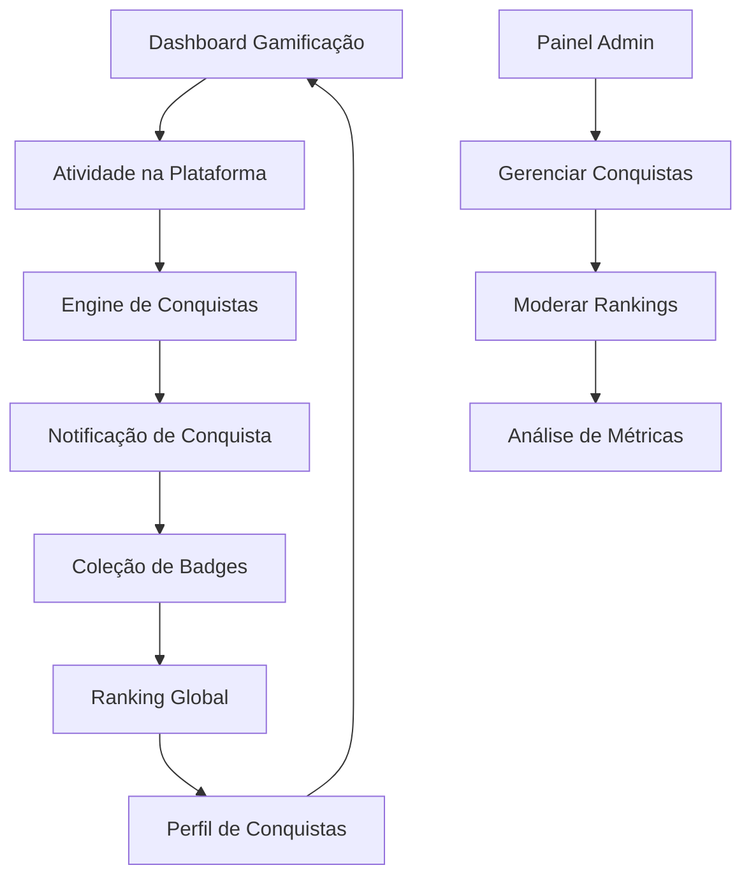

# Sistema de Gamificação - Caminhos de Hekate

## 1. Product Overview

O Sistema de Gamificação é uma funcionalidade avançada que transforma a experiência de aprendizado em uma jornada envolvente através de elementos de jogos. O sistema implementa conquistas, pontos, streaks, badges e rankings para aumentar o engajamento e motivação dos usuários.

Este sistema resolve o problema de baixo engajamento em plataformas educacionais, oferecendo recompensas tangíveis e reconhecimento por progresso e dedicação. Destinado a todos os usuários da plataforma, desde iniciantes até praticantes avançados.

O objetivo é aumentar a retenção de usuários em 40% e o tempo de engajamento em 60% através de mecânicas de jogos bem estruturadas.

## 2. Core Features

### 2.1 User Roles

| Role | Registration Method | Core Permissions |
|------|---------------------|------------------|
| Usuário Básico | Registro padrão | Pode ganhar pontos, conquistas básicas e ver ranking público |
| Usuário Premium | Assinatura ativa | Acesso a conquistas exclusivas, badges premium e ranking VIP |
| Moderador | Convite administrativo | Pode gerenciar conquistas customizadas e moderar rankings |

### 2.2 Feature Module

Nosso sistema de gamificação consiste nas seguintes páginas principais:

1. **Dashboard de Gamificação**: visão geral de pontos, conquistas recentes, progresso de streaks e posição no ranking.
2. **Coleção de Badges**: galeria completa de conquistas, badges desbloqueados e em progresso.
3. **Ranking Global**: leaderboards por categoria, período e tipo de usuário.
4. **Perfil de Conquistas**: histórico detalhado de progressão e estatísticas pessoais.

### 2.3 Page Details

| Page Name | Module Name | Feature description |
|-----------|-------------|---------------------|
| Dashboard de Gamificação | Visão Geral | Exibir pontos totais, nível atual, próximas conquistas e progresso de streaks em tempo real |
| Dashboard de Gamificação | Conquistas Recentes | Mostrar últimas 5 conquistas desbloqueadas com animações e detalhes |
| Dashboard de Gamificação | Ranking Rápido | Exibir posição atual do usuário e top 5 do ranking geral |
| Coleção de Badges | Galeria de Conquistas | Listar todas as conquistas disponíveis organizadas por categoria (aprendizado, engajamento, social) |
| Coleção de Badges | Progresso Individual | Mostrar barra de progresso para conquistas em andamento com critérios específicos |
| Coleção de Badges | Badges Raros | Destacar conquistas especiais e limitadas por tempo com raridade |
| Ranking Global | Leaderboard Geral | Exibir top 100 usuários por pontos totais com filtros por período |
| Ranking Global | Rankings por Categoria | Separar rankings por tipo de atividade (cursos, práticas, comunidade) |
| Ranking Global | Competições Sazonais | Mostrar eventos especiais e competições temporárias |
| Perfil de Conquistas | Histórico Completo | Listar todas as conquistas do usuário com datas e detalhes |
| Perfil de Conquistas | Estatísticas Avançadas | Gráficos de progresso, streaks máximos e análise de desempenho |
| Perfil de Conquistas | Compartilhamento Social | Permitir compartilhar conquistas em redes sociais e perfil público |

## 3. Core Process

### Fluxo Principal do Usuário:

1. **Entrada no Sistema**: Usuário acessa dashboard e visualiza status atual de gamificação
2. **Atividade na Plataforma**: Realiza ações que geram pontos (assistir vídeos, completar exercícios, participar de discussões)
3. **Engine de Conquistas**: Sistema automaticamente detecta critérios atingidos e desbloqueia conquistas
4. **Notificação**: Usuário recebe notificação em tempo real sobre nova conquista ou milestone
5. **Visualização**: Usuário pode explorar coleção de badges e verificar progresso
6. **Competição**: Usuário compete no ranking global e visualiza posição
7. **Engajamento Contínuo**: Streaks e desafios diários mantêm usuário ativo

### Fluxo de Moderador:

1. **Acesso Administrativo**: Moderador acessa painel de gerenciamento de gamificação
2. **Criação de Conquistas**: Define novas conquistas customizadas e critérios
3. **Moderação**: Monitora rankings e remove comportamentos inadequados
4. **Análise**: Visualiza métricas de engajamento e efetividade do sistema

## 4. User Interface Design

### 4.1 Design Style

- **Cores Primárias**: Dourado (#FFD700) para conquistas, Roxo místico (#6B46C1) para elementos mágicos
- **Cores Secundárias**: Verde esmeralda (#10B981) para progresso, Azul safira (#3B82F6) para informações
- **Estilo de Botões**: Botões com gradiente e efeito de brilho, bordas arredondadas (8px)
- **Fontes**: Inter para textos gerais (14-16px), Cinzel para títulos de conquistas (18-24px)
- **Layout**: Cards flutuantes com sombras suaves, animações de partículas para conquistas
- **Ícones**: Estilo místico com elementos de cristais, runas e símbolos esotéricos

### 4.2 Page Design Overview

| Page Name | Module Name | UI Elements |
|-----------|-------------|-------------|
| Dashboard Gamificação | Visão Geral | Cards com gradiente dourado, barras de progresso animadas, contador de pontos com efeito de brilho |
| Dashboard Gamificação | Conquistas Recentes | Modal popup com animação de explosão de partículas, badges 3D com rotação |
| Coleção de Badges | Galeria | Grid responsivo com hover effects, filtros por categoria com ícones temáticos |
| Coleção de Badges | Progresso | Barras de progresso circulares, tooltips informativos, badges bloqueados em escala de cinza |
| Ranking Global | Leaderboard | Tabela com alternância de cores, avatares circulares, medalhas para top 3 |
| Ranking Global | Competições | Cards de eventos com countdown timer, banners promocionais animados |
| Perfil de Conquistas | Histórico | Timeline vertical com marcos importantes, gráficos interativos Chart.js |
| Perfil de Conquistas | Estatísticas | Dashboard com KPIs, gráficos de linha para streaks, medidores radiais |

### 4.3 Responsiveness

O sistema é mobile-first com adaptação completa para desktop. Inclui otimizações para touch em dispositivos móveis, com gestos de swipe para navegação entre conquistas e pull-to-refresh para atualizar rankings. Animações reduzidas em dispositivos com baixa performance.

## 5. Tipos de Conquistas e Badges

### 5.1 Categorias de Conquistas

**Aprendizado:**
- Primeiro Passo: Completar primeiro curso
- Dedicado: Assistir 10 horas de conteúdo
- Mestre do Conhecimento: Completar 5 cursos
- Sábio Ancestral: Completar 20 cursos

**Engajamento:**
- Streak de Fogo: 7 dias consecutivos ativos
- Chama Eterna: 30 dias consecutivos ativos
- Presença Constante: 100 dias consecutivos ativos

**Social:**
- Primeira Interação: Fazer primeiro comentário
- Comunicador: 50 comentários publicados
- Mentor: Ajudar 10 usuários diferentes

**Especiais:**
- Pioneiro: Entre os primeiros 100 usuários
- Colecionador: Desbloquear 50 conquistas
- Lenda Viva: Alcançar nível 50

### 5.2 Sistema de Raridade

- **Comum** (Bronze): Conquistas básicas de progresso
- **Raro** (Prata): Conquistas de dedicação moderada
- **Épico** (Ouro): Conquistas de alto engajamento
- **Lendário** (Diamante): Conquistas extremamente raras
- **Mítico** (Arco-íris): Conquistas limitadas por tempo

## 6. Sistema de Pontos e Níveis

### 6.1 Estrutura de Pontos

- **Assistir Vídeo**: 10 pontos por vídeo completo
- **Completar Exercício**: 25 pontos por exercício
- **Finalizar Curso**: 100 pontos por curso
- **Comentário Útil**: 5 pontos (com likes)
- **Streak Diário**: 15 pontos por dia consecutivo
- **Primeira Atividade do Dia**: 20 pontos bônus

### 6.2 Sistema de Níveis

- **Nível 1-10**: 100 pontos por nível (Iniciante)
- **Nível 11-25**: 200 pontos por nível (Praticante)
- **Nível 26-50**: 500 pontos por nível (Avançado)
- **Nível 51+**: 1000 pontos por nível (Mestre)

Cada nível desbloqueado concede benefícios especiais como badges exclusivos, acesso a conteúdo premium temporário ou destaque no perfil.

## 7. Notificações e Feedback

### 7.1 Tipos de Notificações

- **Conquista Desbloqueada**: Modal com animação e som opcional
- **Novo Nível**: Celebração com confetes e efeitos visuais
- **Streak Quebrado**: Notificação motivacional para retomar
- **Posição no Ranking**: Alertas sobre mudanças significativas
- **Eventos Especiais**: Notificações sobre competições temporárias

### 7.2 Sistema de Feedback

- **Micro-animações**: Feedback visual imediato para cada ação
- **Barras de Progresso**: Atualização em tempo real
- **Efeitos Sonoros**: Sons opcionais para conquistas (configurável)
- **Haptic Feedback**: Vibração em dispositivos móveis para conquistas importantes