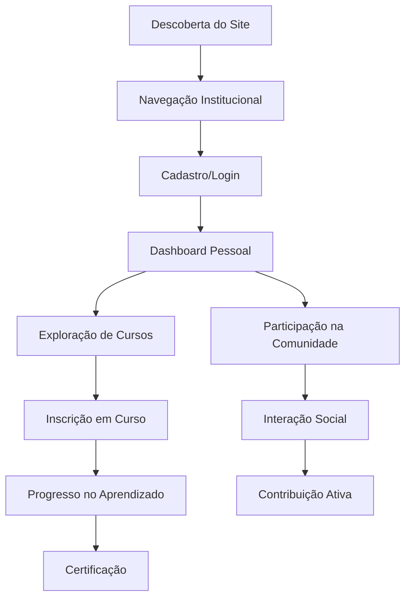
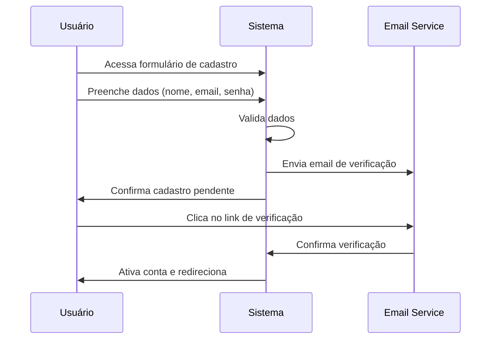
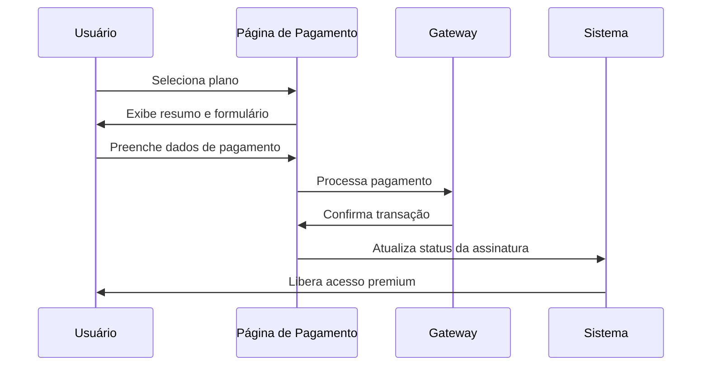
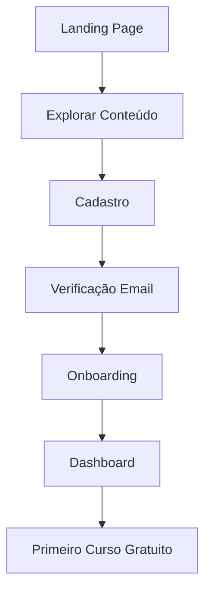
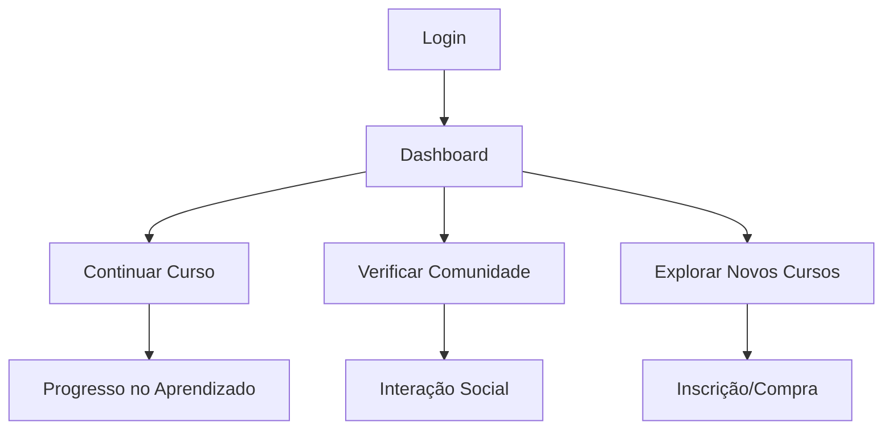
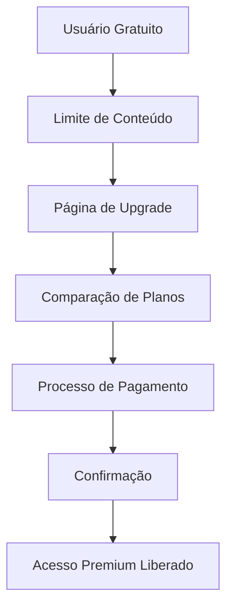

# Experiência do Usuário - Caminhos de Hekate

## 1. Visão Geral da Experiência do Usuário

O projeto Caminhos de Hekate oferece uma experiência completa de aprendizado esotérico, desde o primeiro contato com o site institucional até o uso avançado da plataforma de cursos e comunidade. A jornada do usuário é projetada para ser intuitiva, envolvente e progressiva.

### 1.1 Personas de Usuário

| Persona                      | Descrição                                                 | Necessidades Principais                                            |
| ---------------------------- | --------------------------------------------------------- | ------------------------------------------------------------------ |
| **Iniciante Curioso**        | Pessoa interessada em esoterismo, sem conhecimento prévio | Informações claras, conteúdo introdutório, facilidade de navegação |
| **Praticante Intermediário** | Já possui algum conhecimento, busca aprofundamento        | Cursos estruturados, comunidade ativa, recursos avançados          |
| **Especialista**             | Profissional ou praticante avançado                       | Conteúdo exclusivo, networking, ferramentas especializadas         |
| **Administrador**            | Gerencia conteúdo e usuários                              | Painel administrativo completo, relatórios, moderação              |

### 1.2 Jornada do Usuário Principal

## 2. Site Institucional Público

### 2.1 Páginas Principais

| Página         | Objetivo                                       | Elementos Principais                                          |
| -------------- | ---------------------------------------------- | ------------------------------------------------------------- |
| **Home**       | Apresentar a plataforma e converter visitantes | Hero section, depoimentos, preview de cursos, CTA de cadastro |
| **Sobre**      | Contar a história e missão da plataforma       | História, missão, valores, equipe                             |
| **Cursos**     | Mostrar catálogo público de cursos             | Lista de cursos, filtros, preview gratuito                    |
| **Comunidade** | Apresentar a comunidade e seus benefícios      | Estatísticas, destaques, convite para participar              |
| **Contato**    | Facilitar comunicação com a equipe             | Formulário, informações de contato, FAQ                       |
| **Preços**     | Apresentar planos e valores                    | Tabela de preços, comparação de planos, garantias             |

### 2.2 Funcionalidades do Site Institucional

* **Navegação Responsiva**: Menu adaptável para desktop, tablet e mobile

* **SEO Otimizado**: Meta tags, structured data, sitemap

* **Performance**: Carregamento rápido, imagens otimizadas

* **Acessibilidade**: Conformidade com WCAG 2.1

* **Analytics**: Tracking de conversões e comportamento

## 3. Sistema de Cadastro e Autenticação

### 3.1 Fluxo de Cadastro

### 3.2 Métodos de Autenticação

* **Email/Senha**: Método principal com validação robusta

* **Login Social**: Google, Facebook (opcional)

* **Recuperação de Senha**: Via email com token seguro

* **Autenticação de Dois Fatores**: Para contas premium (futuro)

### 3.3 Validações e Segurança

* Senha forte obrigatória (mínimo 8 caracteres, maiúscula, minúscula, número)

* Rate limiting para tentativas de login

* Bloqueio temporário após múltiplas tentativas falhadas

* Criptografia de senhas com bcrypt

* Sessões seguras com JWT

## 4. Dashboard Pessoal do Usuário

### 4.1 Visão Geral do Dashboard

| Seção                 | Conteúdo                                      | Funcionalidades                                    |
| --------------------- | --------------------------------------------- | -------------------------------------------------- |
| **Resumo**            | Progresso geral, próximas aulas, notificações | Cards informativos, quick actions                  |
| **Meus Cursos**       | Cursos inscritos, progresso, próximas aulas   | Lista de cursos, barra de progresso, acesso rápido |
| **Atividade Recente** | Últimas interações na comunidade, comentários | Timeline de atividades, links diretos              |
| **Recomendações**     | Cursos sugeridos, posts populares             | Algoritmo de recomendação, personalização          |
| **Estatísticas**      | Tempo de estudo, conquistas, ranking          | Gamificação, badges, comparações                   |

### 4.2 Navegação Principal

* **Sidebar Responsiva**: Menu lateral colapsável

* **Breadcrumbs**: Navegação hierárquica clara

* **Busca Global**: Pesquisa em cursos, posts e usuários

* **Notificações**: Centro de notificações em tempo real

* **Perfil Rápido**: Acesso rápido a configurações

## 5. Sistema de Cursos para Usuários

### 5.1 Catálogo de Cursos

#### 5.1.1 Página de Listagem

* **Filtros Avançados**: Por categoria, nível, duração, preço

* **Ordenação**: Por popularidade, data, avaliação, preço

* **Busca**: Por título, descrição, instrutor

* **Visualização**: Grid ou lista, com preview

#### 5.1.2 Página do Curso

* **Informações Gerais**: Título, descrição, instrutor, duração

* **Currículo**: Lista de módulos e aulas

* **Avaliações**: Reviews de outros alunos

* **Preview Gratuito**: Primeira aula ou trailer

* **CTA de Inscrição**: Botão destacado para inscrever-se

### 5.2 Experiência de Aprendizado

#### 5.2.1 Player de Vídeo

* **Controles Avançados**: Velocidade, qualidade, legendas

* **Marcadores**: Bookmarks em pontos importantes

* **Notas**: Sistema de anotações pessoais

* **Progresso**: Tracking automático de visualização

#### 5.2.2 Materiais Complementares

* **Downloads**: PDFs, áudios, recursos extras

* **Exercícios**: Questionários e atividades práticas

* **Fórum da Aula**: Discussões específicas por aula

* **Suporte**: Canal direto com instrutor

### 5.3 Progresso e Gamificação

* **Barra de Progresso**: Visual claro do avanço no curso

* **Certificados**: Emissão automática ao completar

* **Badges**: Conquistas por marcos alcançados

* **Ranking**: Comparação com outros alunos

* **Streak**: Dias consecutivos de estudo

## 6. Área da Comunidade

### 6.1 Estrutura da Comunidade

#### 6.1.1 Fóruns Temáticos

* **Categorias**: Organizadas por temas esotéricos

* **Tópicos**: Discussões específicas dentro de cada categoria

* **Tags**: Sistema de etiquetas para organização

* **Moderação**: Ferramentas de moderação comunitária

#### 6.1.2 Sistema de Posts

* **Tipos de Post**: Texto, imagem, vídeo, enquete

* **Interações**: Curtidas, comentários, compartilhamentos

* **Menções**: Sistema de @menções entre usuários

* **Notificações**: Alertas para interações relevantes

### 6.2 Perfis de Usuário na Comunidade

* **Perfil Público**: Bio, cursos concluídos, contribuições

* **Sistema de Reputação**: Pontos por participação ativa

* **Seguidores**: Sistema de follow entre usuários

* **Mensagens Privadas**: Chat direto entre membros

### 6.3 Funcionalidades Sociais

* **Feed Personalizado**: Algoritmo baseado em interesses

* **Grupos Privados**: Comunidades menores por interesse

* **Eventos**: Calendário de eventos online e presenciais

* **Mentoria**: Sistema de conexão mentor-aprendiz

## 7. Sistema de Pagamentos e Assinaturas

### 7.1 Modelos de Monetização

| Modelo                 | Descrição                     | Benefícios                           |
| ---------------------- | ----------------------------- | ------------------------------------ |
| **Freemium**           | Conteúdo básico gratuito      | Acesso limitado, comunidade básica   |
| **Premium Mensal**     | Assinatura mensal             | Acesso completo, suporte prioritário |
| **Premium Anual**      | Assinatura anual com desconto | Todos os benefícios + desconto       |
| **Cursos Individuais** | Compra avulsa de cursos       | Acesso vitalício ao curso específico |

### 7.2 Fluxo de Pagamento

### 7.3 Gestão de Assinaturas

* **Painel de Cobrança**: Histórico de pagamentos, faturas

* **Cancelamento**: Processo simples de cancelamento

* **Upgrade/Downgrade**: Mudança de planos facilitada

* **Renovação Automática**: Com notificações prévias

* **Reembolsos**: Política clara e processo automatizado

## 8. Experiência Mobile e Responsividade

### 8.1 Design Responsivo

* **Breakpoints**: Mobile (320px+), Tablet (768px+), Desktop (1024px+)

* **Navigation**: Menu hamburger, bottom navigation

* **Touch Interactions**: Gestos intuitivos, botões adequados

* **Performance**: Otimização para conexões lentas

### 8.2 Funcionalidades Mobile-First

* **Offline Mode**: Cache de conteúdo para acesso offline

* **Push Notifications**: Notificações nativas do navegador

* **PWA**: Progressive Web App com instalação

* **Gestos**: Swipe, pinch-to-zoom, pull-to-refresh

### 8.3 Otimizações Mobile

* **Lazy Loading**: Carregamento sob demanda

* **Image Optimization**: WebP, responsive images

* **Minificação**: CSS/JS otimizados

* **CDN**: Distribuição global de conteúdo

## 9. Perfil do Usuário e Configurações

### 9.1 Perfil Pessoal

#### 9.1.1 Informações Básicas

* **Dados Pessoais**: Nome, email, foto, bio

* **Preferências**: Temas de interesse, notificações

* **Privacidade**: Controles de visibilidade do perfil

* **Segurança**: Alteração de senha, 2FA

#### 9.1.2 Histórico de Atividades

* **Cursos Concluídos**: Lista com certificados

* **Participação na Comunidade**: Posts, comentários

* **Conquistas**: Badges e marcos alcançados

* **Estatísticas**: Tempo de estudo, progresso geral

### 9.2 Configurações da Conta

* **Notificações**: Granular por tipo e canal

* **Privacidade**: Controles detalhados de visibilidade

* **Tema**: Dark/light mode, personalização

* **Idioma**: Suporte multilíngue (futuro)

* **Exportação**: Download de dados pessoais (LGPD)

## 10. Fluxos de Navegação Principais

### 10.1 Primeiro Acesso (Usuário Novo)

### 10.2 Usuário Recorrente

### 10.3 Conversão para Premium

## 11. Métricas e KPIs de UX

### 11.1 Métricas de Engajamento

* **Tempo na Plataforma**: Sessão média, tempo total

* **Taxa de Conclusão**: Cursos finalizados vs iniciados

* **Participação na Comunidade**: Posts, comentários, interações

* **Retenção**: Usuários ativos diários/mensais

### 11.2 Métricas de Conversão

* **Taxa de Cadastro**: Visitantes que se cadastram

* **Conversão Premium**: Gratuitos que viram pagantes

* **Churn Rate**: Taxa de cancelamento de assinaturas

* **LTV**: Lifetime Value dos usuários

### 11.3 Métricas de Satisfação

* **NPS**: Net Promoter Score

* **CSAT**: Customer Satisfaction Score

* **Avaliações**: Ratings de cursos e plataforma

* **Feedback**: Sugestões e reclamações

## 12. Acessibilidade e Inclusão

### 12.1 Conformidade WCAG 2.1

* **Nível AA**: Padrão mínimo de acessibilidade

* **Contraste**: Ratios adequados para texto e fundo

* **Navegação por Teclado**: Todos os elementos acessíveis

* **Screen Readers**: Compatibilidade com leitores de tela

### 12.2 Recursos de Acessibilidade

* **Legendas**: Vídeos com legendas em português

* **Transcrições**: Texto alternativo para conteúdo de áudio

* **Zoom**: Interface escalável até 200%

* **Alto Contraste**: Modo de alto contraste opcional

## 13. Performance e Otimização

### 13.1 Métricas de Performance

* **Core Web Vitals**: LCP, FID, CLS dentro dos padrões

* **Time to Interactive**: Menos de 3 segundos

* **First Contentful Paint**: Menos de 1.5 segundos

* **Speed Index**: Otimizado para conexões 3G

### 13.2 Estratégias de Otimização

* **Code Splitting**: Carregamento modular

* **Caching**: Estratégias agressivas de cache

* **Compression**: Gzip/Brotli para todos os assets

* **Preloading**: Recursos críticos pré-carregados

## 14. Segurança e Privacidade

### 14.1 Proteção de Dados

* **LGPD Compliance**: Conformidade com lei brasileira

* **Criptografia**: Dados sensíveis sempre criptografados

* **Backup**: Backups regulares e seguros

* **Auditoria**: Logs de acesso e modificações

### 14.2 Privacidade do Usuário

* **Consentimento**: Opt-in explícito para cookies

* **Transparência**: Política de privacidade clara

* **Controle**: Usuário controla seus dados

* **Portabilidade**: Exportação de dados facilitada

## 15. Roadmap de Melhorias

### 15.1 Curto Prazo (3 meses)

* Implementação do sistema de notificações push

* Otimização da experiência mobile

* Sistema de recomendações básico

* Integração com analytics avançado

### 15.2 Médio Prazo (6 meses)

* App mobile nativo (iOS/Android)

* Sistema de mentoria peer-to-peer

* Gamificação avançada com rankings

* Integração com redes sociais

### 15.3 Longo Prazo (12 meses)

* IA para personalização de conteúdo

* Realidade virtual para experiências imersivas

* Marketplace de cursos de terceiros

* Internacionalização da plataforma

