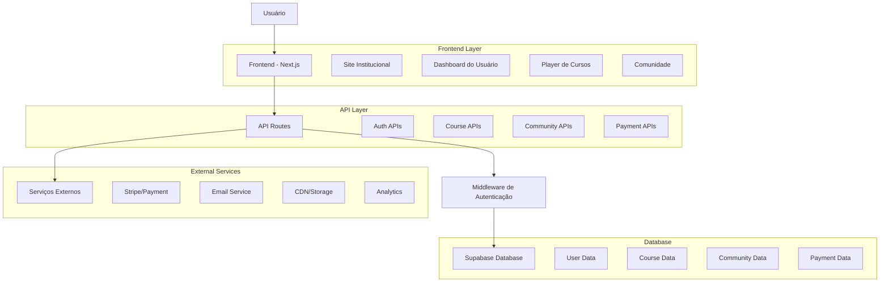

# Arquitetura Técnica - Experiência do Usuário

# Caminhos de Hekate

## 1. Arquitetura Geral da Experiência do Usuário



## 2. Stack Tecnológico

### 2.1 Frontend

* **Framework**: Next.js 14 (App Router)

* **Styling**: Tailwind CSS + Shadcn/ui

* **State Management**: Zustand + React Query

* **Forms**: React Hook Form + Zod

* **Animations**: Framer Motion

* **Icons**: Lucide React

### 2.2 Backend

* **Runtime**: Node.js (Next.js API Routes)

* **Database**: Supabase (PostgreSQL)

* **Authentication**: NextAuth.js + Supabase Auth

* **File Storage**: Supabase Storage

* **Email**: Resend ou SendGrid

* **Payments**: Stripe

### 2.3 DevOps e Infraestrutura

* **Hosting**: Vercel

* **CDN**: Vercel Edge Network

* **Analytics**: Vercel Analytics + Google Analytics

* **Monitoring**: Sentry

* **CI/CD**: GitHub Actions

## 3. Estrutura de Rotas

### 3.1 Rotas Públicas (Site Institucional)

```typescript
// Estrutura de rotas públicas
const publicRoutes = {
  '/': 'Homepage',
  '/sobre': 'Página sobre',
  '/cursos': 'Catálogo público de cursos',
  '/cursos/[slug]': 'Página individual do curso',
  '/comunidade': 'Apresentação da comunidade',
  '/precos': 'Planos e preços',
  '/contato': 'Página de contato',
  '/blog': 'Blog/artigos',
  '/blog/[slug]': 'Post individual do blog',
  '/termos': 'Termos de uso',
  '/privacidade': 'Política de privacidade'
}
```

### 3.2 Rotas de Autenticação

```typescript
// Rotas de auth
const authRoutes = {
  '/auth/login': 'Página de login',
  '/auth/register': 'Página de cadastro',
  '/auth/forgot-password': 'Recuperação de senha',
  '/auth/reset-password': 'Reset de senha',
  '/auth/verify-email': 'Verificação de email',
  '/auth/callback': 'Callback OAuth'
}
```

### 3.3 Rotas Protegidas (Área do Usuário)

```typescript
// Rotas protegidas
const protectedRoutes = {
  '/dashboard': 'Dashboard principal',
  '/profile': 'Perfil do usuário',
  '/settings': 'Configurações da conta',
  '/my-courses': 'Meus cursos',
  '/course/[id]': 'Player do curso',
  '/course/[id]/lesson/[lessonId]': 'Aula específica',
  '/community': 'Área da comunidade',
  '/community/topics/[id]': 'Tópico específico',
  '/community/profile/[userId]': 'Perfil de outro usuário',
  '/billing': 'Área de cobrança',
  '/certificates': 'Certificados'
}
```

## 4. Modelos de Dados

### 4.1 Extensões do Schema Prisma para UX

```prisma
// Extensões necessárias para a experiência do usuário

model User {
  id            String    @id @default(cuid())
  email         String    @unique
  name          String?
  avatar        String?
  bio           String?
  phone         String?
  birthDate     DateTime?
  
  // Preferências UX
  theme         Theme     @default(LIGHT)
  language      String    @default("pt-BR")
  timezone      String    @default("America/Sao_Paulo")
  
  // Notificações
  emailNotifications     Boolean @default(true)
  pushNotifications      Boolean @default(true)
  communityNotifications Boolean @default(true)
  courseNotifications    Boolean @default(true)
  
  // Gamificação
  points        Int       @default(0)
  level         Int       @default(1)
  streak        Int       @default(0)
  lastActivity  DateTime?
  
  // Relacionamentos
  enrollments   Enrollment[]
  posts         Post[]
  comments      Comment[]
  likes         Like[]
  followers     Follow[]  @relation("UserFollowers")
  following     Follow[]  @relation("UserFollowing")
  certificates  Certificate[]
  progress      LessonProgress[]
  bookmarks     Bookmark[]
  notes         Note[]
  
  createdAt     DateTime  @default(now())
  updatedAt     DateTime  @updatedAt
}

enum Theme {
  LIGHT
  DARK
  SYSTEM
}

model LessonProgress {
  id          String   @id @default(cuid())
  userId      String
  lessonId    String
  courseId    String
  completed   Boolean  @default(false)
  watchTime   Int      @default(0) // em segundos
  lastPosition Int     @default(0) // posição do vídeo
  
  user        User     @relation(fields: [userId], references: [id], onDelete: Cascade)
  lesson      Lesson   @relation(fields: [lessonId], references: [id], onDelete: Cascade)
  course      Course   @relation(fields: [courseId], references: [id], onDelete: Cascade)
  
  createdAt   DateTime @default(now())
  updatedAt   DateTime @updatedAt
  
  @@unique([userId, lessonId])
}

model Certificate {
  id          String   @id @default(cuid())
  userId      String
  courseId    String
  code        String   @unique
  issuedAt    DateTime @default(now())
  
  user        User     @relation(fields: [userId], references: [id], onDelete: Cascade)
  course      Course   @relation(fields: [courseId], references: [id], onDelete: Cascade)
  
  @@unique([userId, courseId])
}

model Bookmark {
  id        String   @id @default(cuid())
  userId    String
  lessonId  String
  timestamp Int      // posição no vídeo em segundos
  note      String?
  
  user      User     @relation(fields: [userId], references: [id], onDelete: Cascade)
  lesson    Lesson   @relation(fields: [lessonId], references: [id], onDelete: Cascade)
  
  createdAt DateTime @default(now())
}

model Note {
  id        String   @id @default(cuid())
  userId    String
  lessonId  String
  content   String
  timestamp Int?     // posição no vídeo, se aplicável
  
  user      User     @relation(fields: [userId], references: [id], onDelete: Cascade)
  lesson    Lesson   @relation(fields: [lessonId], references: [id], onDelete: Cascade)
  
  createdAt DateTime @default(now())
  updatedAt DateTime @updatedAt
}

model Like {
  id     String @id @default(cuid())
  userId String
  postId String
  
  user   User   @relation(fields: [userId], references: [id], onDelete: Cascade)
  post   Post   @relation(fields: [postId], references: [id], onDelete: Cascade)
  
  createdAt DateTime @default(now())
  
  @@unique([userId, postId])
}

model Follow {
  id          String @id @default(cuid())
  followerId  String
  followingId String
  
  follower    User   @relation("UserFollowers", fields: [followerId], references: [id], onDelete: Cascade)
  following   User   @relation("UserFollowing", fields: [followingId], references: [id], onDelete: Cascade)
  
  createdAt   DateTime @default(now())
  
  @@unique([followerId, followingId])
}

// Extensões para Course
model Course {
  // ... campos existentes
  
  // Novos campos para UX
  trailer       String?   // URL do vídeo trailer
  difficulty    Difficulty @default(BEGINNER)
  estimatedHours Int?
  tags          String[]  // tags para busca
  
  // Relacionamentos UX
  certificates  Certificate[]
  progress      LessonProgress[]
  
  // Estatísticas
  totalStudents Int @default(0)
  averageRating Float?
  totalReviews  Int @default(0)
}

enum Difficulty {
  BEGINNER
  INTERMEDIATE
  ADVANCED
  EXPERT
}

// Extensões para Lesson
model Lesson {
  // ... campos existentes
  
  // Novos campos para UX
  transcript    String?   // transcrição do vídeo
  resources     Json?     // recursos adicionais
  quiz          Json?     // quiz da aula
  
  // Relacionamentos UX
  progress      LessonProgress[]
  bookmarks     Bookmark[]
  notes         Note[]
}
```

### 4.2 Tipos TypeScript

```typescript
// types/user-experience.ts

export interface UserProfile {
  id: string
  email: string
  name: string | null
  avatar: string | null
  bio: string | null
  theme: 'LIGHT' | 'DARK' | 'SYSTEM'
  language: string
  timezone: string
  points: number
  level: number
  streak: number
  preferences: UserPreferences
}

export interface UserPreferences {
  emailNotifications: boolean
  pushNotifications: boolean
  communityNotifications: boolean
  courseNotifications: boolean
}

export interface CourseProgress {
  courseId: string
  totalLessons: number
  completedLessons: number
  progressPercentage: number
  lastAccessedLesson: string | null
  totalWatchTime: number
  estimatedTimeRemaining: number
}

export interface LessonState {
  id: string
  completed: boolean
  watchTime: number
  lastPosition: number
  bookmarks: Bookmark[]
  notes: Note[]
}

export interface CommunityStats {
  totalPosts: number
  totalComments: number
  totalLikes: number
  followers: number
  following: number
  reputation: number
}
```

## 5. APIs da Experiência do Usuário

### 5.1 APIs de Autenticação e Perfil

```typescript
// /api/auth/register
POST /api/auth/register
Body: {
  name: string
  email: string
  password: string
  acceptTerms: boolean
}
Response: {
  success: boolean
  message: string
  user?: UserProfile
}

// /api/auth/verify-email
POST /api/auth/verify-email
Body: {
  token: string
}
Response: {
  success: boolean
  message: string
}

// /api/user/profile
GET /api/user/profile
Response: UserProfile

PUT /api/user/profile
Body: Partial<UserProfile>
Response: UserProfile

// /api/user/preferences
GET /api/user/preferences
Response: UserPreferences

PUT /api/user/preferences
Body: Partial<UserPreferences>
Response: UserPreferences
```

### 5.2 APIs de Cursos e Progresso

```typescript
// /api/courses/public
GET /api/courses/public
Query: {
  category?: string
  difficulty?: string
  search?: string
  page?: number
  limit?: number
}
Response: {
  courses: Course[]
  total: number
  hasMore: boolean
}

// /api/courses/[id]/enroll
POST /api/courses/[id]/enroll
Response: {
  success: boolean
  enrollment: Enrollment
}

// /api/courses/[id]/progress
GET /api/courses/[id]/progress
Response: CourseProgress

// /api/lessons/[id]/progress
POST /api/lessons/[id]/progress
Body: {
  watchTime: number
  lastPosition: number
  completed?: boolean
}
Response: {
  success: boolean
  progress: LessonState
}

// /api/lessons/[id]/bookmark
POST /api/lessons/[id]/bookmark
Body: {
  timestamp: number
  note?: string
}
Response: {
  success: boolean
  bookmark: Bookmark
}
```

### 5.3 APIs da Comunidade

```typescript
// /api/community/feed
GET /api/community/feed
Query: {
  page?: number
  limit?: number
  filter?: 'following' | 'popular' | 'recent'
}
Response: {
  posts: Post[]
  hasMore: boolean
}

// /api/community/posts
POST /api/community/posts
Body: {
  title: string
  content: string
  topicId: string
  tags?: string[]
}
Response: {
  success: boolean
  post: Post
}

// /api/community/posts/[id]/like
POST /api/community/posts/[id]/like
Response: {
  success: boolean
  liked: boolean
  totalLikes: number
}

// /api/community/users/[id]/follow
POST /api/community/users/[id]/follow
Response: {
  success: boolean
  following: boolean
}
```

### 5.4 APIs de Dashboard e Analytics

```typescript
// /api/dashboard/stats
GET /api/dashboard/stats
Response: {
  totalCourses: number
  completedCourses: number
  totalWatchTime: number
  currentStreak: number
  weeklyProgress: number[]
  recentActivity: Activity[]
  recommendations: Course[]
}

// /api/dashboard/notifications
GET /api/dashboard/notifications
Query: {
  unread?: boolean
  limit?: number
}
Response: {
  notifications: Notification[]
  unreadCount: number
}

// /api/dashboard/notifications/[id]/read
PUT /api/dashboard/notifications/[id]/read
Response: {
  success: boolean
}
```

## 6. Componentes da Interface

### 6.1 Componentes de Layout

```typescript
// components/layout/PublicLayout.tsx
export interface PublicLayoutProps {
  children: React.ReactNode
  showHeader?: boolean
  showFooter?: boolean
}

// components/layout/DashboardLayout.tsx
export interface DashboardLayoutProps {
  children: React.ReactNode
  title?: string
  breadcrumbs?: Breadcrumb[]
}

// components/layout/CourseLayout.tsx
export interface CourseLayoutProps {
  children: React.ReactNode
  course: Course
  currentLesson?: Lesson
  sidebar?: boolean
}
```

### 6.2 Componentes de Autenticação

```typescript
// components/auth/LoginForm.tsx
export interface LoginFormProps {
  onSuccess?: (user: User) => void
  redirectTo?: string
}

// components/auth/RegisterForm.tsx
export interface RegisterFormProps {
  onSuccess?: (user: User) => void
  redirectTo?: string
}

// components/auth/ProtectedRoute.tsx
export interface ProtectedRouteProps {
  children: React.ReactNode
  requiredRole?: Role
  fallback?: React.ReactNode
}
```

### 6.3 Componentes de Cursos

```typescript
// components/courses/CourseCard.tsx
export interface CourseCardProps {
  course: Course
  showProgress?: boolean
  variant?: 'default' | 'compact' | 'featured'
}

// components/courses/VideoPlayer.tsx
export interface VideoPlayerProps {
  src: string
  poster?: string
  onProgress?: (progress: number) => void
  onComplete?: () => void
  bookmarks?: Bookmark[]
  notes?: Note[]
}

// components/courses/LessonList.tsx
export interface LessonListProps {
  lessons: Lesson[]
  currentLesson?: string
  progress?: Record<string, LessonState>
  onLessonSelect?: (lesson: Lesson) => void
}
```

### 6.4 Componentes da Comunidade

```typescript
// components/community/PostCard.tsx
export interface PostCardProps {
  post: Post
  showActions?: boolean
  variant?: 'full' | 'compact'
}

// components/community/CommentThread.tsx
export interface CommentThreadProps {
  comments: Comment[]
  postId: string
  onReply?: (comment: Comment) => void
}

// components/community/UserProfile.tsx
export interface UserProfileProps {
  user: User
  stats: CommunityStats
  isOwnProfile?: boolean
}
```

## 7. Hooks Customizados

### 7.1 Hooks de Autenticação

```typescript
// hooks/useAuth.ts
export function useAuth() {
  const { data: session, status } = useSession()
  
  return {
    user: session?.user,
    isLoading: status === 'loading',
    isAuthenticated: !!session,
    login: signIn,
    logout: signOut
  }
}

// hooks/useProfile.ts
export function useProfile() {
  const { user } = useAuth()
  
  return useQuery({
    queryKey: ['profile', user?.id],
    queryFn: () => fetchUserProfile(),
    enabled: !!user
  })
}
```

### 7.2 Hooks de Cursos

```typescript
// hooks/useCourseProgress.ts
export function useCourseProgress(courseId: string) {
  return useQuery({
    queryKey: ['course-progress', courseId],
    queryFn: () => fetchCourseProgress(courseId)
  })
}

// hooks/useLessonProgress.ts
export function useLessonProgress(lessonId: string) {
  const queryClient = useQueryClient()
  
  const updateProgress = useMutation({
    mutationFn: (data: ProgressUpdate) => 
      updateLessonProgress(lessonId, data),
    onSuccess: () => {
      queryClient.invalidateQueries(['lesson-progress', lessonId])
    }
  })
  
  return { updateProgress }
}
```

### 7.3 Hooks da Comunidade

```typescript
// hooks/useCommunityFeed.ts
export function useCommunityFeed(filter: FeedFilter = 'recent') {
  return useInfiniteQuery({
    queryKey: ['community-feed', filter],
    queryFn: ({ pageParam = 1 }) => 
      fetchCommunityFeed({ page: pageParam, filter }),
    getNextPageParam: (lastPage) => 
      lastPage.hasMore ? lastPage.page + 1 : undefined
  })
}

// hooks/usePostActions.ts
export function usePostActions(postId: string) {
  const queryClient = useQueryClient()
  
  const likePost = useMutation({
    mutationFn: () => togglePostLike(postId),
    onSuccess: () => {
      queryClient.invalidateQueries(['post', postId])
      queryClient.invalidateQueries(['community-feed'])
    }
  })
  
  return { likePost }
}
```

## 8. Estado Global

### 8.1 Store de Usuário

```typescript
// stores/userStore.ts
interface UserState {
  profile: UserProfile | null
  preferences: UserPreferences | null
  theme: Theme
  setProfile: (profile: UserProfile) => void
  setPreferences: (preferences: UserPreferences) => void
  setTheme: (theme: Theme) => void
}

export const useUserStore = create<UserState>((set) => ({
  profile: null,
  preferences: null,
  theme: 'SYSTEM',
  setProfile: (profile) => set({ profile }),
  setPreferences: (preferences) => set({ preferences }),
  setTheme: (theme) => set({ theme })
}))
```

### 8.2 Store de Navegação

```typescript
// stores/navigationStore.ts
interface NavigationState {
  sidebarOpen: boolean
  breadcrumbs: Breadcrumb[]
  setSidebarOpen: (open: boolean) => void
  setBreadcrumbs: (breadcrumbs: Breadcrumb[]) => void
}

export const useNavigationStore = create<NavigationState>((set) => ({
  sidebarOpen: false,
  breadcrumbs: [],
  setSidebarOpen: (open) => set({ sidebarOpen: open }),
  setBreadcrumbs: (breadcrumbs) => set({ breadcrumbs })
}))
```

### 8.3 Store de Player de Vídeo

```typescript
// stores/playerStore.ts
interface PlayerState {
  currentLesson: string | null
  isPlaying: boolean
  currentTime: number
  duration: number
  playbackRate: number
  volume: number
  muted: boolean
  fullscreen: boolean
  setCurrentLesson: (lessonId: string) => void
  setIsPlaying: (playing: boolean) => void
  setCurrentTime: (time: number) => void
  setDuration: (duration: number) => void
  setPlaybackRate: (rate: number) => void
  setVolume: (volume: number) => void
  setMuted: (muted: boolean) => void
  setFullscreen: (fullscreen: boolean) => void
}

export const usePlayerStore = create<PlayerState>((set) => ({
  currentLesson: null,
  isPlaying: false,
  currentTime: 0,
  duration: 0,
  playbackRate: 1,
  volume: 1,
  muted: false,
  fullscreen: false,
  setCurrentLesson: (lessonId) => set({ currentLesson: lessonId }),
  setIsPlaying: (playing) => set({ isPlaying: playing }),
  setCurrentTime: (time) => set({ currentTime: time }),
  setDuration: (duration) => set({ duration }),
  setPlaybackRate: (rate) => set({ playbackRate: rate }),
  setVolume: (volume) => set({ volume }),
  setMuted: (muted) => set({ muted }),
  setFullscreen: (fullscreen) => set({ fullscreen })
}))
```

## 9. Middleware e Proteção de Rotas

### 9.1 Middleware de Autenticação

```typescript
// middleware.ts
import { withAuth } from 'next-auth/middleware'
import { NextResponse } from 'next/server'

export default withAuth(
  function middleware(req) {
    const { pathname } = req.nextUrl
    const token = req.nextauth.token
    
    // Rotas que requerem autenticação
    const protectedRoutes = [
      '/dashboard',
      '/profile',
      '/settings',
      '/my-courses',
      '/course',
      '/community',
      '/billing'
    ]
    
    // Rotas que requerem role específico
    const adminRoutes = ['/admin']
    
    // Verificar se a rota é protegida
    const isProtectedRoute = protectedRoutes.some(route => 
      pathname.startsWith(route)
    )
    
    const isAdminRoute = adminRoutes.some(route => 
      pathname.startsWith(route)
    )
    
    // Redirecionar usuários não autenticados
    if (isProtectedRoute && !token) {
      return NextResponse.redirect(
        new URL('/auth/login?callbackUrl=' + pathname, req.url)
      )
    }
    
    // Verificar permissões de admin
    if (isAdminRoute && token?.role !== 'ADMIN') {
      return NextResponse.redirect(new URL('/dashboard', req.url))
    }
    
    return NextResponse.next()
  },
  {
    callbacks: {
      authorized: ({ token, req }) => {
        const { pathname } = req.nextUrl
        
        // Permitir acesso a rotas públicas
        const publicRoutes = ['/', '/sobre', '/cursos', '/contato', '/auth']
        const isPublicRoute = publicRoutes.some(route => 
          pathname.startsWith(route)
        )
        
        if (isPublicRoute) return true
        
        // Requer token para outras rotas
        return !!token
      }
    }
  }
)

export const config = {
  matcher: [
    '/((?!api|_next/static|_next/image|favicon.ico).*)',
  ]
}
```

### 9.2 HOC de Proteção

```typescript
// components/auth/withAuth.tsx
export function withAuth<P extends object>(
  Component: React.ComponentType<P>,
  options?: {
    requiredRole?: Role
    redirectTo?: string
  }
) {
  return function AuthenticatedComponent(props: P) {
    const { data: session, status } = useSession()
    const router = useRouter()
    
    useEffect(() => {
      if (status === 'loading') return
      
      if (!session) {
        router.push(options?.redirectTo || '/auth/login')
        return
      }
      
      if (options?.requiredRole && session.user.role !== options.requiredRole) {
        router.push('/dashboard')
        return
      }
    }, [session, status, router])
    
    if (status === 'loading') {
      return <LoadingSpinner />
    }
    
    if (!session) {
      return null
    }
    
    return <Component {...props} />
  }
}
```

## 10. Otimizações de Performance

### 10.1 Lazy Loading de Componentes

```typescript
// Lazy loading de páginas pesadas
const CoursePlayer = lazy(() => import('@/components/courses/CoursePlayer'))
const CommunityFeed = lazy(() => import('@/components/community/CommunityFeed'))
const VideoPlayer = lazy(() => import('@/components/courses/VideoPlayer'))

// Wrapper com Suspense
function LazyComponent({ children }: { children: React.ReactNode }) {
  return (
    <Suspense fallback={<ComponentSkeleton />}>
      {children}
    </Suspense>
  )
}
```

### 10.2 Otimização de Imagens

```typescript
// components/ui/OptimizedImage.tsx
import Image from 'next/image'

interface OptimizedImageProps {
  src: string
  alt: string
  width?: number
  height?: number
  priority?: boolean
  className?: string
}

export function OptimizedImage({
  src,
  alt,
  width = 400,
  height = 300,
  priority = false,
  className
}: OptimizedImageProps) {
  return (
    <Image
      src={src}
      alt={alt}
      width={width}
      height={height}
      priority={priority}
      className={className}
      placeholder="blur"
      blurDataURL="data:image/jpeg;base64,/9j/4AAQSkZJRgABAQAAAQABAAD/2wBDAAYEBQYFBAYGBQYHBwYIChAKCgkJChQODwwQFxQYGBcUFhYaHSUfGhsjHBYWICwgIyYnKSopGR8tMC0oMCUoKSj/2wBDAQcHBwoIChMKChMoGhYaKCgoKCgoKCgoKCgoKCgoKCgoKCgoKCgoKCgoKCgoKCgoKCgoKCgoKCgoKCgoKCgoKCj/wAARCAABAAEDASIAAhEBAxEB/8QAFQABAQAAAAAAAAAAAAAAAAAAAAv/xAAUEAEAAAAAAAAAAAAAAAAAAAAA/8QAFQEBAQAAAAAAAAAAAAAAAAAAAAX/xAAUEQEAAAAAAAAAAAAAAAAAAAAA/9oADAMBAAIRAxEAPwCdABmX/9k="
      sizes="(max-width: 768px) 100vw, (max-width: 1200px) 50vw, 33vw"
    />
  )
}
```

### 10.3 Caching e SWR

```typescript
// lib/cache.ts
import { unstable_cache } from 'next/cache'

// Cache para dados estáticos
export const getCachedCourses = unstable_cache(
  async () => {
    return await fetchCourses()
  },
  ['courses'],
  {
    revalidate: 3600, // 1 hora
    tags: ['courses']
  }
)

// Cache para dados do usuário
export const getCachedUserProgress = unstable_cache(
  async (userId: string) => {
    return await fetchUserProgress(userId)
  },
  ['user-progress'],
  {
    revalidate: 300, // 5 minutos
    tags: ['user-progress']
  }
)
```

## 11. Testes

### 11.1 Testes de Componentes

```typescript
// __tests__/components/CourseCard.test.tsx
import { render, screen } from '@testing-library/react'
import { CourseCard } from '@/components/courses/CourseCard'

const mockCourse = {
  id: '1',
  title: 'Curso de Tarot',
  description: 'Aprenda tarot do básico ao avançado',
  thumbnail: '/images/course-1.jpg',
  price: 99.99,
  instructor: 'Maria Silva'
}

describe('CourseCard', () => {
  it('renders course information correctly', () => {
    render(<CourseCard course={mockCourse} />)
    
    expect(screen.getByText('Curso de Tarot')).toBeInTheDocument()
    expect(screen.getByText('Maria Silva')).toBeInTheDocument()
    expect(screen.getByText('R$ 99,99')).toBeInTheDocument()
  })
  
  it('shows progress when provided', () => {
    render(<CourseCard course={mockCourse} showProgress />)
    
    expect(screen.getByRole('progressbar')).toBeInTheDocument()
  })
})
```

### 11.2 Testes de API

```typescript
// __tests__/api/courses.test.ts
import { createMocks } from 'node-mocks-http'
import handler from '@/pages/api/courses'

describe('/api/courses', () => {
  it('returns courses list', async () => {
    const { req, res } = createMocks({
      method: 'GET',
    })
    
    await handler(req, res)
    
    expect(res._getStatusCode()).toBe(200)
    
    const data = JSON.parse(res._getData())
    expect(data).toHaveProperty('courses')
    expect(Array.isArray(data.courses)).toBe(true)
  })
})
```

### 11.3 Testes E2E

```typescript
// e2e/user-journey.spec.ts
import { test, expect } from '@playwright/test'

test('complete user journey', async ({ page }) => {
  // Visitar homepage
  await page.goto('/')
  await expect(page.locator('h1')).toContainText('Caminhos de Hekate')
  
  // Fazer cadastro
  await page.click('text=Cadastrar')
  await page.fill('[name="name"]', 'João Silva')
  await page.fill('[name="email"]', 'joao@example.com')
  await page.fill('[name="password"]', 'senha123')
  await page.click('button[type="submit"]')
  
  // Verificar redirecionamento para dashboard
  await expect(page).toHaveURL('/dashboard')
  await expect(page.locator('h1')).toContainText('Dashboard')
  
  // Navegar para cursos
  await page.click('text=Meus Cursos')
  await expect(page).toHaveURL('/my-courses')
  
  // Inscrever-se em um curso
  await page.click('.course-card:first-child button')
  await expect(page.locator('.success-message')).toBeVisible()
})
```

## 12. Monitoramento e Analytics

### 12.1 Tracking de Eventos

```typescript
// lib/analytics.ts
interface AnalyticsEvent {
  name: string
  properties?: Record<string, any>
}

export function trackEvent({ name, properties }: AnalyticsEvent) {
  // Google Analytics
  if (typeof gtag !== 'undefined') {
    gtag('event', name, properties)
  }
  
  // Vercel Analytics
  if (typeof va !== 'undefined') {
    va.track(name, properties)
  }
  
  // Custom analytics
  fetch('/api/analytics/track', {
    method: 'POST',
    headers: { 'Content-Type': 'application/json' },
    body: JSON.stringify({ name, properties })
  })
}

// Eventos específicos
export const analytics = {
  courseStarted: (courseId: string) => 
    trackEvent({ name: 'course_started', properties: { courseId } }),
  
  lessonCompleted: (lessonId: string, courseId: string) => 
    trackEvent({ 
      name: 'lesson_completed', 
      properties: { lessonId, courseId } 
    }),
  
  postCreated: (topicId: string) => 
    trackEvent({ name: 'post_created', properties: { topicId } }),
  
  subscriptionUpgraded: (plan: string) => 
    trackEvent({ name: 'subscription_upgraded', properties: { plan } })
}
```

### 12.2 Error Monitoring

```typescript
// lib/monitoring.ts
import * as Sentry from '@sentry/nextjs'

export function initMonitoring() {
  Sentry.init({
    dsn: process.env.NEXT_PUBLIC_SENTRY_DSN,
    environment: process.env.NODE_ENV,
    tracesSampleRate: 0.1,
    beforeSend(event) {
      // Filtrar erros conhecidos
      if (event.exception) {
        const error = event.exception.values?.[0]
        if (error?.value?.includes('Network Error')) {
          return null
        }
      }
      return event
    }
  })
}

export function captureUserFeedback({
  name,
  email,
  message
}: {
  name: string
  email: string
  message: string
}) {
  Sentry.captureUserFeedback({
    name,
    email,
    comments: message
  })
}
```

## 13. Implementação por Fases

### 13.1 Fase 1: Fundação (2 semanas)
- [ ] Setup do projeto Next.js com TypeScript
- [ ] Configuração do Supabase e autenticação
- [ ] Layout básico e sistema de rotas
- [ ] Componentes de UI fundamentais
- [ ] Sistema de autenticação completo

### 13.2 Fase 2: Site Institucional (1 semana)
- [ ] Homepage com hero section
- [ ] Páginas sobre, contato, preços
- [ ] Catálogo público de cursos
- [ ] SEO e otimizações básicas
- [ ] Responsividade mobile

### 13.3 Fase 3: Dashboard do Usuário (2 semanas)
- [ ] Dashboard principal com estatísticas
- [ ] Perfil do usuário e configurações
- [ ] Sistema de notificações
- [ ] Navegação e breadcrumbs
- [ ] Área "Meus Cursos"

### 13.4 Fase 4: Player de Cursos (3 semanas)
- [ ] Player de vídeo avançado
- [ ] Sistema de progresso e bookmarks
- [ ] Notas e materiais complementares
- [ ] Certificados automáticos
- [ ] Gamificação básica

### 13.5 Fase 5: Comunidade (2 semanas)
- [ ] Feed da comunidade
- [ ] Sistema de posts e comentários
- [ ] Perfis de usuário públicos
- [ ] Sistema de seguir/seguidores
- [ ] Moderação básica

### 13.6 Fase 6: Pagamentos (1 semana)
- [ ] Integração com Stripe
- [ ] Fluxo de assinatura
- [ ] Gestão de cobrança
- [ ] Área de faturamento

### 13.7 Fase 7: Otimizações (1 semana)
- [ ] Performance e caching
- [ ] Analytics e monitoramento
- [ ] Testes automatizados
- [ ] Deploy e CI/CD

## 14. Considerações de Segurança

### 14.1 Autenticação e Autorização
- JWT tokens com expiração curta
- Refresh tokens seguros
- Rate limiting em APIs sensíveis
- Validação rigorosa de inputs
- Sanitização de dados do usuário

### 14.2 Proteção de Dados
- Criptografia de dados sensíveis
- HTTPS obrigatório
- Headers de segurança (CSP, HSTS)
- Validação server-side
- Logs de auditoria

### 14.3 Conformidade LGPD
- Consentimento explícito para cookies
- Política de privacidade clara
- Direito ao esquecimento
- Portabilidade de dados
- Notificação de vazamentos

Esta arquitetura técnica fornece uma base sólida para implementar uma experiência de usuário completa e profissional no projeto Caminhos de Hekate, priorizando performance, segurança e usabilidade.
```

