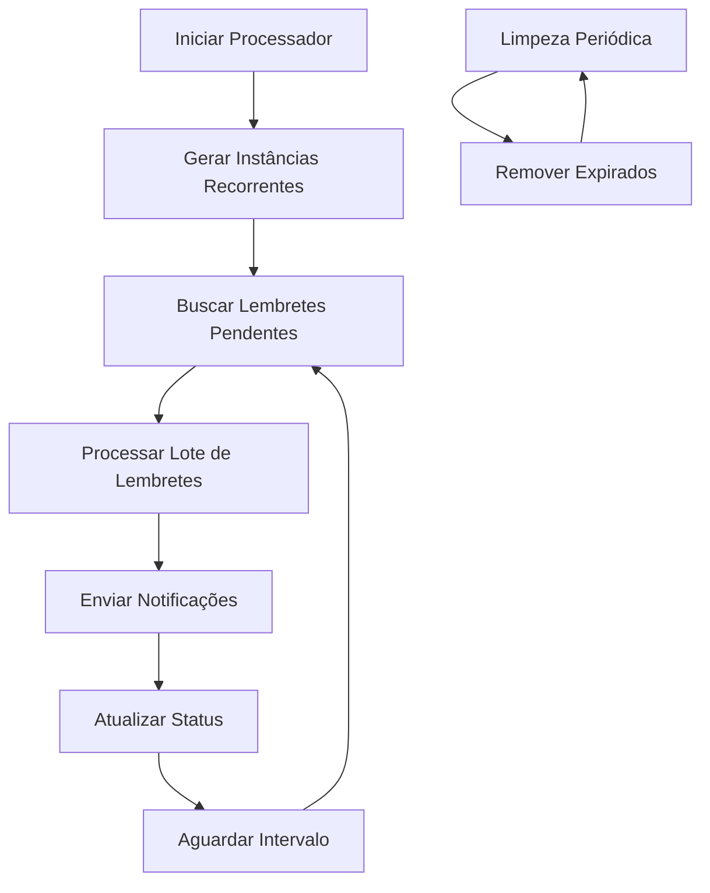

# Sistema de Processamento de Lembretes

Este documento descreve o sistema de processamento em background para geração e envio de lembretes de eventos recorrentes.

## Visão Geral

O sistema de processamento de lembretes é responsável por:

- ✅ Gerar instâncias de eventos recorrentes automaticamente
- ✅ Processar lembretes pendentes baseados em timing configurado
- ✅ Enviar notificações via email, push e SMS
- ✅ Integrar com sistema de gamificação para conquistas
- ✅ Limpar lembretes expirados automaticamente
- ✅ Monitorar performance e estatísticas

## Arquitetura

### Componentes Principais

1. **ReminderProcessor** (`src/lib/background/reminder-processor.ts`)
   - Processador principal que executa em background
   - Gerencia ciclo de vida e configurações
   - Implementa padrão singleton para evitar múltiplas instâncias

2. **RecurringEventsNotificationService** (`src/lib/notifications/recurring-events-notification-service.ts`)
   - Serviço especializado para notificações de eventos recorrentes
   - Integra com sistema de notificações existente
   - Calcula prioridades e formata mensagens

3. **APIs de Controle** (`src/app/api/background/reminder-processor/route.ts`)
   - Endpoints para monitorar e controlar o processador
   - Acesso restrito a administradores
   - Estatísticas em tempo real

4. **Middleware de Inicialização** (`src/middleware/reminder-processor-middleware.ts`)
   - Auto-inicialização em produção
   - Integração com middleware do Next.js
   - Graceful shutdown

### Fluxo de Processamento



## Configuração

### Variáveis de Ambiente

```bash
# Auto-inicialização
AUTO_START_REMINDER_PROCESSOR=true

# Configurações do processador
REMINDER_BATCH_SIZE=50              # Lembretes por lote
REMINDER_INTERVAL_MS=60000          # Intervalo entre processamentos (1 min)
REMINDER_MAX_RETRIES=3              # Tentativas máximas por lembrete
REMINDER_LOOKAHEAD_DAYS=30          # Dias para gerar instâncias futuras

# Tipos de notificação
ENABLE_EMAIL_REMINDERS=true
ENABLE_PUSH_REMINDERS=true
ENABLE_SMS_REMINDERS=false

# Limpeza automática
CLEANUP_EXPIRED_REMINDERS=true
CLEANUP_INTERVAL_HOURS=24
REMINDER_RETENTION_DAYS=90
```

### Modos de Execução

#### 1. Integrado à Aplicação (Recomendado para Produção)

```bash
# Configurar no .env.local
AUTO_START_REMINDER_PROCESSOR=true

# Iniciar aplicação normalmente
npm run start
```

#### 2. Processo Separado (Desenvolvimento/Debug)

```bash
# Executar uma vez
npm run reminder-processor

# Executar com watch (desenvolvimento)
npm run reminder-processor:dev

# Executar em produção
npm run reminder-processor:prod
```

#### 3. Script Standalone

```bash
# Executar diretamente
tsx scripts/start-reminder-processor.ts
```

## Monitoramento

### Interface de Administração

Acesse `/admin/reminder-processor` para:

- 📊 Visualizar estatísticas em tempo real
- ⚙️ Configurar parâmetros do processador
- 🎮 Controlar execução (start/stop/restart)
- 📈 Monitorar performance e erros

### APIs de Monitoramento

```typescript
// Status do processador
GET /api/background/reminder-processor

// Controlar processador
POST /api/background/reminder-processor
{
  "action": "start" | "stop" | "restart" | "process_now"
}

// Atualizar configuração
PUT /api/background/reminder-processor
{
  "batchSize": 50,
  "intervalMs": 60000,
  "maxRetries": 3,
  "lookAheadDays": 30
}
```

### Métricas Disponíveis

- **Status**: running, stopped, error
- **Uptime**: Tempo de execução
- **Processed**: Total de lembretes processados
- **Queue Size**: Lembretes pendentes
- **Success Rate**: Taxa de sucesso
- **Memory Usage**: Uso de memória
- **Last Error**: Último erro ocorrido

## Tipos de Lembretes

### 1. Lembretes de Eventos
- **Timing**: Configurável por evento (5min, 1h, 1d antes)
- **Canais**: Email, Push, SMS
- **Prioridade**: Baseada na proximidade do evento

### 2. Lembretes de Recorrência
- **Criação**: Nova série recorrente criada
- **Modificação**: Série ou instância modificada
- **Cancelamento**: Instância cancelada
- **Conflito**: Sobreposição de eventos

### 3. Lembretes de Gamificação
- **Conquistas**: Baseadas em participação
- **Streaks**: Sequências de participação
- **Milestones**: Marcos importantes

## Tratamento de Erros

### Estratégia de Retry

1. **Retry Exponencial**: Delay aumenta a cada tentativa
2. **Max Retries**: Limite de tentativas por lembrete
3. **Dead Letter Queue**: Lembretes que falharam definitivamente
4. **Alertas**: Notificação para administradores

### Logs e Debugging

```bash
# Logs do processador
tail -f logs/reminder-processor.log

# Logs da aplicação
tail -f .next/server.log

# Debug específico
DEBUG=reminder-processor npm run dev
```

## Performance

### Otimizações Implementadas

- ✅ **Batch Processing**: Processa múltiplos lembretes por vez
- ✅ **Connection Pooling**: Reutiliza conexões do banco
- ✅ **Caching**: Cache de configurações e templates
- ✅ **Lazy Loading**: Carrega dados sob demanda
- ✅ **Memory Management**: Limpeza automática de memória

### Limites Recomendados

- **Batch Size**: 50-100 lembretes
- **Interval**: 30-60 segundos
- **Concurrent**: 5-10 processamentos simultâneos
- **Memory**: < 512MB por processo

## Troubleshooting

### Problemas Comuns

#### Processador Não Inicia
```bash
# Verificar configuração
echo $AUTO_START_REMINDER_PROCESSOR

# Verificar logs
tail -f logs/reminder-processor.log

# Forçar inicialização
curl -X POST /api/background/reminder-processor -d '{"action":"start"}'
```

#### Alta Latência
```bash
# Reduzir batch size
REMINDER_BATCH_SIZE=25

# Aumentar intervalo
REMINDER_INTERVAL_MS=120000

# Verificar conexões do banco
SHOW PROCESSLIST;
```

#### Memória Alta
```bash
# Habilitar limpeza automática
CLEANUP_EXPIRED_REMINDERS=true

# Reduzir retenção
REMINDER_RETENTION_DAYS=30

# Reiniciar processador
curl -X POST /api/background/reminder-processor -d '{"action":"restart"}'
```

## Desenvolvimento

### Executar Testes

```bash
# Testes unitários
npm test -- reminder-processor

# Testes de integração
npm run test:e2e -- reminder

# Teste manual
curl -X POST /api/background/reminder-processor -d '{"action":"process_now"}'
```

### Adicionar Novos Tipos de Lembrete

1. Estender `ReminderType` enum
2. Adicionar template em `notification-templates`
3. Implementar lógica em `RecurringEventsNotificationService`
4. Atualizar testes

### Debugging

```typescript
// Habilitar logs detalhados
process.env.REMINDER_LOG_LEVEL = 'debug'

// Processar um lembrete específico
const processor = getReminderProcessor()
processor.processReminder(reminderId)
```

## Segurança

- ✅ **Autenticação**: APIs protegidas por auth
- ✅ **Autorização**: Apenas admins podem controlar
- ✅ **Rate Limiting**: Limite de requisições
- ✅ **Input Validation**: Validação com Zod
- ✅ **Error Handling**: Não vaza informações sensíveis

## Roadmap

- [ ] **Clustering**: Suporte a múltiplas instâncias
- [ ] **Webhooks**: Notificações via webhook
- [ ] **Analytics**: Métricas avançadas
- [ ] **A/B Testing**: Testes de templates
- [ ] **Machine Learning**: Otimização de timing